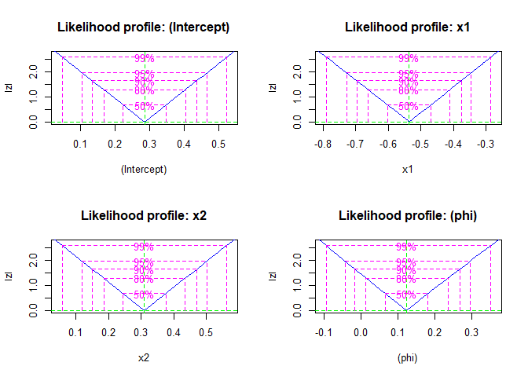
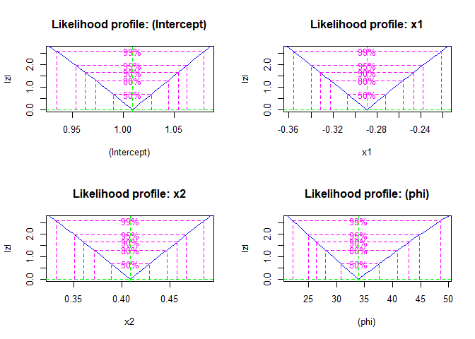
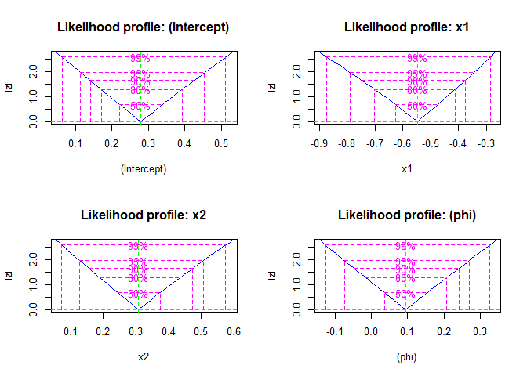
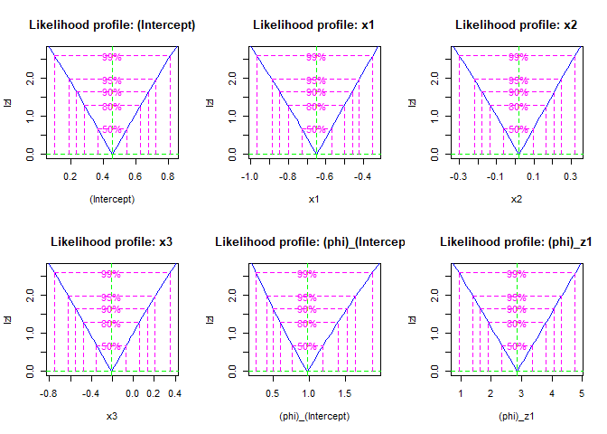
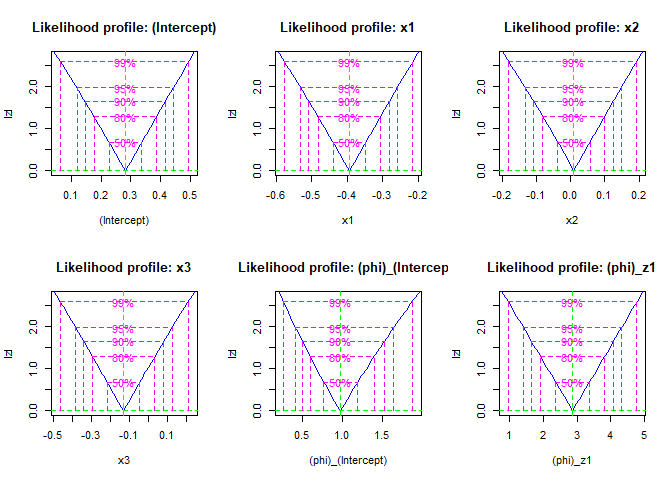

<!-- README.md is generated from README.Rmd. Please edit that file -->

# betaregscale

<!-- badges: start -->

[](https://github.com/evandeilton/betaroti/actions/workflows/pkgdown.yaml)
<!-- badges: end -->

O pacote `betaregscale` oferece uma biblioteca de funções em R para ajuste
de modelos de regressão beta para dados oriundos de escalas mapeáveis no
suporte da distribuição beta, como por exemplo Escaldas de dor, Likert
entre outras, do modo que a incertea do instrumento é avaliada de forma
intervalar. O *framework* aqui suporta modelos com dispersão fixa ou
variável, tudo no paradigma de máxima verossimilhança. São oferecidas
ainda, funções para simulações e avaliação do desempenho dos modelos no
processo de estimação e outras para akjuste do modelo a dados reais. O
código-fonte e contribuições podem ser acessados no repositório oficial
do GitHub. Informações detalhadas sobre instalação e uso estão
disponíveis na documentação do pacote.

O `betaregscale` é voltado para modelagem de dados com variável resposta
mapeável em intervalo contínuo, e.g., $y = (y_s;y_i)$, abrangendo
censura à esquerda, direita ou intervalar independente do tempo.
Aplica-se em pesquisas de opinião, avaliações de produtos, escalas de
dor no estilo NRS-11, NRS-21 e NRS-101, avaliações de compostos
químicos, entre outros. Utilizando a distribuição beta, acomoda
características dos dados em estrutura de regressão, associando
variáveis explicativas à variável resposta intervalar e permitindo
preditores lineares para coeficientes relacionados à média e dispersão,
fornecendo estimativas robustas e confiáveis dos parâmetros do modelo.

## Principais funcionalidades

Entre as principais funcionalidades ten-se:

- Ajuste de modelos de regressão beta com dispersão fixa e variável.
- Funções para simulação de dados, permitindo a avaliação do desempenho
  dos modelos em diferentes cenários.
- Estatística de bondade do ajuste como AIC e BIC, por exemplo em
  `gof()`.
- Funções genéricas como `coef`, `vcov`, `fitted`, `residuals`,
  `summary` e `print` foram implementadas para a classe `betaregscale`
  para facilitar o acesso às medidas do ajuste.
- Funções para ajuste e comparação de modelos com diferentes combinações
  de variáveis explicativas tanto para $\mu$ como $\phi$.

> Acesse a documentação detalhada de cada função e exemplos de uso neste
> site para obter informações sobre como utilizar o pacote `betaregscale`
> em suas análises.

## Instalação

Você pode instalar o pacote com esse comando abaixo.

``` r
if(!require(betaregscale)){
  devtools::install_github("evandeilton/betaregscale")  
}
require(betaregscale, quietly = TRUE)
```

## Exemplos

Esses são alguns exemplos de uso das funções do pacote.

### Simula dados do modelo beta intervalar com dispersão fixa

Esta função gera amostras de variável beta com dispersão fixa usando
várias funções de ligação.

No exemplo a seguir em código R, demonstramos como usar a função
`betaregscale_simula_dados` para simular dados de variável beta com
dispersão fixa:

- Criamos um conjunto de dados com 100 observações e duas variáveis
  explicativas independentes (x1 e x2) a partir de uma distribuição
  normal.
- Utilizamos a função beta_ordinal_simula_dados para simular dados com
  parâmetros personalizados fornecidos.

> OBS.: `type` é o tipo de tratamento do intervalo `m` centraliza `y` ao
> meio. Ex. Se foi coletado o valor $y = 6$, transforma-se
> $y_t = 6/10 = 0.6$. Assim, para tratar a incerteza do instrumento,
> sugere-se que a medida anotada pode estar limitada a $y_{left} = 5.5$
> e $y_{right} = 6.6$.

``` r
# Criar um conjunto de dados de exemplo
set.seed(4255)
n <- 200
dados <- data.frame(x1 = rnorm(n),
                    x2 = rnorm(n))

dados_simulados <- betaregscale_simula_dados(
  formula = ~ x1 + x2,
  dados = dados,
  betas = c(0.3, -0.6, 0.4),
  phi = 1/10,
  link = "logit",
  link_phi = "logit",
  ncuts = 100,
  type = "m",
  repar = "2"
)
dados_simulados %>%
  head() %>%
  knitr::kable(digits = 4, caption = "")
```

|  left | right |   yt |   y |      x1 |      x2 |
|------:|------:|-----:|----:|--------:|--------:|
| 0.005 | 0.015 | 0.01 |   1 |  1.9510 | -0.5588 |
| 0.665 | 0.675 | 0.67 |  67 |  0.7725 | -0.0711 |
| 0.285 | 0.295 | 0.29 |  29 |  0.7264 |  0.4692 |
| 0.895 | 0.905 | 0.90 |  90 |  0.0487 |  0.1113 |
| 0.315 | 0.325 | 0.32 |  32 | -0.5445 | -0.5612 |
| 0.995 | 1.000 | 1.00 | 100 |  0.3600 |  0.0187 |

### Ajuste de modelos com dispersão fixa

- Exemplo do ajuste com optim direto para uma lista de links

``` r
links <- c("logit","probit","cauchit","cloglog")
names(links) <- links

fit_fixo <- purrr::map(links, .f = function(link){
  betaregscale(
    formula = y ~ x1 + x2,
    dados = dados_simulados,
    link = link,
    link_phi = "logit",
    repar = "2",
    num_hessiana = TRUE)
})
```

- Resumo das estimativas e bondade

- Estimativas do ajuste e Bondade

``` r
resumo <- purrr::map(fit_fixo, function(fit){
  summary(fit)
})
```

``` r
purrr::map_df(resumo, function(res){
  res$est
  }, .id = "link") %>% 
  knitr::kable(digits = 4, caption = "")  
```

| link    | variable           | estimate | ci_lower | ci_upper |     se | t_value | p_value |
|:--------|:-------------------|---------:|---------:|---------:|-------:|--------:|--------:|
| logit   | (Intercept)        |   0.2859 |   0.1050 |   0.4669 | 0.0923 |  3.0979 |  0.0022 |
| logit   | x1                 |  -0.5358 |  -0.7265 |  -0.3452 | 0.0972 | -5.5101 |  0.0000 |
| logit   | x2                 |   0.3098 |   0.1195 |   0.5002 | 0.0971 |  3.1899 |  0.0017 |
| logit   | (phi)\_(Intercept) |   0.1224 |  -0.0467 |   0.2915 | 0.0863 |  1.4184 |  0.1577 |
| probit  | (Intercept)        |   0.1728 |   0.0618 |   0.2839 | 0.0567 |  3.0506 |  0.0026 |
| probit  | x1                 |  -0.3206 |  -0.4326 |  -0.2086 | 0.0571 | -5.6119 |  0.0000 |
| probit  | x2                 |   0.1851 |   0.0705 |   0.2997 | 0.0585 |  3.1666 |  0.0018 |
| probit  | (phi)\_(Intercept) |   0.1288 |  -0.0394 |   0.2970 | 0.0858 |  1.5006 |  0.1351 |
| cauchit | (Intercept)        |   0.2793 |   0.1106 |   0.4479 | 0.0861 |  3.2453 |  0.0014 |
| cauchit | x1                 |  -0.5481 |  -0.7691 |  -0.3271 | 0.1128 | -4.8607 |  0.0000 |
| cauchit | x2                 |   0.3083 |   0.1212 |   0.4954 | 0.0955 |  3.2302 |  0.0015 |
| cauchit | (phi)\_(Intercept) |   0.0947 |  -0.0770 |   0.2664 | 0.0876 |  1.0808 |  0.2811 |
| cloglog | (Intercept)        |  -0.1950 |  -0.3188 |  -0.0711 | 0.0632 | -3.0844 |  0.0023 |
| cloglog | x1                 |  -0.3173 |  -0.4309 |  -0.2037 | 0.0580 | -5.4745 |  0.0000 |
| cloglog | x2                 |   0.1752 |   0.0584 |   0.2919 | 0.0596 |  2.9399 |  0.0037 |
| cloglog | (phi)\_(Intercept) |   0.1492 |  -0.0169 |   0.3154 | 0.0848 |  1.7603 |  0.0799 |

``` r
purrr::map_df(resumo, function(res){
  res$gof
  }, .id = "link") %>% 
  knitr::kable(digits = 4, caption = "")
```

| link    |   logLik |       AIC |       BIC |
|:--------|---------:|----------:|----------:|
| logit   | 798.1895 | -1586.379 | -1569.887 |
| probit  | 798.5201 | -1587.040 | -1570.549 |
| cauchit | 796.5680 | -1583.136 | -1566.644 |
| cloglog | 799.7853 | -1589.571 | -1573.079 |

- Exemplo do ajuste com `bbmle` direto para uma lista de links

``` r
require(bbmle, quietly = TRUE)
links <- c("logit","probit","cauchit","cloglog")
names(links) <- links

fit_fixo_bbmle <- purrr::map(links, .f = function(link){
  betaregscale_bbmle(
    formula = y ~ x1 + x2,
    dados = dados_simulados,
    link = link,
    link_phi = "logit",
    repar = "2",
    num_hessiana = TRUE)
})
```

- Gráficos dos perfis de verossimilhança

``` r
fit_fixo_profiles <- purrr::map(fit_fixo_bbmle, profile)
purrr::walk(names(fit_fixo_profiles), function(p){
  cat("\n+", p, "\n")
  plot(fit_fixo_profiles[[p]])
})
```

- logit
  
- probit
  
- cauchit
  
- cloglog
  

### Simula dados do modelo beta intervalar com dispersão variável

Neste bloco de código R, é criado um conjunto de dados simulados de um
modelo beta com dispersão variável utilizando a função
`betaregscale_simula_dados_z.` O processo é resumido abaixo:

- Definir semente e tamanho da amostra, além das fórmulas para as
  variáveis explicativas x e z.

- Criar um conjunto de dados de exemplo com 50 observações e quatro
  variáveis independentes (x1, x2, z1 e z2), geradas a partir de
  distribuições normal e uniforme.

- Utilizar a função `betaregscale_simula_dados_z` para gerar dados
  simulados com base nos parâmetros fornecidos, como fórmulas,
  coeficientes de regressão, funções de ligação e número de pontos de
  corte.

``` r
# Criar um conjunto de dados de exemplo
set.seed(2222)
n <- 200
fx <- ~ x1 + x2 + x3
fz <- ~ z1 + z2

dados <- data.frame(
  x1 = rnorm(n),
  x2 = rnorm(n),
  x3 = rbinom(n, size = 1, prob = 1/2),
  z1 = rnorm(n),
  z2 = rnorm(n)
)

dados_simulados <- betaregscale_simula_dados_z(
  formula_x = fx,
  formula_z = fz,
  dados = dados,
  betas = c(0.2, -0.6, 0.2, 0.2),
  zetas = c(0.2, -0.8, 0.6),
  link = "logit",
  link_phi = "logit",
  ncuts = 100,
  type = "m",
  repar = "2"
)

dados_simulados %>% 
  head() %>%
  knitr::kable(digits = 4, caption = "")
```

|  left | right |   yt |   y |      x1 |      x2 |  x3 |      z1 |      z2 |
|------:|------:|-----:|----:|--------:|--------:|----:|--------:|--------:|
| 0.995 | 1.000 | 1.00 | 100 | -0.3381 | -0.4210 |   1 |  0.4465 |  0.6887 |
| 0.995 | 1.000 | 1.00 | 100 |  0.9392 |  0.6792 |   0 | -0.2571 |  0.7827 |
| 0.975 | 0.985 | 0.98 |  98 |  1.7377 | -0.9226 |   0 |  2.4296 |  1.1177 |
| 0.785 | 0.795 | 0.79 |  79 |  0.6963 | -0.1522 |   0 | -0.0379 |  0.3732 |
| 0.575 | 0.585 | 0.58 |  58 |  0.4623 | -0.6422 |   0 |  0.3168 | -1.1604 |
| 0.415 | 0.425 | 0.42 |  42 | -0.3151 |  0.7921 |   0 | -1.1367 | -0.8366 |

### Ajuste de modelos com dispersão variável

- Exemplo do ajuste com optim direto para uma lista de links

``` r
links <- c("logit","probit","cauchit","cloglog")
names(links) <- links

fit_variavel <- purrr::map(links, .f = function(link){
  betaregscale(
    formula = y ~x1 + x2 | z1,
    dados = dados_simulados,
    link = link,
    link_phi = "logit",
    repar = "2",
    num_hessiana = TRUE)
})
```

- Resumo das estimativas e bondade

- Estimativas do ajuste e Bondade

``` r
resumo <- purrr::map(fit_variavel, function(fit){
  summary(fit)
})
```

``` r
purrr::map_df(resumo, function(res){
  res$est
  }, .id = "link") %>% 
  knitr::kable(digits = 4, caption = "")  
```

| link    | variable           | estimate | ci_lower | ci_upper |     se | t_value | p_value |
|:--------|:-------------------|---------:|---------:|---------:|-------:|--------:|--------:|
| logit   | (Intercept)        |   0.4458 |   0.2672 |   0.6243 | 0.0911 |  4.8938 |  0.0000 |
| logit   | x1                 |  -0.4420 |  -0.6277 |  -0.2563 | 0.0947 | -4.6660 |  0.0000 |
| logit   | x2                 |   0.1419 |  -0.0213 |   0.3052 | 0.0833 |  1.7044 |  0.0899 |
| logit   | (phi)\_(Intercept) |   0.0733 |  -0.0942 |   0.2407 | 0.0854 |  0.8577 |  0.3921 |
| logit   | (phi)\_z1          |  -0.4949 |  -0.6700 |  -0.3198 | 0.0893 | -5.5401 |  0.0000 |
| probit  | (Intercept)        |   0.2759 |   0.1663 |   0.3856 | 0.0559 |  4.9326 |  0.0000 |
| probit  | x1                 |  -0.2701 |  -0.3813 |  -0.1590 | 0.0567 | -4.7639 |  0.0000 |
| probit  | x2                 |   0.0877 |  -0.0127 |   0.1881 | 0.0512 |  1.7115 |  0.0886 |
| probit  | (phi)\_(Intercept) |   0.0732 |  -0.0942 |   0.2406 | 0.0854 |  0.8567 |  0.3927 |
| probit  | (phi)\_z1          |  -0.4960 |  -0.6710 |  -0.3210 | 0.0893 | -5.5538 |  0.0000 |
| cauchit | (Intercept)        |   0.3749 |   0.2140 |   0.5358 | 0.0821 |  4.5654 |  0.0000 |
| cauchit | x1                 |  -0.3922 |  -0.5743 |  -0.2101 | 0.0929 | -4.2207 |  0.0000 |
| cauchit | x2                 |   0.1219 |  -0.0221 |   0.2659 | 0.0735 |  1.6590 |  0.0987 |
| cauchit | (phi)\_(Intercept) |   0.0787 |  -0.0882 |   0.2455 | 0.0851 |  0.9241 |  0.3566 |
| cauchit | (phi)\_z1          |  -0.4896 |  -0.6651 |  -0.3140 | 0.0896 | -5.4667 |  0.0000 |
| cloglog | (Intercept)        |  -0.0777 |  -0.1939 |   0.0385 | 0.0593 | -1.3098 |  0.1918 |
| cloglog | x1                 |  -0.2767 |  -0.3878 |  -0.1655 | 0.0567 | -4.8787 |  0.0000 |
| cloglog | x2                 |   0.0947 |  -0.0104 |   0.1999 | 0.0537 |  1.7657 |  0.0790 |
| cloglog | (phi)\_(Intercept) |   0.0721 |  -0.0952 |   0.2394 | 0.0854 |  0.8444 |  0.3995 |
| cloglog | (phi)\_z1          |  -0.5008 |  -0.6756 |  -0.3259 | 0.0892 | -5.6131 |  0.0000 |

``` r
purrr::map_df(resumo, function(res){
  res$gof
  }, .id = "link") %>% 
  knitr::kable(digits = 4, caption = "")
```

| link    |   logLik |       AIC |       BIC |
|:--------|---------:|----------:|----------:|
| logit   | 800.7512 | -1589.502 | -1569.713 |
| probit  | 800.7324 | -1589.465 | -1569.675 |
| cauchit | 801.0642 | -1590.128 | -1570.338 |
| cloglog | 800.5678 | -1589.136 | -1569.346 |

- Exemplo do ajuste com `bbmle` direto para uma lista de links

``` r
require(bbmle, quietly = TRUE)
links <- c("logit","probit","cloglog")
names(links) <- links

fit_variavel_bbmle <- purrr::map(links, .f = function(link){
  betaregscale_bbmle(
    formula = y ~ x1 + x2 | z1,
    dados = dados_simulados,
    link = link,
    link_phi = "logit",
    lim = 0.5,
    repar = "2",
    num_hessiana = FALSE)
})
```

- Gráficos dos perfis de verossimilhança

``` r
fit_variavel_profiles <- purrr::map(fit_variavel_bbmle, function(m){
  out <- try(profile(m))
  if(!inherits(out, "try-error")){
    return(out)
  }
})
purrr::walk(names(fit_variavel_profiles), function(p){
  cat("\n+", p, "\n")
  plot(fit_variavel_profiles[[p]])
})
```

- logit
  
- probit
  
- cloglog
  

### Outras funções genéricas

``` r
## Resumo das estimativas e bondades
summary(fit_fixo$logit)

## Coeficientes do modelo
coef(fit_fixo$logit)

## Matriz de covariâncias
vcov(fit_fixo$logit)

## Resíduo dos valores preditos em relação ao ponto médio do intervalo de y, 
## isto é (left + right) / 2
resid(fit_fixo$logit)

## Valores preditos
fitted(fit_fixo$logit)

## Print do modelo
print(fit_fixo$logit)
```

------------------------------------------------------------------------

## Work in progress …


