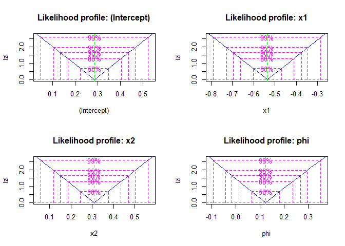
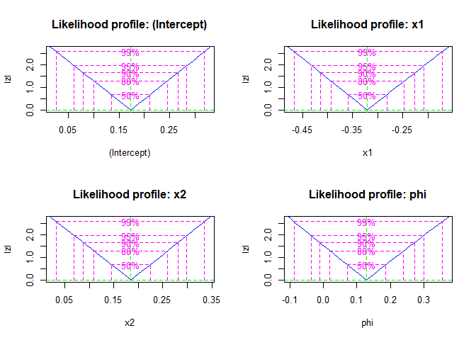
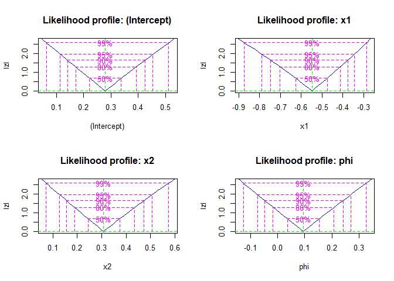
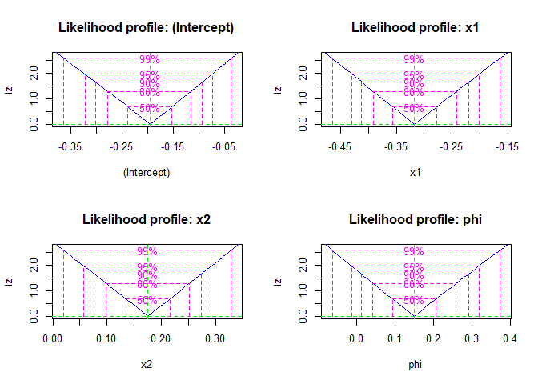
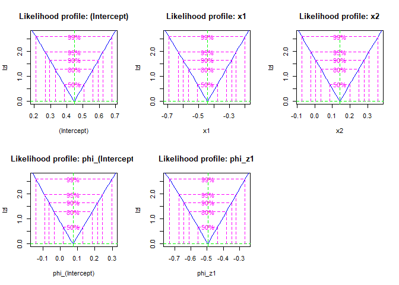
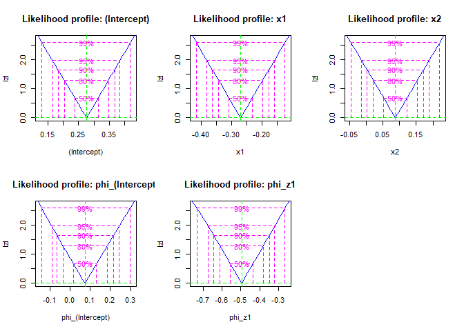
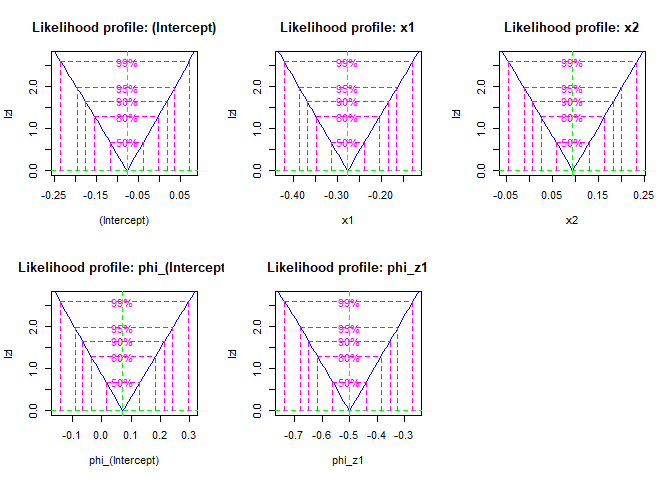

<style>
body {
text-align: justify}
</style>
<!-- README.md is generated from README.Rmd. Please edit that file -->
<!-- README.md is generated from README.Rmd. Please edit that file -->

# betaregscale <a href="https://evandeilton.github.io/betaregscale/"></a>

<!-- badges: start -->

[](https://github.com/evandeilton/betaregscale/actions/workflows/pkgdown.yaml)
<!-- badges: end -->

O pacote `betaregscale` oferece uma biblioteca de funções em R para
ajuste de modelos de regressão beta para dados oriundos de escalas
mapeáveis no suporte da distribuição beta, como por exemplo Escaldas de
dor, Likert entre outras, do modo que a incertea do instrumento é
avaliada de forma intervalar. O *framework* aqui suporta modelos com
dispersão fixa ou variável, tudo no paradigma de máxima verossimilhança.
São oferecidas ainda, funções para simulações e avaliação do desempenho
dos modelos no processo de estimação e outras para akjuste do modelo a
dados reais. O código-fonte e contribuições podem ser acessados no
repositório oficial do GitHub. Informações detalhadas sobre instalação e
uso estão disponíveis na documentação do pacote.

O `betaregscale` é voltado para modelagem de dados com variável resposta
mapeável em intervalo contínuo, e.g., $y = (y_s;y_i)$, abrangendo
censura à esquerda, direita ou intervalar independente do tempo.
Aplica-se em pesquisas de opinião, avaliações de produtos, escalas de
dor no estilo NRS-11, NRS-21 e NRS-101, avaliações de compostos
químicos, entre outros. Utilizando a distribuição beta, acomoda
características dos dados em estrutura de regressão, associando
variáveis explicativas à variável resposta intervalar e permitindo
preditores lineares para coeficientes relacionados à média e dispersão,
fornecendo estimativas robustas e confiáveis dos parâmetros do modelo.

## Principais funcionalidades

Entre as principais funcionalidades ten-se:

- Ajuste de modelos de regressão beta com dispersão fixa e variável.
- Funções para simulação de dados, permitindo a avaliação do desempenho
  dos modelos em diferentes cenários.
- Estatística de bondade do ajuste como AIC e BIC, por exemplo em
  `gof()`.
- Funções genéricas como `coef`, `vcov`, `fitted`, `residuals`,
  `summary` e `print` foram implementadas para a classe `betaregscale`
  para facilitar o acesso às medidas do ajuste.
- Funções para ajuste e comparação de modelos com diferentes combinações
  de variáveis explicativas tanto para $\mu$ como $\phi$.

> Acesse a documentação detalhada de cada função e exemplos de uso neste
> site para obter informações sobre como utilizar o pacote
> `betaregscale` em suas análises.

## Instalação

Você pode instalar o pacote com esse comando abaixo.

``` r
if(!require(betaregscale)){
  devtools::install_github("evandeilton/betaregscale")  
}
require(betaregscale, quietly = TRUE)
```

## Exemplos

Esses são alguns exemplos de uso das funções do pacote.

### Simula dados do modelo beta intervalar com dispersão fixa

Esta função gera amostras de variável beta com dispersão fixa usando
várias funções de ligação.

No exemplo a seguir em código R, demonstramos como usar a função
`betaregscale_simula_dados` para simular dados de variável beta com
dispersão fixa:

- Criamos um conjunto de dados com 100 observações e duas variáveis
  explicativas independentes (x1 e x2) a partir de uma distribuição
  normal.
- Utilizamos a função beta_ordinal_simula_dados para simular dados com
  parâmetros personalizados fornecidos.

> OBS.: `type` é o tipo de tratamento do intervalo `m` centraliza `y` ao
> meio. Ex. Se foi coletado o valor $y = 6$, transforma-se
> $y_t = 6/10 = 0.6$. Assim, para tratar a incerteza do instrumento,
> sugere-se que a medida anotada pode estar limitada a $y_{left} = 5.5$
> e $y_{right} = 6.6$.

``` r
# Criar um conjunto de dados de exemplo
set.seed(4255)
n <- 200
dados <- data.frame(x1 = rnorm(n),
                    x2 = rnorm(n))

dados_simulados <- betaregscale_simula_dados(
  formula = ~ x1 + x2,
  dados = dados,
  betas = c(0.3, -0.6, 0.4),
  phi = 1/10,
  link = "logit",
  link_phi = "logit",
  ncuts = 100,
  type = "m",
  repar = "2"
)
dados_simulados %>%
  head() %>%
  knitr::kable(digits = 6, caption = "")
```

|  left |   right |      yt |   y |        x1 |        x2 |
|------:|--------:|--------:|----:|----------:|----------:|
| 0.005 | 0.01500 | 0.01000 |   1 |  1.951024 | -0.558840 |
| 0.665 | 0.67500 | 0.67000 |  67 |  0.772539 | -0.071061 |
| 0.285 | 0.29500 | 0.29000 |  29 |  0.726408 |  0.469168 |
| 0.895 | 0.90500 | 0.90000 |  90 |  0.048740 |  0.111298 |
| 0.315 | 0.32500 | 0.32000 |  32 | -0.544501 | -0.561158 |
| 0.995 | 0.99999 | 0.99999 | 100 |  0.360029 |  0.018664 |

### Ajuste de modelos com dispersão fixa

- Exemplo do ajuste com optim direto para uma lista de links

``` r
links <- c("logit","probit","cauchit","cloglog")
names(links) <- links

fit_fixo <- purrr::map(links, .f = function(link){
  betaregscale(
    formula = y ~ x1 + x2,
    dados = dados_simulados,
    link = link,
    link_phi = "logit",
    repar = "2",
    num_hessiana = TRUE)
})
```

- Resumo das estimativas e bondade

- Estimativas do ajuste e Bondade

``` r
resumo <- purrr::map(fit_fixo, function(fit){
  summary(fit)
})
```

``` r
purrr::map_df(resumo, function(res){
  res$est
  }, .id = "link") %>% 
  knitr::kable(digits = 6, caption = "")  
```

| link    | variable    |  estimate |  ci_lower |  ci_upper |       se |   t_value |  p_value |
|:--------|:------------|----------:|----------:|----------:|---------:|----------:|---------:|
| logit   | (Intercept) |  0.285958 |  0.105043 |  0.466872 | 0.092305 |  3.097969 | 0.002235 |
| logit   | x1          | -0.535849 | -0.726451 | -0.345246 | 0.097248 | -5.510131 | 0.000000 |
| logit   | x2          |  0.309824 |  0.119457 |  0.500191 | 0.097128 |  3.189862 | 0.001658 |
| logit   | phi         |  0.122371 | -0.046731 |  0.291473 | 0.086278 |  1.418329 | 0.157683 |
| probit  | (Intercept) |  0.172830 |  0.061790 |  0.283870 | 0.056654 |  3.050608 | 0.002600 |
| probit  | x1          | -0.320602 | -0.432574 | -0.208631 | 0.057130 | -5.611855 | 0.000000 |
| probit  | x2          |  0.185124 |  0.070543 |  0.299706 | 0.058461 |  3.166636 | 0.001789 |
| probit  | phi         |  0.128801 | -0.039429 |  0.297031 | 0.085833 |  1.500601 | 0.135068 |
| cauchit | (Intercept) |  0.279274 |  0.110607 |  0.447942 | 0.086056 |  3.245248 | 0.001380 |
| cauchit | x1          | -0.548090 | -0.769094 | -0.327086 | 0.112759 | -4.860709 | 0.000002 |
| cauchit | x2          |  0.308322 |  0.121243 |  0.495402 | 0.095451 |  3.230177 | 0.001451 |
| cauchit | phi         |  0.094684 | -0.077021 |  0.266388 | 0.087606 |  1.080790 | 0.281118 |
| cloglog | (Intercept) | -0.194945 | -0.318825 | -0.071064 | 0.063206 | -3.084296 | 0.002335 |
| cloglog | x1          | -0.317336 | -0.430945 | -0.203728 | 0.057965 | -5.474660 | 0.000000 |
| cloglog | x2          |  0.175157 |  0.058389 |  0.291926 | 0.059577 |  2.940015 | 0.003677 |
| cloglog | phi         |  0.149242 | -0.016905 |  0.315388 | 0.084770 |  1.760547 | 0.079875 |

``` r
purrr::map_df(resumo, function(res){
  res$gof
  }, .id = "link") %>% 
  knitr::kable(digits = 6, caption = "")
```

| link    |    logLik |      AIC |      BIC |
|:--------|----------:|---------:|---------:|
| logit   | -798.1895 | 1606.379 | 1622.870 |
| probit  | -798.5201 | 1607.040 | 1623.532 |
| cauchit | -796.5680 | 1603.136 | 1619.628 |
| cloglog | -799.7853 | 1609.571 | 1626.062 |

- Exemplo do ajuste com `bbmle` direto para uma lista de links

``` r
require(bbmle, quietly = TRUE)
links <- c("logit","probit","cauchit","cloglog")
names(links) <- links

fit_fixo_bbmle <- purrr::map(links, .f = function(link){
  betaregscale_bbmle(
    formula = y ~ x1 + x2,
    dados = dados_simulados,
    link = link,
    link_phi = "logit",
    repar = "2",
    num_hessiana = TRUE)
})
```

- Gráficos dos perfis de verossimilhança

``` r
fit_fixo_profiles <- purrr::map(fit_fixo_bbmle, profile)
purrr::walk(names(fit_fixo_profiles), function(p){
  cat("\n+", p, "\n")
  plot(fit_fixo_profiles[[p]])
})
```

- logit
  
- probit
  
- cauchit
  
- cloglog
  

### Simula dados do modelo beta intervalar com dispersão variável

Neste bloco de código R, é criado um conjunto de dados simulados de um
modelo beta com dispersão variável utilizando a função
`betaregscale_simula_dados_z.` O processo é resumido abaixo:

- Definir semente e tamanho da amostra, além das fórmulas para as
  variáveis explicativas x e z.

- Criar um conjunto de dados de exemplo com 50 observações e quatro
  variáveis independentes (x1, x2, z1 e z2), geradas a partir de
  distribuições normal e uniforme.

- Utilizar a função `betaregscale_simula_dados_z` para gerar dados
  simulados com base nos parâmetros fornecidos, como fórmulas,
  coeficientes de regressão, funções de ligação e número de pontos de
  corte.

``` r
# Criar um conjunto de dados de exemplo
set.seed(2222)
n <- 200
fx <- ~ x1 + x2 + x3
fz <- ~ z1 + z2

dados <- data.frame(
  x1 = rnorm(n),
  x2 = rnorm(n),
  x3 = rbinom(n, size = 1, prob = 1/2),
  z1 = rnorm(n),
  z2 = rnorm(n)
)

dados_simulados <- betaregscale_simula_dados_z(
  formula_x = fx,
  formula_z = fz,
  dados = dados,
  betas = c(0.2, -0.6, 0.2, 0.2),
  zetas = c(0.2, -0.8, 0.6),
  link = "logit",
  link_phi = "logit",
  ncuts = 100,
  type = "m",
  repar = "2"
)

dados_simulados %>% 
  head() %>%
  knitr::kable(digits = 6, caption = "")
```

|  left |   right |      yt |   y |        x1 |        x2 |  x3 |        z1 |        z2 |
|------:|--------:|--------:|----:|----------:|----------:|----:|----------:|----------:|
| 0.995 | 0.99999 | 0.99999 | 100 | -0.338062 | -0.421044 |   1 |  0.446492 |  0.688665 |
| 0.995 | 0.99999 | 0.99999 | 100 |  0.939164 |  0.679178 |   0 | -0.257052 |  0.782745 |
| 0.975 | 0.98500 | 0.98000 |  98 |  1.737719 | -0.922568 |   0 |  2.429594 |  1.117668 |
| 0.785 | 0.79500 | 0.79000 |  79 |  0.696326 | -0.152152 |   0 | -0.037938 |  0.373224 |
| 0.575 | 0.58500 | 0.58000 |  58 |  0.462296 | -0.642230 |   0 |  0.316763 | -1.160381 |
| 0.415 | 0.42500 | 0.42000 |  42 | -0.315087 |  0.792150 |   0 | -1.136686 | -0.836590 |

### Ajuste de modelos com dispersão variável

- Exemplo do ajuste com optim direto para uma lista de links

``` r
links <- c("logit","probit","cauchit","cloglog")
names(links) <- links

fit_variavel <- purrr::map(links, .f = function(link){
  betaregscale(
    formula = y ~x1 + x2 | z1,
    dados = dados_simulados,
    link = link,
    link_phi = "logit",
    repar = "2",
    num_hessiana = TRUE)
})
```

- Resumo das estimativas e bondade

``` r
resumo <- purrr::map(fit_variavel, function(fit){
  summary(fit)
})
```

- Estimativas do ajuste e Bondade

``` r
purrr::map_df(resumo, function(res){
  res$est
  }, .id = "link") %>% 
  knitr::kable(digits = 6, caption = "")  
```

| link    | variable         |  estimate |  ci_lower |  ci_upper |       se |   t_value |  p_value |
|:--------|:-----------------|----------:|----------:|----------:|---------:|----------:|---------:|
| logit   | (Intercept)      |  0.445794 |  0.267268 |  0.624321 | 0.091087 |  4.894188 | 0.000002 |
| logit   | x1               | -0.442042 | -0.627710 | -0.256374 | 0.094730 | -4.666323 | 0.000006 |
| logit   | x2               |  0.141964 | -0.021257 |  0.305185 | 0.083278 |  1.704705 | 0.089842 |
| logit   | phi\_(Intercept) |  0.073326 | -0.094114 |  0.240766 | 0.085430 |  0.858316 | 0.391772 |
| logit   | phi_z1           | -0.494942 | -0.670041 | -0.319843 | 0.089338 | -5.540124 | 0.000000 |
| probit  | (Intercept)      |  0.275973 |  0.166338 |  0.385609 | 0.055938 |  4.933600 | 0.000002 |
| probit  | x1               | -0.270047 | -0.381192 | -0.158902 | 0.056708 | -4.762096 | 0.000004 |
| probit  | x2               |  0.087677 | -0.012760 |  0.188113 | 0.051244 |  1.710962 | 0.088678 |
| probit  | phi\_(Intercept) |  0.073199 | -0.094215 |  0.240613 | 0.085417 |  0.856963 | 0.392517 |
| probit  | phi_z1           | -0.496055 | -0.671092 | -0.321018 | 0.089306 | -5.554533 | 0.000000 |
| cauchit | (Intercept)      |  0.374931 |  0.213981 |  0.535880 | 0.082119 |  4.565727 | 0.000009 |
| cauchit | x1               | -0.392204 | -0.574332 | -0.210077 | 0.092924 | -4.220707 | 0.000037 |
| cauchit | x2               |  0.121876 | -0.022106 |  0.265857 | 0.073461 |  1.659042 | 0.098715 |
| cauchit | phi\_(Intercept) |  0.078629 | -0.088212 |  0.245471 | 0.085125 |  0.923693 | 0.356788 |
| cauchit | phi_z1           | -0.489545 | -0.665069 | -0.314022 | 0.089554 | -5.466450 | 0.000000 |
| cloglog | (Intercept)      | -0.077662 | -0.193872 |  0.038549 | 0.059292 | -1.309818 | 0.191798 |
| cloglog | x1               | -0.276700 | -0.387856 | -0.165545 | 0.056713 | -4.878953 | 0.000002 |
| cloglog | x2               |  0.094747 | -0.010419 |  0.199913 | 0.053657 |  1.765786 | 0.078997 |
| cloglog | phi\_(Intercept) |  0.072089 | -0.095219 |  0.239397 | 0.085363 |  0.844500 | 0.399425 |
| cloglog | phi_z1           | -0.500790 | -0.675649 | -0.325930 | 0.089216 | -5.613244 | 0.000000 |

``` r
purrr::map_df(resumo, function(res){
  res$gof
  }, .id = "link") %>% 
  knitr::kable(digits = 6, caption = "")
```

| link    |    logLik |      AIC |      BIC |
|:--------|----------:|---------:|---------:|
| logit   | -800.7512 | 1613.502 | 1633.292 |
| probit  | -800.7324 | 1613.465 | 1633.255 |
| cauchit | -801.0642 | 1614.128 | 1633.918 |
| cloglog | -800.5678 | 1613.136 | 1632.925 |

- Exemplo do ajuste com `bbmle` direto para uma lista de links

``` r
require(bbmle, quietly = TRUE)
links <- c("logit","probit","cloglog")
names(links) <- links

fit_variavel_bbmle <- purrr::map(links, .f = function(link){
  betaregscale_bbmle(
    formula = y ~ x1 + x2 | z1,
    dados = dados_simulados,
    link = link,
    link_phi = "logit",
    lim = 0.5,
    repar = "2",
    num_hessiana = FALSE)
})
```

- Gráficos dos perfis de verossimilhança

``` r
fit_variavel_profiles <- purrr::map(fit_variavel_bbmle, function(m){
  out <- try(profile(m))
  if(!inherits(out, "try-error")){
    return(out)
  }
})
purrr::walk(names(fit_variavel_profiles), function(p){
  cat("\n+", p, "\n")
  plot(fit_variavel_profiles[[p]])
})
```

- logit
  
- probit
  
- cloglog
  

### Outras funções genéricas

``` r
## Resumo das estimativas e bondades
summary(fit_fixo$logit)

## Coeficientes do modelo
coef(fit_fixo$logit)

## Matriz de covariâncias
vcov(fit_fixo$logit)

## Resíduo dos valores preditos em relação ao ponto médio do intervalo de y, 
## isto é (left + right) / 2
resid(fit_fixo$logit)

## Valores preditos
fitted(fit_fixo$logit)

## Print do modelo
print(fit_fixo$logit)
```

------------------------------------------------------------------------

## Work in progress …


