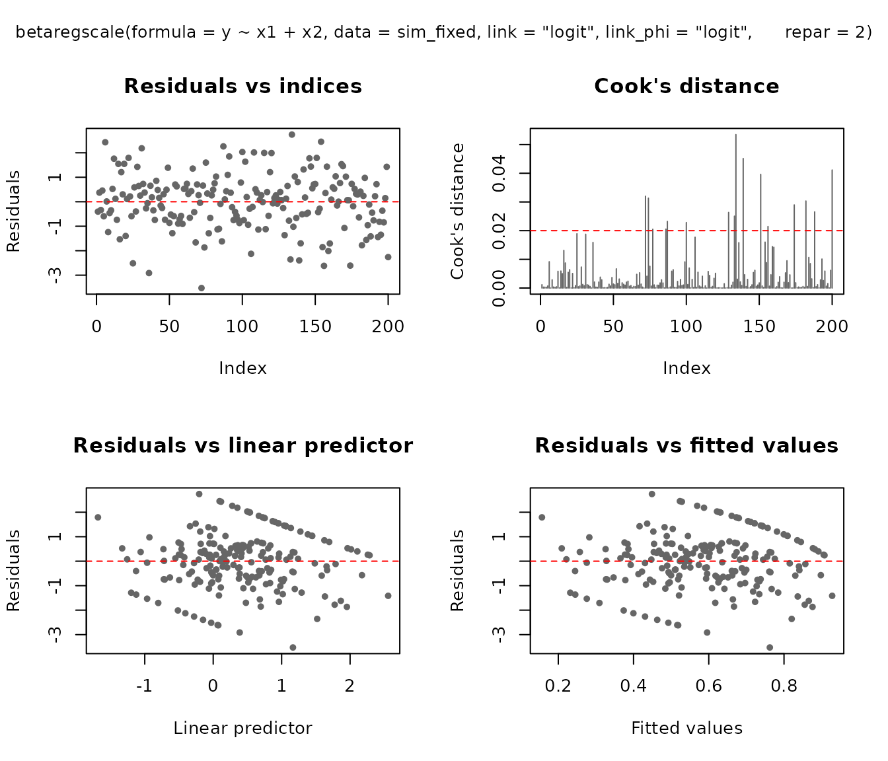
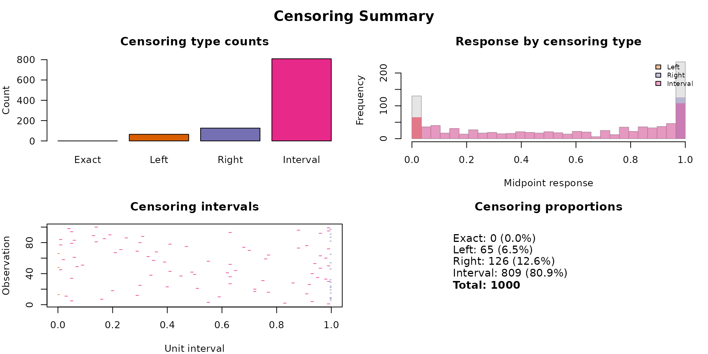
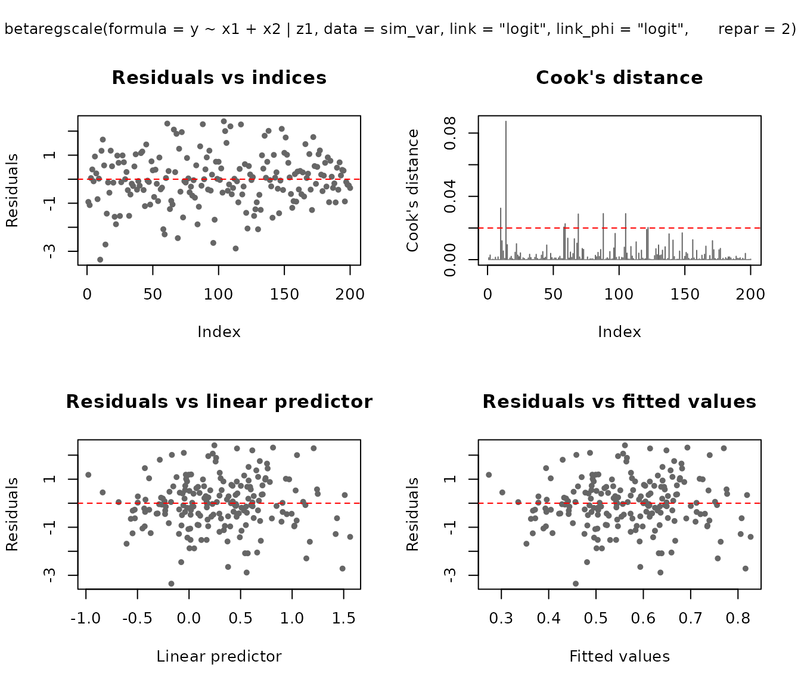

# Introduction to betaregscale

## Overview

The **betaregscale** package provides maximum-likelihood estimation of
beta regression models for responses derived from bounded rating scales.
Common examples include pain intensity scales (NRS-11, NRS-21, NRS-101),
Likert-type scales, product quality ratings, and any instrument whose
response can be mapped to the open interval $(0,1)$.

The key idea is that a discrete score recorded on a bounded scale
carries measurement uncertainty inherent to the instrument. For
instance, a pain score of $y = 6$ on a 0–10 NRS is not an exact value
but rather represents a range: after rescaling to $(0,1)$, the
observation is treated as interval-censored in
$\lbrack 0.55,0.65\rbrack$. The package uses the beta distribution to
model such data, building a complete likelihood that supports mixed
censoring types within the same dataset.

## Installation

``` r
# Development version from GitHub:
# install.packages("remotes")
remotes::install_github("evandeilton/betaregscale")
```

``` r
library(betaregscale)
```

## Censoring types

The complete likelihood (Lopes, 2024, Eq. 2.24) supports four censoring
types, automatically classified by
[`check_response()`](https://evandeilton.github.io/betaregscale/reference/check_response.md):

| $\delta$ | Type                     | Likelihood contribution                                                       |
|:--------:|:-------------------------|:------------------------------------------------------------------------------|
|    0     | Exact (uncensored)       | $f\left( y_{i};\, a_{i},b_{i} \right)$                                        |
|    1     | Left-censored ($y = 0$)  | $F\left( u_{i};\, a_{i},b_{i} \right)$                                        |
|    2     | Right-censored ($y = K$) | $1 - F\left( l_{i};\, a_{i},b_{i} \right)$                                    |
|    3     | Interval-censored        | $F\left( u_{i};\, a_{i},b_{i} \right) - F\left( l_{i};\, a_{i},b_{i} \right)$ |

where $f( \cdot )$ and $F( \cdot )$ are the beta density and CDF,
$\left\lbrack l_{i},u_{i} \right\rbrack$ are the interval endpoints, and
$\left( a_{i},b_{i} \right)$ are the beta shape parameters derived from
$\mu_{i}$ and $\phi_{i}$ via the chosen reparameterization.

## Interval construction

Scale observations are mapped to $(0,1)$ with uncertainty intervals
controlled by the `type` argument:

- `"m"` (midpoint): $y_{t} = y/K$, interval
  $\left\lbrack y_{t} - 0.5/K,\; y_{t} + 0.5/K \right\rbrack$
- `"l"` (left-aligned): $y_{t} = y/K$, interval
  $\left\lbrack y_{t},\; y_{t} + 1/K \right\rbrack$
- `"r"` (right-aligned): $y_{t} = y/K$, interval
  $\left\lbrack y_{t} - 1/K,\; y_{t} \right\rbrack$

where $K$ is the number of scale categories (`ncuts`).

``` r
# Illustrate check_response with a 0-10 NRS scale
y_example <- c(0, 3, 5, 7, 10)
cr <- check_response(y_example, ncuts = 10)
cr
#>         left   right      yt  y delta
#> [1,] 0.00001 0.05000 0.00001  0     1
#> [2,] 0.25000 0.35000 0.30000  3     3
#> [3,] 0.45000 0.55000 0.50000  5     3
#> [4,] 0.65000 0.75000 0.70000  7     3
#> [5,] 0.95000 0.99999 0.99999 10     2
```

The `delta` column shows that $y = 0$ is left-censored ($\delta = 1$),
$y = 10$ is right-censored ($\delta = 2$), and all interior values are
interval-censored ($\delta = 3$).

## Data preparation with `bs_prepare()`

In practice, analysts may want to supply their own censoring indicators
or interval endpoints rather than relying on the automatic
classification of
[`check_response()`](https://evandeilton.github.io/betaregscale/reference/check_response.md).
The
[`bs_prepare()`](https://evandeilton.github.io/betaregscale/reference/bs_prepare.md)
function provides a flexible, validated bridge between raw analyst data
and
[`betaregscale()`](https://evandeilton.github.io/betaregscale/reference/betaregscale.md).

It supports four input modes:

### Mode 1: Score only (automatic)

``` r
# Equivalent to check_response <U+2014> delta inferred from y
d1 <- data.frame(y = c(0, 3, 5, 7, 10), x1 = rnorm(5))
bs_prepare(d1, ncuts = 10)
#> bs_prepare: n = 5 | exact = 0, left = 1, right = 1, interval = 3
#>      left   right      yt  y delta           x1
#> 1 0.00001 0.05000 0.00001  0     1 -1.400043517
#> 2 0.25000 0.35000 0.30000  3     3  0.255317055
#> 3 0.45000 0.55000 0.50000  5     3 -2.437263611
#> 4 0.65000 0.75000 0.70000  7     3 -0.005571287
#> 5 0.95000 0.99999 0.99999 10     2  0.621552721
```

### Mode 2: Score + explicit censoring indicator

``` r
# Analyst specifies delta directly
d2 <- data.frame(
  y     = c(50, 0, 99, 50),
  delta = c(0, 1, 2, 3),
  x1    = rnorm(4)
)
bs_prepare(d2, ncuts = 100)
#> Warning: Observation(s) 3: delta = 2 (right-censored) but y != 100.
#> bs_prepare: n = 4 | exact = 1, left = 1, right = 1, interval = 1
#>      left   right      yt  y delta         x1
#> 1 0.50000 0.50000 0.50000 50     0  1.1484116
#> 2 0.00001 0.00500 0.00001  0     1 -1.8218177
#> 3 0.99500 0.99999 0.99999 99     2 -0.2473253
#> 4 0.49500 0.50500 0.50000 50     3 -0.2441996
```

### Mode 3: Interval endpoints with NA patterns

When the analyst provides `left` and/or `right` columns, censoring is
inferred from the NA pattern:

``` r
d3 <- data.frame(
  left  = c(NA, 20, 30, NA),
  right = c(5, NA, 45, NA),
  y     = c(NA, NA, NA, 50),
  x1    = rnorm(4)
)
bs_prepare(d3, ncuts = 100)
#> bs_prepare: n = 4 | exact = 1, left = 1, right = 1, interval = 1
#>    left   right    yt  y delta         x1
#> 1 1e-05 0.05000 0.025 NA     1 -0.2827054
#> 2 2e-01 0.99999 0.600 NA     2 -0.5536994
#> 3 3e-01 0.45000 0.375 NA     3  0.6289820
#> 4 5e-01 0.50000 0.500 50     0  2.0650249
```

### Mode 4: Analyst-supplied intervals

When the analyst provides `y`, `left`, and `right` simultaneously, their
endpoints are used directly (rescaled by $K$):

``` r
d4 <- data.frame(
  y     = c(50, 75),
  left  = c(48, 73),
  right = c(52, 77),
  x1    = rnorm(2)
)
bs_prepare(d4, ncuts = 100)
#> bs_prepare: n = 2 | exact = 0, left = 0, right = 0, interval = 2
#>   left right   yt  y delta         x1
#> 1 0.48  0.52 0.50 50     3 -1.6309894
#> 2 0.73  0.77 0.75 75     3  0.5124269
```

### Using prepared data with `betaregscale()`

Data processed by
[`bs_prepare()`](https://evandeilton.github.io/betaregscale/reference/bs_prepare.md)
is automatically detected by
[`betaregscale()`](https://evandeilton.github.io/betaregscale/reference/betaregscale.md)
— the internal
[`check_response()`](https://evandeilton.github.io/betaregscale/reference/check_response.md)
step is skipped:

``` r
set.seed(42)
n <- 1000
dat <- data.frame(x1 = rnorm(n), x2 = rnorm(n))
sim <- betaregscale_simulate(
  formula = ~ x1 + x2, data = dat,
  beta = c(0.2, -0.5, 0.3), phi = 1 / 5,
  link = "logit", link_phi = "logit",
  repar = 2
)
prep <- bs_prepare(sim, ncuts = 100)
#> bs_prepare: n = 1000 | exact = 0, left = 71, right = 106, interval = 823
fit_prep <- betaregscale(y ~ x1 + x2,
  data = prep, repar = 2,
  link = "logit", link_phi = "logit"
)
#> Warning in betaregscale_fit(formula = formula, data = data, link = link, : The
#> 'type' argument of betaregscale_fit() is deprecated and will be removed in a
#> future version. Use bs_prepare() to control interval geometry.
summary(fit_prep)
#> 
#> Call:
#> betaregscale(formula = y ~ x1 + x2, data = prep, link = "logit", 
#>     link_phi = "logit", repar = 2)
#> 
#> Quantile residuals:
#>     Min      1Q  Median      3Q     Max 
#> -3.9434 -0.5715  0.2788  0.6560  1.3786 
#> 
#> Coefficients (mean model with logit link):
#>             Estimate Std. Error  z value Pr(>|z|)    
#> (Intercept) -5.11254    0.03821 -133.798  < 2e-16 ***
#> x1          -0.29458    0.02680  -10.990  < 2e-16 ***
#> x2           0.18828    0.02695    6.986 2.83e-12 ***
#> ---
#> Signif. codes:  0 '***' 0.001 '**' 0.01 '*' 0.05 '.' 0.1 ' ' 1
#> 
#> Phi coefficients (precision model with logit link):
#>       Estimate Std. Error z value Pr(>|z|)    
#> (phi) -4.88273    0.05962   -81.9   <2e-16 ***
#> ---
#> Signif. codes:  0 '***' 0.001 '**' 0.01 '*' 0.05 '.' 0.1 ' ' 1
#> ---
#> Log-likelihood: -4517.3759 on 4 Df
#> Pseudo R-squared: 0.1010 
#> Number of iterations: 35 (BFGS) 
#> Censoring: 823 interval | 71 left | 106 right
```

## Example 1: Fixed dispersion model

### Simulating data

We simulate 200 observations from a beta regression model with fixed
dispersion, two covariates, and logit link for the mean.

``` r
set.seed(4255)
n <- 1000
dat <- data.frame(x1 = rnorm(n), x2 = rnorm(n))

sim_fixed <- betaregscale_simulate(
  formula  = ~ x1 + x2,
  data     = dat,
  beta     = c(0.3, -0.6, 0.4),
  phi      = 1 / 10,
  link     = "logit",
  link_phi = "logit",
  ncuts    = 100,
  type     = "m",
  repar    = 2
)
#> Warning in betaregscale_simulate(formula = ~x1 + x2, data = dat, beta = c(0.3,
#> : The 'type' argument of betaregscale_simulate() is deprecated and will be
#> removed in a future version. Use bs_prepare() to control interval geometry.

head(sim_fixed)
#>      left right      yt  y delta          x1         x2
#> 1 0.16500 0.175 0.17000 17     3  1.95102377  0.2888356
#> 2 0.98500 0.995 0.99000 99     3  0.77253858  1.6102584
#> 3 0.00001 0.005 0.00001  0     1  0.72640816  1.0542434
#> 4 0.57500 0.585 0.58000 58     3  0.04873961 -0.4923176
#> 5 0.09500 0.105 0.10000 10     3 -0.54450108 -1.4098059
#> 6 0.06500 0.075 0.07000  7     3  0.36002855 -1.0115571
```

The default midpoint interval type means that each observation is
centered in its interval. For example, a score of 67 on a 0–100 scale
yields $y_{t} = 0.67$ with interval $\lbrack 0.665,0.675\rbrack$.

### Fitting the model

``` r
fit_fixed <- betaregscale(
  y ~ x1 + x2,
  data     = sim_fixed,
  link     = "logit",
  link_phi = "logit",
  repar    = 2
)
#> Warning in betaregscale_fit(formula = formula, data = data, link = link, : The
#> 'type' argument of betaregscale_fit() is deprecated and will be removed in a
#> future version. Use bs_prepare() to control interval geometry.
summary(fit_fixed)
#> 
#> Call:
#> betaregscale(formula = y ~ x1 + x2, data = sim_fixed, link = "logit", 
#>     link_phi = "logit", repar = 2)
#> 
#> Quantile residuals:
#>     Min      1Q  Median      3Q     Max 
#> -3.4331 -0.6619  0.0070  0.7339  3.0637 
#> 
#> Coefficients (mean model with logit link):
#>             Estimate Std. Error z value Pr(>|z|)    
#> (Intercept)  0.30604    0.04312   7.097 1.28e-12 ***
#> x1          -0.60332    0.04530 -13.317  < 2e-16 ***
#> x2           0.44135    0.04385  10.066  < 2e-16 ***
#> ---
#> Signif. codes:  0 '***' 0.001 '**' 0.01 '*' 0.05 '.' 0.1 ' ' 1
#> 
#> Phi coefficients (precision model with logit link):
#>       Estimate Std. Error z value Pr(>|z|)   
#> (phi)  0.10991    0.04057   2.709  0.00674 **
#> ---
#> Signif. codes:  0 '***' 0.001 '**' 0.01 '*' 0.05 '.' 0.1 ' ' 1
#> ---
#> Log-likelihood: -4035.2262 on 4 Df
#> Pseudo R-squared: 0.2393 
#> Number of iterations: 39 (BFGS) 
#> Censoring: 809 interval | 65 left | 126 right
```

The summary output follows the `betareg` package style, showing separate
coefficient tables for the mean and precision submodels, with Wald
z-tests and $p$-values based on the standard normal distribution.

### Goodness of fit

``` r
gof(fit_fixed)
#>      logLik      AIC      BIC pseudo_r2
#> 1 -4035.226 8078.452 8098.083  0.239315
```

### Comparing link functions

The package supports several link functions for the mean submodel. We
can compare them using information criteria:

``` r
links <- c("logit", "probit", "cauchit", "cloglog")
fits <- lapply(setNames(links, links), function(lnk) {
  betaregscale(y ~ x1 + x2, data = sim_fixed, link = lnk, repar = 2)
})
#> Warning in betaregscale_fit(formula = formula, data = data, link = link, : The
#> 'type' argument of betaregscale_fit() is deprecated and will be removed in a
#> future version. Use bs_prepare() to control interval geometry.
#> Warning in betaregscale_fit(formula = formula, data = data, link = link, : The
#> 'type' argument of betaregscale_fit() is deprecated and will be removed in a
#> future version. Use bs_prepare() to control interval geometry.
#> Warning in betaregscale_fit(formula = formula, data = data, link = link, : The
#> 'type' argument of betaregscale_fit() is deprecated and will be removed in a
#> future version. Use bs_prepare() to control interval geometry.
#> Warning in betaregscale_fit(formula = formula, data = data, link = link, : The
#> 'type' argument of betaregscale_fit() is deprecated and will be removed in a
#> future version. Use bs_prepare() to control interval geometry.

# Estimates
est_table <- do.call(rbind, lapply(names(fits), function(lnk) {
  e <- est(fits[[lnk]])
  e$link <- lnk
  e
}))
est_table
#>       variable   estimate         se    z_value      p_value    ci_lower
#> 1  (Intercept)  0.3060440 0.04312435   7.096780 1.276975e-12  0.22152185
#> 2           x1 -0.6033155 0.04530453 -13.316890 1.846396e-40 -0.69211077
#> 3           x2  0.4413494 0.04384507  10.066111 7.800150e-24  0.35541462
#> 4        (phi)  0.1099131 0.04056639   2.709462 6.739243e-03  0.03040443
#> 5  (Intercept)  0.1865515 0.02619220   7.122409 1.060568e-12  0.13521578
#> 6           x1 -0.3652474 0.02663952 -13.710732 8.757029e-43 -0.41745989
#> 7           x2  0.2668812 0.02611963  10.217650 1.652993e-24  0.21568767
#> 8        (phi)  0.1118451 0.04051860   2.760338 5.774155e-03  0.03243005
#> 9  (Intercept)  0.2765516 0.04086691   6.767127 1.313647e-11  0.19645391
#> 10          x1 -0.5595132 0.04925738 -11.358973 6.692662e-30 -0.65605589
#> 11          x2  0.4092917 0.04464584   9.167523 4.840110e-20  0.32178752
#> 12       (phi)  0.1098255 0.04056937   2.707105 6.787281e-03  0.03031104
#> 13 (Intercept) -0.1949445 0.02881644  -6.765044 1.332688e-11 -0.25142369
#> 14          x1 -0.3814461 0.02769930 -13.770966 3.810830e-43 -0.43573575
#> 15          x2  0.2779569 0.02703699  10.280617 8.617404e-25  0.22496541
#> 16       (phi)  0.1203423 0.04032397   2.984387 2.841474e-03  0.04130879
#>      ci_upper    link
#> 1   0.3905662   logit
#> 2  -0.5145203   logit
#> 3   0.5272841   logit
#> 4   0.1894218   logit
#> 5   0.2378873  probit
#> 6  -0.3130349  probit
#> 7   0.3180747  probit
#> 8   0.1912601  probit
#> 9   0.3566493 cauchit
#> 10 -0.4629705 cauchit
#> 11  0.4967960 cauchit
#> 12  0.1893401 cauchit
#> 13 -0.1384653 cloglog
#> 14 -0.3271565 cloglog
#> 15  0.3309485 cloglog
#> 16  0.1993758 cloglog

# Goodness of fit
gof_table <- do.call(rbind, lapply(fits, gof))
gof_table
#>            logLik      AIC      BIC pseudo_r2
#> logit   -4035.226 8078.452 8098.083 0.2393150
#> probit  -4035.685 8079.370 8099.001 0.2382638
#> cauchit -4035.500 8079.000 8098.631 0.1918217
#> cloglog -4037.563 8083.126 8102.757 0.1823572
```

### Residual diagnostics

The [`plot()`](https://rdrr.io/r/graphics/plot.default.html) method
provides six diagnostic panels. By default, the first four are shown:

``` r
plot(fit_fixed)
```



For ggplot2 output (requires the **ggplot2** package):

``` r
plot(fit_fixed, gg = TRUE)
```


### Predictions

``` r
# Fitted means
head(predict(fit_fixed, type = "response"))
#> [1] 0.3222258 0.6342855 0.5825087 0.5148343 0.5030832 0.4115366

# Conditional variance
head(predict(fit_fixed, type = "variance"))
#> [1] 0.1151933 0.1223514 0.1282719 0.1317466 0.1318576 0.1277349

# Quantile predictions
head(predict(fit_fixed, type = "quantile", at = c(0.25, 0.5, 0.75)))
#>          q_0.25     q_0.5    q_0.75
#> [1,] 0.01699962 0.1779476 0.6024063
#> [2,] 0.31481409 0.7508330 0.9674995
#> [3,] 0.23110586 0.6578331 0.9397720
#> [4,] 0.14442537 0.5287586 0.8860292
#> [5,] 0.13183539 0.5059798 0.8744926
#> [6,] 0.05648038 0.3311318 0.7600605
```

### Confidence intervals

Wald confidence intervals based on the asymptotic normal approximation:

``` r
confint(fit_fixed)
#>                   2.5 %     97.5 %
#> (Intercept)  0.22152185  0.3905662
#> x1          -0.69211077 -0.5145203
#> x2           0.35541462  0.5272841
#> (phi)        0.03040443  0.1894218
confint(fit_fixed, model = "mean")
#>                  2.5 %     97.5 %
#> (Intercept)  0.2215218  0.3905662
#> x1          -0.6921108 -0.5145203
#> x2           0.3554146  0.5272841
```

### Censoring structure

The
[`censoring_summary()`](https://evandeilton.github.io/betaregscale/reference/censoring_summary.md)
function provides a visual and tabular overview of the censoring types
in the fitted model:

``` r
censoring_summary(fit_fixed)
```



## Example 2: Variable dispersion model

In many applications, the dispersion parameter $\phi$ may depend on
covariates. The package supports variable-dispersion models using the
`Formula` package notation: `y ~ x1 + x2 | z1 + z2`, where the terms
after `|` define the linear predictor for $\phi$.

### Simulating data

``` r
set.seed(2222)
n <- 1000
dat_z <- data.frame(
  x1 = rnorm(n),
  x2 = rnorm(n),
  x3 = rbinom(n, size = 1, prob = 0.5),
  z1 = rnorm(n),
  z2 = rnorm(n)
)

sim_var <- betaregscale_simulate_z(
  formula_x = ~ x1 + x2 + x3,
  formula_z = ~ z1 + z2,
  data = dat_z,
  beta = c(0.2, -0.6, 0.2, 0.2),
  zeta = c(0.2, -0.8, 0.6),
  link = "logit",
  link_phi = "logit",
  ncuts = 100,
  repar = 2
)

head(sim_var)
#>      left right      yt  y delta         x1         x2 x3          z1
#> 1 0.26500 0.275 0.27000 27     3 -0.3380621 -0.8235432  0  0.03062031
#> 2 0.17500 0.185 0.18000 18     3  0.9391643 -1.7562699  0  0.19384974
#> 3 0.00001 0.005 0.00001  0     1  1.7377190 -1.3148242  1 -0.42828641
#> 4 0.52500 0.535 0.53000 53     3  0.6963261 -0.8195514  0  0.36942900
#> 5 0.08500 0.095 0.09000  9     3  0.4622959 -0.1182560  1  0.05528553
#> 6 0.95500 0.965 0.96000 96     3 -0.3150868 -0.0648210  1  0.71694347
#>           z2
#> 1 -1.1221809
#> 2 -0.2890842
#> 3  0.3479434
#> 4  0.2811058
#> 5 -1.2184445
#> 6 -0.5612588
```

### Fitting the model

``` r
fit_var <- betaregscale(
  y ~ x1 + x2 | z1,
  data     = sim_var,
  link     = "logit",
  link_phi = "logit",
  repar    = 2
)
#> Warning in betaregscale_fit_z(formula = formula, data = data, link = link, :
#> The 'type' argument of betaregscale_fit_z() is deprecated and will be removed
#> in a future version. Use bs_prepare() to control interval geometry.
summary(fit_var)
#> 
#> Call:
#> betaregscale(formula = y ~ x1 + x2 | z1, data = sim_var, link = "logit", 
#>     link_phi = "logit", repar = 2)
#> 
#> Quantile residuals:
#>     Min      1Q  Median      3Q     Max 
#> -4.4614 -0.6362  0.0056  0.6578  3.4202 
#> 
#> Coefficients (mean model with logit link):
#>             Estimate Std. Error z value Pr(>|z|)    
#> (Intercept)  0.27141    0.04245   6.394 1.62e-10 ***
#> x1          -0.54553    0.04375 -12.468  < 2e-16 ***
#> x2           0.17226    0.04141   4.160 3.18e-05 ***
#> ---
#> Signif. codes:  0 '***' 0.001 '**' 0.01 '*' 0.05 '.' 0.1 ' ' 1
#> 
#> Phi coefficients (precision model with logit link):
#>                   Estimate Std. Error z value Pr(>|z|)    
#> (phi)_(Intercept)  0.24653    0.04233   5.823 5.77e-09 ***
#> (phi)_z1          -0.72230    0.04507 -16.028  < 2e-16 ***
#> ---
#> Signif. codes:  0 '***' 0.001 '**' 0.01 '*' 0.05 '.' 0.1 ' ' 1
#> ---
#> Log-likelihood: -3922.2430 on 5 Df
#> Pseudo R-squared: 0.1159 
#> Number of iterations: 42 (BFGS) 
#> Censoring: 744 interval | 105 left | 151 right
```

Notice the `(phi)_` prefix in the precision coefficient names, following
the `betareg` convention.

### Accessing coefficients by submodel

``` r
# Full parameter vector
coef(fit_var)
#>       (Intercept)                x1                x2 (phi)_(Intercept) 
#>         0.2714053        -0.5455337         0.1722582         0.2465266 
#>          (phi)_z1 
#>        -0.7223034

# Mean submodel only
coef(fit_var, model = "mean")
#> (Intercept)          x1          x2 
#>   0.2714053  -0.5455337   0.1722582

# Precision submodel only
coef(fit_var, model = "precision")
#> (phi)_(Intercept)          (phi)_z1 
#>         0.2465266        -0.7223034

# Variance-covariance matrix for the mean submodel
vcov(fit_var, model = "mean")
#>               (Intercept)            x1           x2
#> (Intercept)  1.801851e-03 -7.620050e-05 4.312471e-05
#> x1          -7.620050e-05  1.914399e-03 2.137302e-05
#> x2           4.312471e-05  2.137302e-05 1.714705e-03
```

### Comparing link functions (variable dispersion)

``` r
links <- c("logit", "probit", "cauchit", "cloglog")
fits_var <- lapply(setNames(links, links), function(lnk) {
  betaregscale(y ~ x1 + x2 | z1, data = sim_var, link = lnk, repar = 2)
})
#> Warning in betaregscale_fit_z(formula = formula, data = data, link = link, :
#> The 'type' argument of betaregscale_fit_z() is deprecated and will be removed
#> in a future version. Use bs_prepare() to control interval geometry.
#> Warning in betaregscale_fit_z(formula = formula, data = data, link = link, :
#> The 'type' argument of betaregscale_fit_z() is deprecated and will be removed
#> in a future version. Use bs_prepare() to control interval geometry.
#> Warning in betaregscale_fit_z(formula = formula, data = data, link = link, :
#> The 'type' argument of betaregscale_fit_z() is deprecated and will be removed
#> in a future version. Use bs_prepare() to control interval geometry.
#> Warning in betaregscale_fit_z(formula = formula, data = data, link = link, :
#> The 'type' argument of betaregscale_fit_z() is deprecated and will be removed
#> in a future version. Use bs_prepare() to control interval geometry.

# Estimates
est_var <- do.call(rbind, lapply(names(fits_var), function(lnk) {
  e <- est(fits_var[[lnk]])
  e$link <- lnk
  e
}))
est_var
#>             variable   estimate         se    z_value      p_value    ci_lower
#> 1        (Intercept)  0.2714053 0.04244822   6.393797 1.618165e-10  0.18820830
#> 2                 x1 -0.5455337 0.04375384 -12.468246 1.112475e-35 -0.63128964
#> 3                 x2  0.1722582 0.04140899   4.159922 3.183568e-05  0.09109804
#> 4  (phi)_(Intercept)  0.2465266 0.04233361   5.823424 5.765393e-09  0.16355422
#> 5           (phi)_z1 -0.7223034 0.04506591 -16.027712 8.184127e-58 -0.81063101
#> 6        (Intercept)  0.1675402 0.02604987   6.431519 1.263347e-10  0.11648343
#> 7                 x1 -0.3351860 0.02618407 -12.801144 1.615539e-37 -0.38650587
#> 8                 x2  0.1056477 0.02529232   4.177066 2.952932e-05  0.05607566
#> 9  (phi)_(Intercept)  0.2467114 0.04232425   5.829080 5.573393e-09  0.16375741
#> 10          (phi)_z1 -0.7228855 0.04508355 -16.034353 7.354594e-58 -0.81124759
#> 11       (Intercept)  0.2313768 0.03790774   6.103682 1.036526e-09  0.15707898
#> 12                x1 -0.4748684 0.04383936 -10.832010 2.427663e-27 -0.56079197
#> 13                x2  0.1487280 0.03733542   3.983564 6.788945e-05  0.07555194
#> 14 (phi)_(Intercept)  0.2487158 0.04230585   5.878993 4.127710e-09  0.16579785
#> 15          (phi)_z1 -0.7182945 0.04497995 -15.969215 2.094062e-57 -0.80645363
#> 16       (Intercept) -0.2030447 0.02869977  -7.074785 1.496803e-12 -0.25929522
#> 17                x1 -0.3596966 0.02798194 -12.854597 8.104674e-38 -0.41454021
#> 18                x2  0.1150788 0.02705914   4.252863 2.110551e-05  0.06204385
#> 19 (phi)_(Intercept)  0.2490380 0.04225119   5.894224 3.764457e-09  0.16622719
#> 20          (phi)_z1 -0.7243353 0.04514341 -16.045206 6.175324e-58 -0.81281476
#>      ci_upper    link
#> 1   0.3546022   logit
#> 2  -0.4597777   logit
#> 3   0.2534183   logit
#> 4   0.3294989   logit
#> 5  -0.6339759   logit
#> 6   0.2185970  probit
#> 7  -0.2838662  probit
#> 8   0.1552197  probit
#> 9   0.3296654  probit
#> 10 -0.6345233  probit
#> 11  0.3056746 cauchit
#> 12 -0.3889448 cauchit
#> 13  0.2219041 cauchit
#> 14  0.3316338 cauchit
#> 15 -0.6301354 cauchit
#> 16 -0.1467942 cloglog
#> 17 -0.3048530 cloglog
#> 18  0.1681137 cloglog
#> 19  0.3318488 cloglog
#> 20 -0.6358559 cloglog

# Goodness of fit
gof_var <- do.call(rbind, lapply(fits_var, gof))
gof_var
#>            logLik      AIC      BIC  pseudo_r2
#> logit   -3922.243 7854.486 7879.025 0.11589802
#> probit  -3922.227 7854.455 7878.994 0.12161749
#> cauchit -3923.161 7856.323 7880.862 0.09022080
#> cloglog -3922.296 7854.593 7879.132 0.08976588
```

### Diagnostics for variable dispersion

``` r
plot(fit_var)
```



## S3 methods reference

The following standard S3 methods are available for objects of class
`"betaregscale"`:

| Method                                                                                   | Description                                                |
|:-----------------------------------------------------------------------------------------|:-----------------------------------------------------------|
| [`print()`](https://rdrr.io/r/base/print.html)                                           | Compact display of call and coefficients                   |
| [`summary()`](https://rdrr.io/r/base/summary.html)                                       | Detailed output with Wald tests and goodness-of-fit        |
| `coef(model=)`                                                                           | Extract coefficients (full, mean, or precision)            |
| `vcov(model=)`                                                                           | Variance-covariance matrix (full, mean, or precision)      |
| `confint(model=)`                                                                        | Wald confidence intervals                                  |
| [`logLik()`](https://rdrr.io/r/stats/logLik.html)                                        | Log-likelihood value                                       |
| [`AIC()`](https://rdrr.io/r/stats/AIC.html), [`BIC()`](https://rdrr.io/r/stats/AIC.html) | Information criteria                                       |
| [`nobs()`](https://rdrr.io/r/stats/nobs.html)                                            | Number of observations                                     |
| [`formula()`](https://rdrr.io/r/stats/formula.html)                                      | Model formula                                              |
| `model.matrix(model=)`                                                                   | Design matrix (mean or precision)                          |
| [`fitted()`](https://rdrr.io/r/stats/fitted.values.html)                                 | Fitted mean values                                         |
| `residuals(type=)`                                                                       | Residuals: response, pearson, rqr, weighted, sweighted     |
| `predict(type=)`                                                                         | Predictions: response, link, precision, variance, quantile |
| `plot(gg=)`                                                                              | Diagnostic plots (base R or ggplot2)                       |

## Reparameterizations

The package supports three reparameterizations of the beta distribution,
controlled by the `repar` argument:

**Direct (`repar = 0`):** Shape parameters $a = \mu$ and $b = \phi$ are
used directly. This is rarely used in practice.

**Precision (`repar = 1`, Ferrari & Cribari-Neto, 2004):** The mean
$\mu \in (0,1)$ and precision $\phi > 0$ yield $a = \mu\phi$ and
$b = (1 - \mu)\phi$. Higher $\phi$ means less variability.

**Mean–variance (`repar = 2`):** The mean $\mu \in (0,1)$ and dispersion
$\phi \in (0,1)$ yield $a = \mu(1 - \phi)/\phi$ and
$b = (1 - \mu)(1 - \phi)/\phi$. Here $\phi$ acts as a coefficient of
variation: smaller $\phi$ means less variability.

``` r
# Precision parameterization: mu = 0.5, phi = 10 (high precision)
beta_reparam(mu = 0.5, phi = 10, repar = 1)
#>   shape1 shape2
#> 1      5      5

# Mean-variance parameterization: mu = 0.5, phi = 0.1 (low dispersion)
beta_reparam(mu = 0.5, phi = 0.1, repar = 2)
#>   shape1 shape2
#> 1    4.5    4.5
```

## References

- Lopes, J. E. (2024). *Beta Regression for Interval-Censored
  Scale-Derived Outcomes*. MSc Dissertation, PPGMNE/UFPR.

- Ferrari, S. and Cribari-Neto, F. (2004). Beta regression for modelling
  rates and proportions. *Journal of Applied Statistics*, **31**(7),
  799–815.
