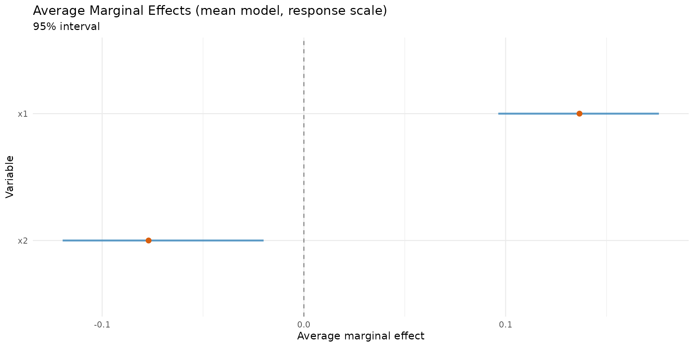
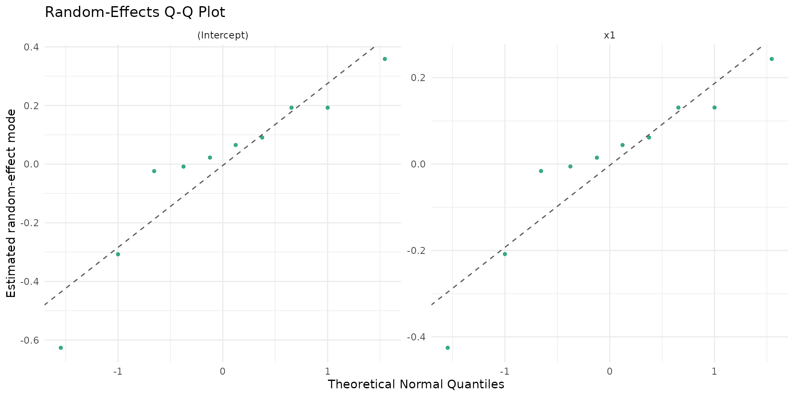

# Advanced Workflows for High-Level Users

## Audience and scope

This vignette is designed for analysts who are already familiar with
beta regression and require a production-oriented workflow featuring:

1.  reproducible model selection;
2.  inferential and predictive diagnostics;
3.  mixed-effects escalation (`brs` -\> `brsmm`) with Likelihood Ratio
    (LR) comparisons;
4.  high-signal reporting tables for technical decision-making.

``` r

library(betaregscale)
```

## 1) Reproducible simulation and data checks

``` r

n <- 150
d <- data.frame(
  x1 = rnorm(n),
  x2 = rnorm(n),
  z1 = rnorm(n)
)

sim <- brs_sim(
  formula = ~ x1 + x2 | z1,
  data = d,
  beta = c(0.15, 0.55, -0.30),
  zeta = c(-0.10, 0.35),
  link = "logit",
  link_phi = "logit",
  ncuts = 100,
  repar = 2
)

kbl10(head(sim, 10))
```

| left  | right |  yt  |  y  | delta |   x1    |   x2    |   z1    |
|:-----:|:-----:|:----:|:---:|:-----:|:-------:|:-------:|:-------:|
| 0.905 | 0.915 | 0.91 | 91  |   3   | 0.5206  | 0.0243  | -0.1486 |
| 0.005 | 0.015 | 0.01 |  1  |   3   | -1.0797 | 0.3346  | -0.1830 |
| 0.315 | 0.325 | 0.32 | 32  |   3   | 0.1392  | 0.9894  | -0.8581 |
| 0.425 | 0.435 | 0.43 | 43  |   3   | -0.0847 | 0.5004  | 0.9582  |
| 0.005 | 0.015 | 0.01 |  1  |   3   | -0.6666 | 0.5769  | -0.8391 |
| 0.000 | 0.005 | 0.00 |  0  |   1   | -2.5161 | 1.1427  | -0.7597 |
| 0.185 | 0.195 | 0.19 | 19  |   3   | -0.7351 | -0.7074 | -0.8665 |
| 0.095 | 0.105 | 0.10 | 10  |   3   | -1.0201 | -0.6186 | 1.6590  |
| 0.995 | 1.000 | 1.00 | 100 |   2   | 0.1136  | -0.0083 | 0.5569  |
| 0.165 | 0.175 | 0.17 | 17  |   3   | -0.4738 | 0.3389  | 0.6014  |

``` r

kbl10(
  data.frame(
    n = nrow(sim),
    exact = sum(sim$delta == 0),
    left = sum(sim$delta == 1),
    right = sum(sim$delta == 2),
    interval = sum(sim$delta == 3)
  ),
  digits = 4
)
```

|  n  | exact | left | right | interval |
|:---:|:-----:|:----:|:-----:|:--------:|
| 150 |   0   |  9   |  10   |   131    |

[`brs_sim()`](https://evandeilton.github.io/betaregscale/reference/brs_sim.md)
coarsens each draw exactly as the likelihood assumes, so the censoring
is non-informative. Its `delta` argument can force one type on every
row; `delta = 1` or `2` censors each row at the cell of its own score,
which is informative censoring with no finite MLE, and
[`brs_sim()`](https://evandeilton.github.io/betaregscale/reference/brs_sim.md)
warns. Leave `delta = NULL` for studies of the estimator.

## 2) Fixed-effects candidate set and model ranking

``` r

fit_logit <- brs(y ~ x1 + x2 | z1, data = sim, link = "logit", repar = 2)
fit_probit <- brs(y ~ x1 + x2 | z1, data = sim, link = "probit", repar = 2)
fit_cauchit <- brs(y ~ x1 + x2 | z1, data = sim, link = "cauchit", repar = 2)

tab_rank <- brs_table(
  logit = fit_logit,
  probit = fit_probit,
  cauchit = fit_cauchit
)
kbl10(tab_rank)
```

| model | nobs | npar | logLik | AIC | BIC | pseudo_r2 | exact | left | right | interval | prop_exact | prop_left | prop_right | prop_interval |
|:--:|:--:|:--:|:--:|:--:|:--:|:--:|:--:|:--:|:--:|:--:|:--:|:--:|:--:|:--:|
| logit | 150 | 5 | -632.6093 | 1275.219 | 1290.272 | 0.2075 | 0 | 9 | 10 | 131 | 0 | 0.06 | 0.0667 | 0.8733 |
| probit | 150 | 5 | -632.4476 | 1274.895 | 1289.948 | 0.2095 | 0 | 9 | 10 | 131 | 0 | 0.06 | 0.0667 | 0.8733 |
| cauchit | 150 | 5 | -633.4406 | 1276.881 | 1291.934 | 0.1334 | 0 | 9 | 10 | 131 | 0 | 0.06 | 0.0667 | 0.8733 |

## 3) Inference stack: Wald + bootstrap + AME

``` r

kbl10(brs_est(fit_logit))
```

|      variable      | estimate |   se   | z_value | p_value | ci_lower | ci_upper |
|:------------------:|:--------:|:------:|:-------:|:-------:|:--------:|:--------:|
|    (Intercept)     |  0.0880  | 0.1059 | 0.8306  | 0.4062  | -0.1196  |  0.2956  |
|         x1         |  0.6022  | 0.1051 | 5.7325  | 0.0000  |  0.3963  |  0.8081  |
|         x2         | -0.3393  | 0.1240 | -2.7371 | 0.0062  | -0.5823  | -0.0963  |
| (phi)\_(Intercept) | -0.0823  | 0.1016 | -0.8099 | 0.4180  | -0.2814  |  0.1168  |
|     (phi)\_z1      |  0.2621  | 0.0955 | 2.7447  | 0.0061  |  0.0749  |  0.4493  |

``` r

kbl10(confint(fit_logit))
```

|                    |  2.5 %  | 97.5 %  |
|:-------------------|:-------:|:-------:|
| (Intercept)        | -0.1196 | 0.2956  |
| x1                 | 0.3963  | 0.8081  |
| x2                 | -0.5823 | -0.0963 |
| (phi)\_(Intercept) | -0.2814 | 0.1168  |
| (phi)\_z1          | 0.0749  | 0.4493  |

``` r


# Draws are kept so that the plots below can reuse this single fit rather
# than resampling a second time.
boot_tab <- brs_bootstrap(fit_logit, R = 30, level = 0.95, keep_draws = TRUE)
kbl10(head(boot_tab, 10))
```

| parameter | estimate | se_boot | ci_lower | ci_upper | mcse_lower | mcse_upper | wald_lower | wald_upper | level |
|:--:|:--:|:--:|:--:|:--:|:--:|:--:|:--:|:--:|:--:|
| (Intercept) | 0.0880 | 0.1056 | -0.0375 | 0.3209 | 0.0159 | 0.0409 | -0.1196 | 0.2956 | 0.95 |
| x1 | 0.6022 | 0.1138 | 0.3534 | 0.7741 | 0.0529 | 0.0278 | 0.3963 | 0.8081 | 0.95 |
| x2 | -0.3393 | 0.1348 | -0.5710 | -0.1492 | 0.0224 | 0.0210 | -0.5823 | -0.0963 | 0.95 |
| (phi)\_(Intercept) | -0.0823 | 0.1035 | -0.2708 | 0.0564 | 0.0209 | 0.0156 | -0.2814 | 0.1168 | 0.95 |
| (phi)\_z1 | 0.2621 | 0.1028 | 0.1054 | 0.4761 | 0.0180 | 0.0334 | 0.0749 | 0.4493 | 0.95 |

``` r


set.seed(2026) # For marginal effects simulation
ame_mu <- brs_marginaleffects(
  fit_logit,
  model = "mean",
  type = "response",
  interval = TRUE,
  n_sim = 60,
  keep_draws = TRUE
)
kbl10(ame_mu)
```

| variable |   ame   | std.error | ci.lower | ci.upper | model |   type   |  n  |
|:--------:|:-------:|:---------:|:--------:|:--------:|:-----:|:--------:|:---:|
|    x1    | 0.1366  |  0.0221   |  0.0964  |  0.176   | mean  | response | 150 |
|    x2    | -0.0770 |  0.0248   | -0.1196  |  -0.020  | mean  | response | 150 |

Each bootstrap replicate draws a new response at the fitted shapes and
refits the original formula on a copy of the data, so factors,
transformations and prepared data keep their structure; each row keeps
its observation mechanism (exact, score, or analyst thresholds, which
are treated as fixed and non-informative). Refits start from the fitted
estimate and use the compiled Hessian. Failed replicates are counted in
the printed header. `ci_type = "bca"` is also available: with parametric
resampling and a leave-one-out jackknife it is an approximation (a
warning says so once per session) and costs `R + n` fits instead of `R`;
see
[`?brs_bootstrap`](https://evandeilton.github.io/betaregscale/reference/brs_bootstrap.md).

``` r

if (requireNamespace("ggplot2", quietly = TRUE)) {
  autoplot.brs_bootstrap(
    boot_tab,
    type = "ci_forest",
    title = "Bootstrap (percentile) vs Wald intervals"
  )
  autoplot.brs_marginaleffects(ame_mu, type = "forest")
}
```



## 4) Prediction layer on analyst scale

``` r

score_prob <- brs_predict_scoreprob(fit_logit, scores = 0:10)
kbl10(score_prob[1:8, 1:7])
```

| score_0 | score_1 | score_2 | score_3 | score_4 | score_5 | score_6 |
|:-------:|:-------:|:-------:|:-------:|:-------:|:-------:|:-------:|
| 0.0150  | 0.0166  | 0.0131  | 0.0115  | 0.0105  | 0.0098  | 0.0093  |
| 0.1131  | 0.0595  | 0.0376  | 0.0292  | 0.0244  | 0.0213  | 0.0191  |
| 0.0292  | 0.0288  | 0.0219  | 0.0188  | 0.0169  | 0.0156  | 0.0146  |
| 0.0793  | 0.0432  | 0.0276  | 0.0216  | 0.0182  | 0.0160  | 0.0144  |
| 0.0610  | 0.0456  | 0.0317  | 0.0259  | 0.0225  | 0.0201  | 0.0184  |
| 0.3873  | 0.0875  | 0.0471  | 0.0335  | 0.0264  | 0.0219  | 0.0189  |
| 0.0260  | 0.0267  | 0.0206  | 0.0178  | 0.0161  | 0.0149  | 0.0140  |
| 0.1375  | 0.0532  | 0.0315  | 0.0236  | 0.0194  | 0.0166  | 0.0147  |

## 5) Out-of-sample validation

``` r

set.seed(2026) # For cross-validation reproducibility
cv_tab <- brs_cv(
  y ~ x1 + x2 | z1,
  data = sim,
  k = 5,
  repeats = 2,
  repar = 2
)
kbl10(head(cv_tab, 10))
```

| repeat | fold | n_train | n_test | log_score | rmse_yt | mae_yt | converged | error |
|:------:|:----:|:-------:|:------:|:---------:|:-------:|:------:|:---------:|:-----:|
|   1    |  1   |   120   |   30   |  -4.1078  | 0.3298  | 0.2945 |   TRUE    |  NA   |
|   1    |  2   |   120   |   30   |  -4.4249  | 0.3907  | 0.3447 |   TRUE    |  NA   |
|   1    |  3   |   120   |   30   |  -4.0241  | 0.3290  | 0.2950 |   TRUE    |  NA   |
|   1    |  4   |   120   |   30   |  -4.4575  | 0.3378  | 0.2984 |   TRUE    |  NA   |
|   1    |  5   |   120   |   30   |  -4.2346  | 0.3401  | 0.2993 |   TRUE    |  NA   |
|   2    |  1   |   120   |   30   |  -4.4746  | 0.3608  | 0.3105 |   TRUE    |  NA   |
|   2    |  2   |   120   |   30   |  -4.3551  | 0.3507  | 0.3146 |   TRUE    |  NA   |
|   2    |  3   |   120   |   30   |  -4.1657  | 0.3262  | 0.2917 |   TRUE    |  NA   |
|   2    |  4   |   120   |   30   |  -3.9674  | 0.3667  | 0.3343 |   TRUE    |  NA   |
|   2    |  5   |   120   |   30   |  -4.4196  | 0.3247  | 0.2831 |   TRUE    |  NA   |

## 6) Escalation to mixed models

### 6.1 Simulate clustered data with random intercept + slope

``` r

g <- 10
ni <- 25
id <- factor(rep(seq_len(g), each = ni))
n_mm <- length(id)
x1 <- rnorm(n_mm)
x2 <- rbinom(n_mm, size = 1, prob = 1 / 2)

b0 <- rnorm(g, sd = 0.40)
b1 <- rnorm(g, sd = 0.22)

eta_mu <- 0.20 + 0.65 * x1 - 0.30 * x2 + b0[id] + b1[id] * x1
eta_phi <- rep(-0.20, n_mm)

mu <- plogis(eta_mu)
phi <- plogis(eta_phi)
shp <- brs_repar(mu = mu, phi = phi, repar = 2)
y <- round(stats::rbeta(n_mm, shp$shape1, shp$shape2) * 100)

dmm <- data.frame(y = y, id = id, x1 = x1, x2 = x2)
kbl10(head(dmm, 10))
```

|  y  | id  |   x1    | x2  |
|:---:|:---:|:-------:|:---:|
|  8  |  1  | -0.5886 |  0  |
| 89  |  1  | -0.2773 |  1  |
|  9  |  1  | -1.6193 |  0  |
| 61  |  1  | -0.1864 |  1  |
| 78  |  1  | -0.5432 |  1  |
| 77  |  1  | -0.3511 |  1  |
| 100 |  1  | 0.7576  |  1  |
| 53  |  1  | -0.3713 |  1  |
|  0  |  1  | -0.4505 |  1  |
| 26  |  1  | -0.1020 |  1  |

### 6.2 Fit evolutionary sequence

``` r

fit_brs <- brs(y ~ x1 + x2, data = dmm, repar = 2)
fit_ri <- brsmm(y ~ x1 + x2, random = ~ 1 | id, data = dmm, repar = 2)
fit_rs <- brsmm(y ~ x1 + x2, random = ~ 1 + x1 | id, data = dmm, repar = 2)

tab_lr <- anova(fit_brs, fit_ri, fit_rs, test = "Chisq")
tab_lr
#> Likelihood-ratio comparison of brs/brsmm models
#> Rows M2, M3: one added random effect (variance on the boundary); Pr(>Chisq) from the chi-bar-square mixture 1/2 chi2(Df - 1) + 1/2 chi2(Df).
#> 
#>            Df  logLik    AIC    BIC  Chisq Chi Df Pr(>Chisq)   
#> M1 (brs)    4 -1057.0 2122.1 2136.1                            
#> M2 (brsmm)  5 -1054.1 2118.2 2135.8 5.8355      1   0.007853 **
#> M3 (brsmm)  7 -1052.2 2118.3 2143.0 3.8718      2   0.096701 . 
#> ---
#> Signif. codes:  0 '***' 0.001 '**' 0.01 '*' 0.05 '.' 0.1 ' ' 1
```

### 6.3 Model choice by LLR/LRT (ANOVA)

The [`anova()`](https://rdrr.io/r/stats/anova.html) methods provide a
practical Likelihood Ratio Test (LLR) workflow:

- `M0 = brs` (no random effects);
- `M1 = brsmm` with random intercept (`~ 1 | id`);
- `M2 = brsmm` with random intercept + slope (`~ 1 + x1 | id`).

In nested comparisons, the test statistic is:
``` math
LR=2\{\ell(\hat\theta_{\text{complex}})-\ell(\hat\theta_{\text{simple}})\}
```

Both steps add one random-effect term whose variance is on the boundary
of the parameter space under $`H_0`$ ($`\sigma^2=0`$). The reference
distribution is then the mixture
$`\frac12\chi^2_{d-1}+\frac12\chi^2_{d}`$ (Self and Liang, 1987; Stram
and Lee, 1994): $`\frac12\chi^2_0+\frac12\chi^2_1`$ for `M0 -> M1` and
$`\frac12\chi^2_1+\frac12\chi^2_2`$ for `M1 -> M2`, where the slope adds
a variance and a covariance.
[`anova()`](https://rdrr.io/r/stats/anova.html) uses it for such rows
and says so in its heading; the naive $`\chi^2_d`$ p-value would be too
large. A term that adds almost nothing to the likelihood is also flagged
by
[`brsmm()`](https://evandeilton.github.io/betaregscale/reference/brsmm.md)
(“Variance component at the boundary”).

``` r

tab_lr_df <- data.frame(model = rownames(tab_lr), tab_lr, row.names = NULL)
tab_lr_df$decision <- c(
  "baseline",
  ifelse(is.na(tab_lr_df$`Pr(>Chisq)`[2]), "inspect AIC/BIC + diagnostics",
    ifelse(tab_lr_df$`Pr(>Chisq)`[2] < 0.05, "prefer M1 over M0", "prefer M0 (parsimony)")
  ),
  ifelse(is.na(tab_lr_df$`Pr(>Chisq)`[3]), "inspect AIC/BIC + diagnostics",
    ifelse(tab_lr_df$`Pr(>Chisq)`[3] < 0.05, "prefer M2 over M1", "prefer M1 (parsimony)")
  )
)
kbl10(tab_lr_df)
```

|   model    | Df  |  logLik   |   AIC    |   BIC    | Chisq  | Chi.Df | Pr..Chisq. | decision |
|:----------:|:---:|:---------:|:--------:|:--------:|:------:|:------:|:----------:|:--------:|
|  M1 (brs)  |  4  | -1057.029 | 2122.058 | 2136.144 |   NA   |   NA   |     NA     | baseline |
| M2 (brsmm) |  5  | -1054.111 | 2118.223 | 2135.830 | 5.8355 |   1    |   0.0079   | baseline |
| M3 (brsmm) |  7  | -1052.176 | 2118.351 | 2143.001 | 3.8718 |   2    |   0.0967   | baseline |

## 7) Random-effects study (numeric + visual)

``` r

rs <- brsmm_re_study(fit_rs)
print(rs)
#> 
#> Random-effects study
#> Groups: 10 
#> 
#> Random-effects (VarCorr):
#>   Name                      Std.Dev.  Corr
#>   (Intercept)                 0.3240
#>   x1                          0.2200  0.9992
#> 
#> ICC (logit(Y) scale, beta level-1 variance): 0.0804
#> 
#> Summary by term (SD_model = model SD; shrinkage = Var(modes)/Var(model)):
#>         term sd_model mean_mode sd_mode shrinkage_ratio shapiro_p
#>  (Intercept)    0.324   -0.0044  0.2795          0.7441    0.1585
#>           x1    0.220   -0.0030  0.1897          0.7436    0.1585
kbl10(rs$summary)
```

|    term     | sd_model | mean_mode | sd_mode | shrinkage_ratio | shapiro_p |
|:-----------:|:--------:|:---------:|:-------:|:---------------:|:---------:|
| (Intercept) |  0.324   |  -0.0044  | 0.2795  |     0.7441      |  0.1585   |
|     x1      |  0.220   |  -0.0030  | 0.1897  |     0.7436      |  0.1585   |

``` r

kbl10(rs$D)
```

|             | (Intercept) |   x1   |
|:------------|:-----------:|:------:|
| (Intercept) |   0.1050    | 0.0712 |
| x1          |   0.0712    | 0.0484 |

``` r

kbl10(rs$Corr)
```

|             | (Intercept) |   x1   |
|:------------|:-----------:|:------:|
| (Intercept) |   1.0000    | 0.9992 |
| x1          |   0.9992    | 1.0000 |

``` r

if (requireNamespace("ggplot2", quietly = TRUE)) {
  autoplot.brsmm(fit_rs, type = "ranef_caterpillar")
  autoplot.brsmm(fit_rs, type = "ranef_density")
  autoplot.brsmm(fit_rs, type = "ranef_pairs")
  autoplot.brsmm(fit_rs, type = "ranef_qq")
}
```



## 8) A Monte Carlo study (design of Lopes, 2023, ch. 3)

A simulation study is a loop of
[`brs_sim()`](https://evandeilton.github.io/betaregscale/reference/brs_sim.md)
and
[`brs()`](https://evandeilton.github.io/betaregscale/reference/brs.md)
over a fixed design. The code below mirrors the dissertation’s design
with a smaller grid: repar 2 with logit links, `interval = "mid"`, two
scale lengths ($`K=10`$ and $`K=100`$), two sample sizes and three
dispersion levels, 200 replicates per cell. It takes under a minute, so
it is not run here.

``` r

R <- 200L
beta <- c(0.5, 0.2, -0.7)
grid <- expand.grid(sigma = c(0.08, 0.2, 0.4), n = c(100L, 500L), K = c(10L, 100L))
one_cell <- function(sigma, n, K) {
  set.seed(1000 + n + K + round(100 * sigma))
  d <- data.frame(x1 = rnorm(n), x2 = rbinom(n, 1, 0.5))   # fixed design
  truth <- c(beta, qlogis(sigma))
  est <- se <- matrix(NA_real_, R, 4)
  for (r in seq_len(R)) {
    s <- brs_sim(~ x1 + x2, data = d, beta = beta, phi = qlogis(sigma), ncuts = K)
    f <- tryCatch(brs(y ~ x1 + x2, data = s), error = function(e) NULL)
    if (is.null(f) || f$convergence != 0L) next
    est[r, ] <- coef(f)
    se[r, ] <- sqrt(diag(vcov(f)))
  }
  ok <- stats::complete.cases(est, se)
  err <- est[ok, ] - rep(truth, each = sum(ok))
  data.frame(sigma, n, K, par = c("b0", "b1", "b2", "logit_sigma"),
             bias = colMeans(err), rmse = sqrt(colMeans(err^2)),
             cover = colMeans(abs(err) <= qnorm(0.975) * se[ok, ]))
}
res <- do.call(rbind, Map(one_cell, grid$sigma, grid$n, grid$K))
```

Results for the slope $`\beta_1=0.2`$ and for $`\mathrm{logit}(\sigma)`$
(bias, root mean squared error and coverage of the 95% Wald interval,
with the default compiled Hessian; `hessian_method = "numDeriv"` gives
the same coverages):

| $`K`$ | $`n`$ | $`\sigma`$ | $`\beta_1`$ bias | RMSE | cover | $`\mathrm{logit}\,\sigma`$ bias | RMSE | cover |
|---:|---:|---:|---:|---:|---:|---:|---:|---:|
| 10 | 100 | 0.08 | 0.003 | 0.057 | 0.925 | -0.047 | 0.160 | 0.920 |
| 10 | 100 | 0.20 | 0.009 | 0.092 | 0.925 | -0.038 | 0.146 | 0.945 |
| 10 | 100 | 0.40 | -0.011 | 0.127 | 0.945 | -0.024 | 0.141 | 0.945 |
| 10 | 500 | 0.08 | 0.000 | 0.029 | 0.920 | -0.013 | 0.067 | 0.930 |
| 10 | 500 | 0.20 | 0.005 | 0.039 | 0.975 | -0.004 | 0.061 | 0.945 |
| 10 | 500 | 0.40 | -0.003 | 0.060 | 0.945 | -0.013 | 0.059 | 0.945 |
| 100 | 100 | 0.08 | -0.003 | 0.055 | 0.955 | -0.047 | 0.132 | 0.965 |
| 100 | 100 | 0.20 | 0.006 | 0.097 | 0.930 | -0.043 | 0.138 | 0.935 |
| 100 | 100 | 0.40 | 0.014 | 0.113 | 0.940 | -0.046 | 0.131 | 0.935 |
| 100 | 500 | 0.08 | 0.002 | 0.031 | 0.920 | -0.012 | 0.064 | 0.930 |
| 100 | 500 | 0.20 | 0.001 | 0.040 | 0.945 | -0.003 | 0.059 | 0.955 |
| 100 | 500 | 0.40 | 0.008 | 0.063 | 0.930 | -0.004 | 0.057 | 0.940 |

With 200 replicates the Monte Carlo standard error of a coverage near
0.95 is about 0.015. The slopes are unbiased at both scale lengths; the
dispersion is slightly underestimated at $`n=100`$ (about $`-0.04`$ on
the logit scale, a third of its RMSE) and the bias vanishes at
$`n=500`$. A coarse scale ($`K=10`$) costs little precision relative to
$`K=100`$.

## 9) Practical decision checklist

- Start with `brs` candidates (`link`, `repar`) and rank them using
  [`brs_table()`](https://evandeilton.github.io/betaregscale/reference/brs_table.md).
- Add bootstrap analysis and Average Marginal Effects (AME) before
  escalating complexity.
- Use
  [`brs_cv()`](https://evandeilton.github.io/betaregscale/reference/brs_cv.md)
  for out-of-sample stability checks.
- Escalate to `brsmm` only when LR/AIC/BIC metrics and diagnostics
  clearly support it.
- For random slopes, always inspect
  [`brsmm_re_study()`](https://evandeilton.github.io/betaregscale/reference/brsmm_re_study.md)
  and the associated random-effects plots.
- Read the one-line warnings of
  [`brs()`](https://evandeilton.github.io/betaregscale/reference/brs.md)/[`brsmm()`](https://evandeilton.github.io/betaregscale/reference/brsmm.md)
  (gradient, Hessian, clamps, variance at the boundary) before any Wald
  statement; `fit$diagnostics` keeps the numbers.

## References

Lopes, J. E. (2023). *Modelos de regressão beta para dados de escala*.
Master’s dissertation, Universidade Federal do Paraná, Curitiba.
<https://hdl.handle.net/1884/86624>.

Self, S. G., and Liang, K.-Y. (1987). Asymptotic properties of maximum
likelihood estimators and likelihood ratio tests under nonstandard
conditions. *Journal of the American Statistical Association*, 82(398),
605-610.

Stram, D. O., and Lee, J. W. (1994). Variance components testing in the
longitudinal mixed effects model. *Biometrics*, 50(4), 1171-1177.

Ferrari, S. L. P. and Cribari-Neto, F. (2004). Beta regression for
modelling rates and proportions. *Journal of Applied Statistics*, 31(7),
799-815. DOI: 10.1080/0266476042000214501. Validated online via:
<https://doi.org/10.1080/0266476042000214501>.

Smithson, M., and Verkuilen, J. (2006). A better lemon squeezer?
Maximum-likelihood regression with beta-distributed dependent variables.
*Psychological Methods*, 11(1), 54-71. DOI: 10.1037/1082-989X.11.1.54.
Validated online via: <https://doi.org/10.1037/1082-989X.11.1.54>.

Rue, H., Martino, S., and Chopin, N. (2009). Approximate Bayesian
inference for latent Gaussian models by using integrated nested Laplace
approximations. *Journal of the Royal Statistical Society: Series B*,
71(2), 319-392. DOI: 10.1111/j.1467-9868.2008.00700.x. Validated online
via: <https://doi.org/10.1111/j.1467-9868.2008.00700.x>.
