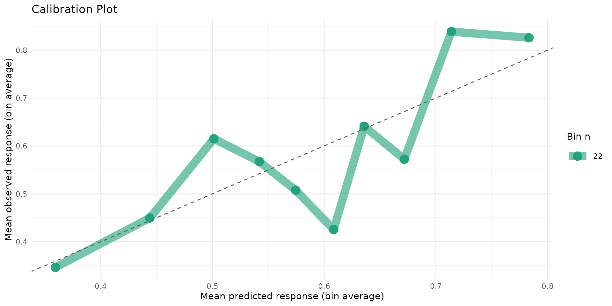
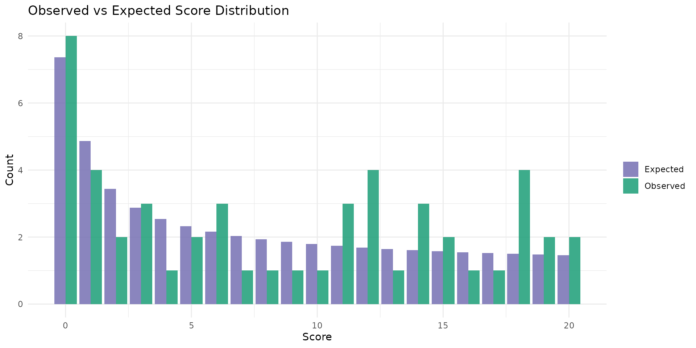
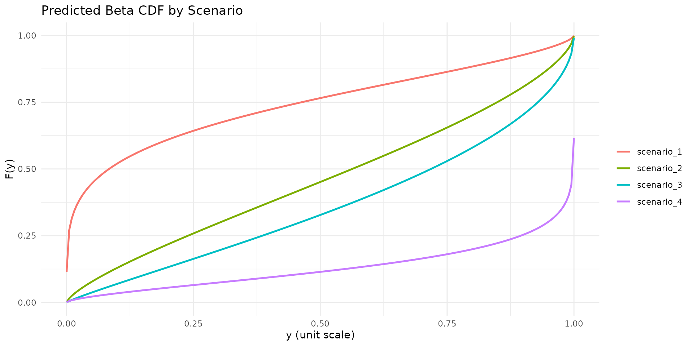
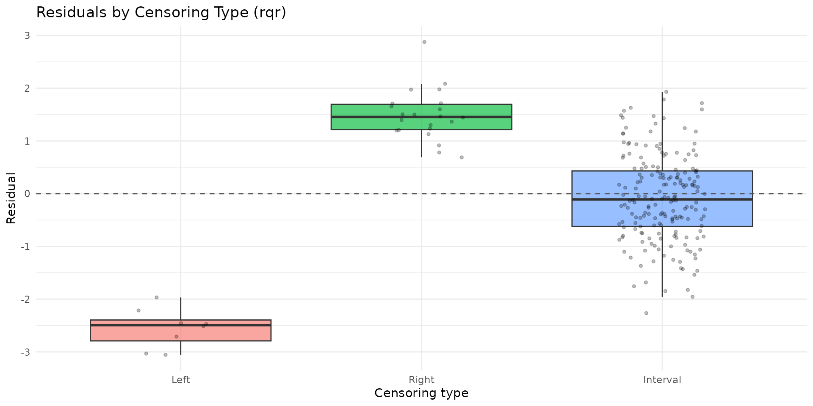

# Analyst Tools for betaregscale

## Overview

This vignette presents analyst-oriented tools added to **betaregscale**
for post-estimation workflows:

- [`brs_table()`](https://evandeilton.github.io/betaregscale/reference/brs_table.md):
  model comparison tables.
- [`brs_marginaleffects()`](https://evandeilton.github.io/betaregscale/reference/brs_marginaleffects.md):
  average marginal effects (AME).
- [`brs_predict_scoreprob()`](https://evandeilton.github.io/betaregscale/reference/brs_predict_scoreprob.md):
  probabilities on the original score scale.
- [`autoplot.brs()`](https://evandeilton.github.io/betaregscale/reference/autoplot.brs.md):
  `ggplot2` diagnostics.
- [`brs_cv()`](https://evandeilton.github.io/betaregscale/reference/brs_cv.md):
  repeated k-fold cross-validation.

The examples use bounded scale data under the interval-censored beta
regression framework of Lopes (2024).

``` r
library(betaregscale)
```

## Mathematical foundations

### Complete likelihood by censoring type

For each observation $i$, let $\delta_{i} \in \{ 0,1,2,3\}$ indicate
exact, left-censored, right-censored, or interval-censored status. With
beta CDF $F( \cdot )$, beta density $f( \cdot )$, and interval endpoints
$\left\lbrack l_{i},u_{i} \right\rbrack$, the contribution is:

$$L_{i}(\theta) = \begin{cases}
{f\left( y_{i};a_{i},b_{i} \right),} & {\delta_{i} = 0,} \\
{F\left( u_{i};a_{i},b_{i} \right),} & {\delta_{i} = 1,} \\
{1 - F\left( l_{i};a_{i},b_{i} \right),} & {\delta_{i} = 2,} \\
{F\left( u_{i};a_{i},b_{i} \right) - F\left( l_{i};a_{i},b_{i} \right),} & {\delta_{i} = 3.}
\end{cases}$$

This is the basis for fitting, prediction, and validation metrics.

### Model-comparison metrics

[`brs_table()`](https://evandeilton.github.io/betaregscale/reference/brs_table.md)
reports:

- $\log L\left( \widehat{\theta} \right)$,
- $AIC = - 2\log L\left( \widehat{\theta} \right) + 2k$,
- $BIC = - 2\log L\left( \widehat{\theta} \right) + k\log n$,

where $k$ is the number of estimated parameters and $n$ is sample size.

### Average marginal effects (AME)

[`brs_marginaleffects()`](https://evandeilton.github.io/betaregscale/reference/brs_marginaleffects.md)
computes AME by finite differences:

$${AME}_{j} = \frac{1}{n}\sum\limits_{i = 1}^{n}\frac{{\widehat{g}}_{i}\left( x_{ij} + h \right) - {\widehat{g}}_{i}\left( x_{ij} \right)}{h},$$

with ${\widehat{g}}_{i}$ on the requested prediction scale (`response`
or `link`). For binary covariates $x_{j} \in \{ 0,1\}$, it uses the
discrete contrast
$\widehat{g}\left( x_{j} = 1 \right) - \widehat{g}\left( x_{j} = 0 \right)$.

### Score-scale probabilities

For integer scores $s \in \{ 0,\ldots,K\}$,
[`brs_predict_scoreprob()`](https://evandeilton.github.io/betaregscale/reference/brs_predict_scoreprob.md)
computes:

$$P(Y = s) = \begin{cases}
{F\left( {lim}/K \right),} & {s = 0,} \\
{1 - F\left( \left( K - {lim} \right)/K \right),} & {s = K,} \\
{F\left( \left( s + {lim} \right)/K \right) - F\left( \left( s - {lim} \right)/K \right),} & {1 \leq s \leq K - 1.}
\end{cases}$$

These probabilities are directly aligned with interval geometry on the
original instrument scale.

### Cross-validation log score

In
[`brs_cv()`](https://evandeilton.github.io/betaregscale/reference/brs_cv.md),
fold-level predictive quality includes:

$${log\_ score} = \frac{1}{n_{test}}\sum\limits_{i \in test}\log\left( p_{i} \right),$$

where $p_{i}$ is the predictive contribution from the same
censoring-rule piecewise definition shown above.

It also reports:

$${RMSE}_{yt} = \sqrt{\frac{1}{n_{test}}\sum\left( y_{t,i} - {\widehat{\mu}}_{i} \right)^{2}},\qquad{MAE}_{yt} = \frac{1}{n_{test}}\sum\left| y_{t,i} - {\widehat{\mu}}_{i} \right|.$$

## Reproducible workflow

### 1) Simulate data and fit candidate models

``` r
set.seed(2026)
n <- 220
d <- data.frame(
  x1 = rnorm(n),
  x2 = rnorm(n),
  z1 = rnorm(n)
)

sim <- brs_sim(
  formula = ~ x1 + x2 | z1,
  data = d,
  beta = c(0.20, -0.45, 0.25),
  zeta = c(0.15, -0.30),
  ncuts = 100,
  repar = 2
)

fit_fixed <- brs(y ~ x1 + x2, data = sim, repar = 2)
fit_var <- brs(y ~ x1 + x2 | z1, data = sim, repar = 2)
```

### 2) Compare models in one table

``` r
tab <- brs_table(
  fixed = fit_fixed,
  variable = fit_var,
  sort_by = "AIC"
)
knitr::kable(tab, digits = 4)
```

| model    | nobs | npar |    logLik |      AIC |      BIC | pseudo_r2 | exact | left | right | interval | prop_exact | prop_left | prop_right | prop_interval |
|:---------|-----:|-----:|----------:|---------:|---------:|----------:|------:|-----:|------:|---------:|-----------:|----------:|-----------:|--------------:|
| variable |  220 |    5 | -931.8646 | 1873.729 | 1890.697 |    0.1381 |     0 |    8 |    22 |      190 |          0 |    0.0364 |        0.1 |        0.8636 |
| fixed    |  220 |    4 | -939.3243 | 1886.649 | 1900.223 |    0.1381 |     0 |    8 |    22 |      190 |          0 |    0.0364 |        0.1 |        0.8636 |

### 3) Estimate average marginal effects

``` r
me_mean <- brs_marginaleffects(
  fit_var,
  model = "mean",
  type = "response",
  interval = TRUE,
  n_sim = 120
)
knitr::kable(me_mean, digits = 4)
```

| variable |     ame | std.error | ci.lower | ci.upper | model | type     |   n |
|:---------|--------:|----------:|---------:|---------:|:------|:---------|----:|
| x1       | -0.1035 |    0.0193 |  -0.1398 |  -0.0614 | mean  | response | 220 |
| x2       |  0.0734 |    0.0155 |   0.0412 |   0.1059 | mean  | response | 220 |

``` r

me_precision <- brs_marginaleffects(
  fit_var,
  model = "precision",
  type = "link",
  interval = TRUE,
  n_sim = 120,
  seed = 2026
)
knitr::kable(me_precision, digits = 4)
```

| variable |     ame | std.error | ci.lower | ci.upper | model     | type |   n |
|:---------|--------:|----------:|---------:|---------:|:----------|:-----|----:|
| z1       | -0.3361 |    0.0907 |  -0.4909 |  -0.1541 | precision | link | 220 |

### 4) Predict score probabilities

``` r
P <- brs_predict_scoreprob(fit_var, scores = 0:10)
dim(P)
#> [1] 220  11
knitr::kable(P[1:6, 1:5], digits = 4)
```

| score_0 | score_1 | score_2 | score_3 | score_4 |
|--------:|--------:|--------:|--------:|--------:|
|  0.0146 |  0.0178 |  0.0146 |  0.0130 |  0.0121 |
|  0.0215 |  0.0228 |  0.0178 |  0.0155 |  0.0141 |
|  0.0465 |  0.0318 |  0.0216 |  0.0175 |  0.0151 |
|  0.0731 |  0.0371 |  0.0233 |  0.0181 |  0.0152 |
|  0.0076 |  0.0105 |  0.0090 |  0.0083 |  0.0078 |
|  0.0050 |  0.0050 |  0.0039 |  0.0034 |  0.0030 |

``` r
knitr::kable(
  data.frame(row_sum = rowSums(P)),
  digits = 4
)
```

| row_sum |
|--------:|
|  0.1344 |
|  0.1614 |
|  0.2001 |
|  0.2313 |
|  0.0856 |
|  0.0354 |
|  0.0295 |
|  0.0994 |
|  0.1024 |
|  0.1312 |
|  0.0942 |
|  0.0408 |
|  0.0839 |
|  0.0982 |
|  0.0130 |
|  0.1635 |
|  0.3313 |
|  0.0743 |
|  0.0605 |
|  0.0098 |
|  0.0855 |
|  0.0728 |
|  0.0204 |
|  0.1751 |
|  0.0895 |
|  0.3079 |
|  0.3931 |
|  0.2427 |
|  0.0343 |
|  0.2381 |
|  0.1147 |
|  0.2127 |
|  0.1679 |
|  0.2361 |
|  0.1389 |
|  0.2343 |
|  0.1882 |
|  0.0166 |
|  0.2695 |
|  0.1441 |
|  0.0441 |
|  0.1038 |
|  0.0931 |
|  0.2102 |
|  0.0312 |
|  0.2516 |
|  0.1353 |
|  0.0334 |
|  0.1999 |
|  0.3167 |
|  0.0141 |
|  0.1161 |
|  0.1130 |
|  0.0605 |
|  0.0919 |
|  0.0958 |
|  0.0428 |
|  0.1630 |
|  0.1951 |
|  0.1681 |
|  0.0545 |
|  0.0727 |
|  0.2298 |
|  0.0594 |
|  0.0405 |
|  0.1326 |
|  0.0621 |
|  0.3574 |
|  0.0428 |
|  0.1107 |
|  0.1019 |
|  0.0917 |
|  0.1948 |
|  0.0750 |
|  0.1015 |
|  0.0784 |
|  0.4628 |
|  0.1790 |
|  0.1258 |
|  0.2560 |
|  0.1038 |
|  0.2463 |
|  0.1239 |
|  0.0374 |
|  0.2142 |
|  0.2376 |
|  0.2144 |
|  0.0338 |
|  0.2259 |
|  0.2264 |
|  0.0813 |
|  0.4033 |
|  0.0285 |
|  0.1344 |
|  0.0965 |
|  0.1843 |
|  0.1143 |
|  0.0566 |
|  0.0671 |
|  0.1190 |
|  0.1077 |
|  0.0646 |
|  0.0966 |
|  0.0260 |
|  0.2274 |
|  0.1548 |
|  0.0334 |
|  0.3192 |
|  0.0497 |
|  0.0667 |
|  0.0874 |
|  0.0603 |
|  0.1261 |
|  0.2500 |
|  0.1499 |
|  0.0507 |
|  0.1498 |
|  0.3776 |
|  0.3597 |
|  0.0185 |
|  0.2898 |
|  0.2567 |
|  0.1318 |
|  0.2843 |
|  0.0671 |
|  0.0994 |
|  0.0863 |
|  0.0550 |
|  0.1709 |
|  0.1714 |
|  0.0235 |
|  0.5262 |
|  0.0575 |
|  0.1045 |
|  0.1909 |
|  0.1163 |
|  0.0578 |
|  0.2098 |
|  0.2547 |
|  0.1726 |
|  0.1152 |
|  0.2419 |
|  0.3481 |
|  0.0801 |
|  0.0445 |
|  0.0474 |
|  0.2398 |
|  0.1716 |
|  0.1287 |
|  0.0632 |
|  0.1236 |
|  0.1408 |
|  0.1446 |
|  0.2577 |
|  0.1070 |
|  0.2578 |
|  0.1244 |
|  0.1680 |
|  0.2124 |
|  0.1777 |
|  0.1981 |
|  0.0784 |
|  0.1351 |
|  0.1398 |
|  0.1490 |
|  0.2269 |
|  0.1703 |
|  0.1061 |
|  0.1626 |
|  0.0728 |
|  0.1785 |
|  0.0556 |
|  0.3079 |
|  0.0973 |
|  0.1629 |
|  0.2948 |
|  0.0390 |
|  0.2298 |
|  0.1471 |
|  0.1858 |
|  0.0300 |
|  0.2468 |
|  0.3067 |
|  0.2137 |
|  0.1817 |
|  0.2667 |
|  0.1456 |
|  0.0831 |
|  0.1306 |
|  0.1801 |
|  0.2205 |
|  0.1863 |
|  0.2984 |
|  0.1075 |
|  0.1261 |
|  0.3039 |
|  0.1014 |
|  0.0215 |
|  0.0591 |
|  0.1642 |
|  0.0524 |
|  0.1975 |
|  0.0338 |
|  0.1037 |
|  0.1926 |
|  0.2667 |
|  0.1510 |
|  0.1925 |
|  0.1298 |
|  0.3700 |
|  0.0879 |
|  0.1370 |
|  0.0369 |
|  0.1456 |
|  0.0669 |
|  0.2938 |
|  0.2158 |
|  0.2653 |
|  0.3241 |
|  0.3042 |

`rowSums(P)` should be close to 1 (up to numerical tolerance and score
subset selection).

### 5) ggplot2 diagnostics

``` r
autoplot.brs(fit_var, type = "calibration")
```



``` r
autoplot.brs(fit_var, type = "score_dist", scores = 0:20)
```



``` r
autoplot.brs(fit_var, type = "cdf", max_curves = 4)
```



``` r
autoplot.brs(fit_var, type = "residuals_by_delta", residual_type = "rqr")
```



### 6) Repeated k-fold cross-validation

``` r
cv_res <- brs_cv(
  y ~ x1 + x2 | z1,
  data = sim,
  k = 3,
  repeats = 1,
  repar = 2,
  seed = 2026
)

knitr::kable(cv_res, digits = 4)
```

| repeat | fold | n_train | n_test | log_score | rmse_yt | mae_yt | converged | error |
|-------:|-----:|--------:|-------:|----------:|--------:|-------:|:----------|:------|
|      1 |    1 |     146 |     74 |   -4.3077 |  0.3215 | 0.2862 | TRUE      | NA    |
|      1 |    2 |     147 |     73 |   -4.3171 |  0.3449 | 0.3032 | TRUE      | NA    |
|      1 |    3 |     147 |     73 |   -4.1676 |  0.3454 | 0.3022 | TRUE      | NA    |

``` r
knitr::kable(
  data.frame(
    metric = c("log_score", "rmse_yt", "mae_yt"),
    mean = colMeans(cv_res[, c("log_score", "rmse_yt", "mae_yt")], na.rm = TRUE)
  ),
  digits = 4
)
```

|           | metric    |    mean |
|:----------|:----------|--------:|
| log_score | log_score | -4.2641 |
| rmse_yt   | rmse_yt   |  0.3373 |
| mae_yt    | mae_yt    |  0.2972 |

## Practical interpretation

- Prefer the model with lower AIC/BIC and better predictive `log_score`.
- Use AME on the response scale to communicate expected change in mean
  score (on the unit interval) from small covariate shifts.
- Use score probabilities to translate model outputs back to clinically
  interpretable scale categories.
- Inspect calibration and residual-by-censoring plots before inference.

## References

- Lopes, J. E. (2024). *Beta Regression for Interval-Censored
  Scale-Derived Outcomes*. MSc Dissertation, PPGMNE/UFPR.
- Ferrari, S. L. P., and Cribari-Neto, F. (2004). Beta regression for
  modelling rates and proportions. *Journal of Applied Statistics*,
  31(7), 799-815. DOI: 10.1080/0266476042000214501. Validated online
  via: <https://doi.org/10.1080/0266476042000214501> and
  <https://econpapers.repec.org/RePEc:taf:japsta:v:31:y:2004:i:7:p:799-815>.
- Hawker, G. A., Mian, S., Kendzerska, T., and French, M. (2011).
  Measures of adult pain: VAS, NRS, MPQ, SF-MPQ, CPGS, SF-36 BPS, and
  ICOAP. *Arthritis Care and Research*, 63(S11), S240-S252. DOI:
  10.1002/acr.20543. Validated online via:
  <https://doi.org/10.1002/acr.20543> and
  <https://acrjournals.onlinelibrary.wiley.com/doi/10.1002/acr.20543>.
- Hjermstad, M. J., Fayers, P. M., Haugen, D. F., et al. (2011).
  Comparing NRS, VRS, and VAS pain scales in adults: a systematic
  review. *Journal of Pain and Symptom Management*, 41(6), 1073-1093.
  DOI: 10.1016/j.jpainsymman.2010.08.016. Validated online via:
  <https://doi.org/10.1016/j.jpainsymman.2010.08.016> and
  <https://pubmed.ncbi.nlm.nih.gov/21621130/>.
