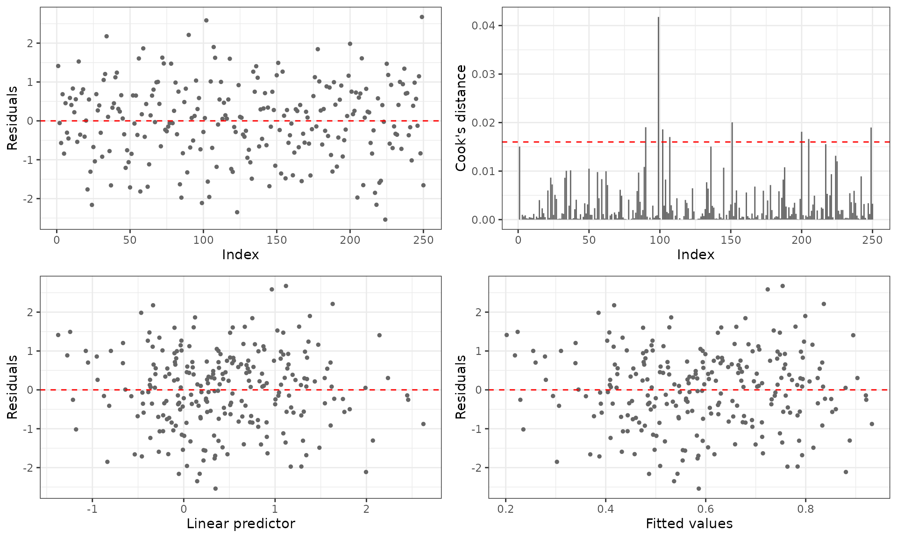
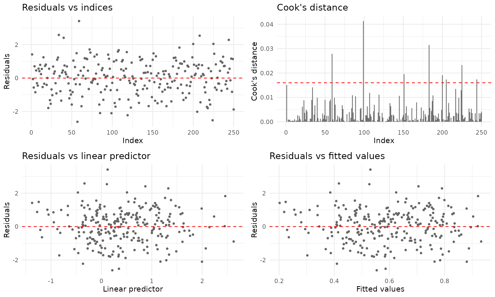
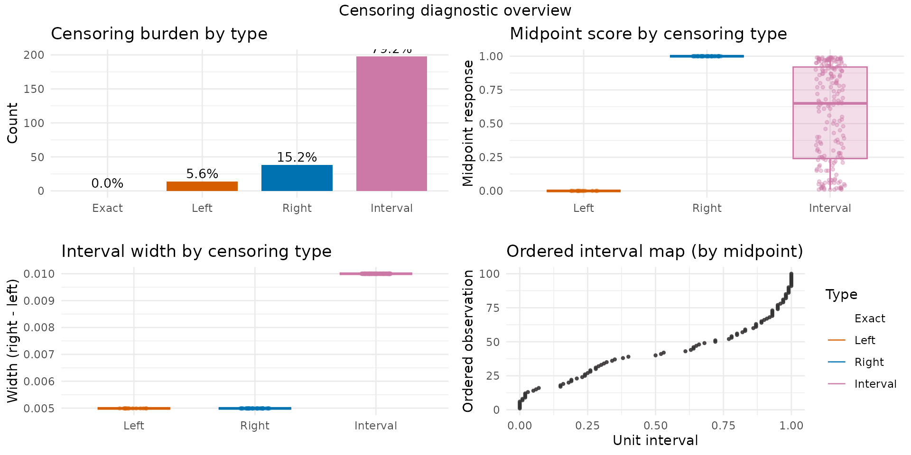
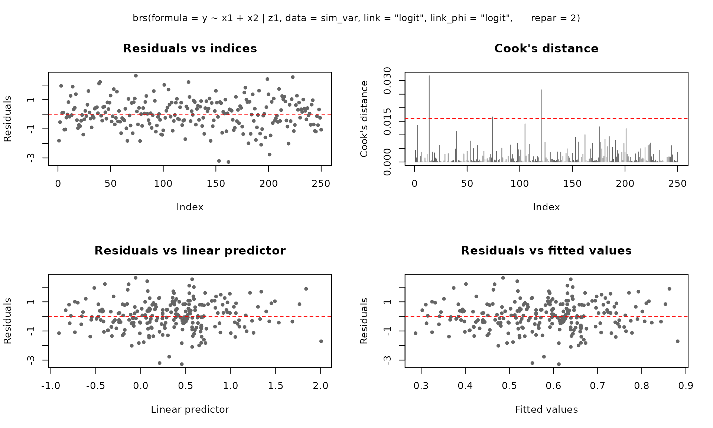
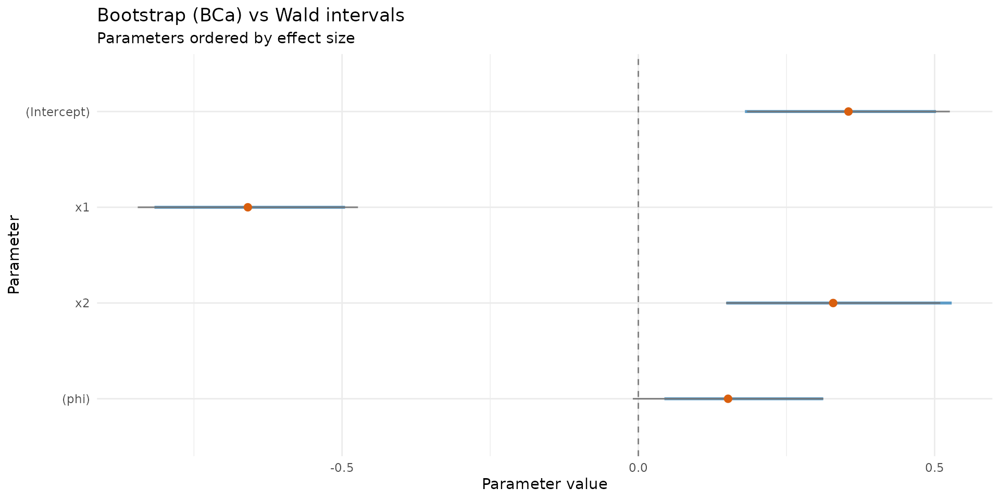
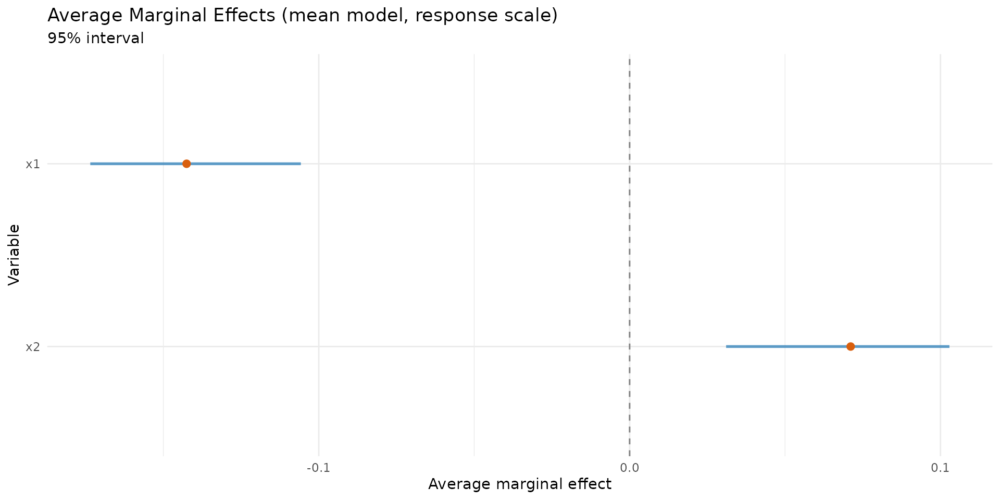

# Introduction to betaregscale

## Overview

The **betaregscale** package provides maximum-likelihood estimation of
beta regression models for responses derived from bounded rating scales.
Common examples include pain intensity scales (NRS-11, NRS-21, NRS-101),
Likert-type scales, product quality ratings, and any instrument whose
response can be mapped to the open interval $`(0,1)`$.

The key idea is that a discrete score recorded on a bounded scale
carries measurement uncertainty inherent to the instrument. For
instance, a pain score of $`y=6`$ on a 0–10 NRS is not an exact value
but rather represents a range: after rescaling to $`(0,1)`$, the
observation is treated as interval-censored in $`[0.55,0.65]`$. The
package uses the beta distribution to model such data, building a
complete likelihood that supports mixed censoring types within the same
dataset.

## Installation

``` r

# Development version from GitHub:
# install.packages("remotes")
remotes::install_github("evandeilton/betaregscale")
```

``` r

library(betaregscale)
```

## Censoring types

The complete likelihood supports four censoring types, automatically
classified by
[`brs_check()`](https://evandeilton.github.io/betaregscale/reference/brs_check.md):

| $`\delta`$ | Type                     | Likelihood contribution           |
|:----------:|:-------------------------|:----------------------------------|
|     0      | Exact (uncensored)       | $`f(y_i;a_i,b_i)`$                |
|     1      | Left-censored ($`y=0`$)  | $`F(u_i;a_i,b_i)`$                |
|     2      | Right-censored ($`y=K`$) | $`1-F(l_i;a_i,b_i)`$              |
|     3      | Interval-censored        | $`F(u_i;a_i,b_i)-F(l_i;a_i,b_i)`$ |

where $`f(\cdot)`$ and $`F(\cdot)`$ are the beta density and CDF,
$`[l_i,u_i]`$ are the interval endpoints, and $`(a_i,b_i)`$ are the beta
shape parameters derived from $`\mu_i`$ and $`\phi_i`$ via the chosen
reparameterization.

## Interval construction

Scale observations are mapped to $`(0,1)`$ with midpoint uncertainty
intervals:

``` math
y_t=y/K,\quad\text{interval }[y_t-h/K,y_t+h/K]
```

where $`K`$ is the number of scale categories (`ncuts`) and $`h`$ is the
half-width (`lim`, default **0.5**).

``` r

# Illustrate brs_check with a 0-10 NRS scale
y_example <- c(0, 3, 5, 7, 10)
cr <- brs_check(y_example, ncuts = 10)
kbl10(cr)
```

| left | right | yt  |  y  | delta |
|:----:|:-----:|:---:|:---:|:-----:|
| 0.00 | 0.05  | 0.0 |  0  |   1   |
| 0.25 | 0.35  | 0.3 |  3  |   3   |
| 0.45 | 0.55  | 0.5 |  5  |   3   |
| 0.65 | 0.75  | 0.7 |  7  |   3   |
| 0.95 | 1.00  | 1.0 | 10  |   2   |

The `delta` column shows that $`y=0`$ is left-censored ($`\delta=1`$),
$`y=10`$ is right-censored ($`\delta=2`$), and all interior values are
interval-censored ($`\delta=3`$).

## Data preparation with `brs_prep()`

In practice, analysts may want to supply their own censoring indicators
or interval endpoints rather than relying on the automatic
classification of
[`brs_check()`](https://evandeilton.github.io/betaregscale/reference/brs_check.md).
The
[`brs_prep()`](https://evandeilton.github.io/betaregscale/reference/brs_prep.md)
function provides a flexible, validated bridge between raw analyst data
and
[`brs()`](https://evandeilton.github.io/betaregscale/reference/brs.md).

It supports four input modes:

### Mode 1: Score only (automatic)

``` r

# Equivalent to brs_check - delta inferred from y
d1 <- data.frame(y = c(0, 3, 5, 7, 10), x1 = rnorm(5))
kbl10(brs_prep(d1, ncuts = 10))
```

| left | right | yt  |  y  | delta |   x1    |
|:----:|:-----:|:---:|:---:|:-----:|:-------:|
| 0.00 | 0.05  | 0.0 |  0  |   1   | -1.4000 |
| 0.25 | 0.35  | 0.3 |  3  |   3   | 0.2553  |
| 0.45 | 0.55  | 0.5 |  5  |   3   | -2.4373 |
| 0.65 | 0.75  | 0.7 |  7  |   3   | -0.0056 |
| 0.95 | 1.00  | 1.0 | 10  |   2   | 0.6216  |

### Mode 2: Score + explicit censoring indicator

``` r

# Analyst specifies delta directly
d2 <- data.frame(
  y     = c(50, 0, 99, 50),
  delta = c(0, 1, 2, 3),
  x1    = rnorm(4)
)
kbl10(brs_prep(d2, ncuts = 100))
```

| left  | right |  yt  |  y  | delta |   x1    |
|:-----:|:-----:|:----:|:---:|:-----:|:-------:|
| 0.500 | 0.500 | 0.50 | 50  |   0   | 1.1484  |
| 0.000 | 0.005 | 0.00 |  0  |   1   | -1.8218 |
| 0.985 | 1.000 | 0.99 | 99  |   2   | -0.2473 |
| 0.495 | 0.505 | 0.50 | 50  |   3   | -0.2442 |

### Mode 3: Interval endpoints with NA patterns

When the analyst provides `left` and/or `right` columns, censoring is
inferred from the NA pattern:

``` r

d3 <- data.frame(
  left  = c(NA, 20, 30, NA),
  right = c(5, NA, 45, NA),
  y     = c(NA, NA, NA, 50),
  x1    = rnorm(4)
)
kbl10(brs_prep(d3, ncuts = 100))
```

| left | right |  yt   |  y  | delta |   x1    |
|:----:|:-----:|:-----:|:---:|:-----:|:-------:|
| 0.0  | 0.05  | 0.025 | NA  |   1   | -0.2827 |
| 0.2  | 1.00  | 0.600 | NA  |   2   | -0.5537 |
| 0.3  | 0.45  | 0.375 | NA  |   3   | 0.6290  |
| 0.5  | 0.50  | 0.500 | 50  |   0   | 2.0650  |

### Mode 4: Analyst-supplied intervals

When the analyst provides `y`, `left`, and `right` simultaneously, their
endpoints are used directly (rescaled by $`K`$):

``` r

d4 <- data.frame(
  y     = c(50, 75),
  left  = c(48, 73),
  right = c(52, 77),
  x1    = rnorm(2)
)
kbl10(brs_prep(d4, ncuts = 100))
```

| left | right |  yt  |  y  | delta |   x1    |
|:----:|:-----:|:----:|:---:|:-----:|:-------:|
| 0.48 | 0.52  | 0.50 | 50  |   3   | -1.6310 |
| 0.73 | 0.77  | 0.75 | 75  |   3   | 0.5124  |

### Using brs_prep with `brs()`

Data processed by
[`brs_prep()`](https://evandeilton.github.io/betaregscale/reference/brs_prep.md)
is automatically detected by
[`brs()`](https://evandeilton.github.io/betaregscale/reference/brs.md) -
the internal
[`brs_check()`](https://evandeilton.github.io/betaregscale/reference/brs_check.md)
step is skipped:

``` r

set.seed(42)
n <- 200
dat <- data.frame(x1 = rnorm(n), x2 = rnorm(n))
sim <- brs_sim(
  formula = ~ x1 + x2, data = dat,
  beta = c(0.2, -0.5, 0.3), phi = 0.3,
  link = "logit", link_phi = "logit",
  repar = 2
)
# Remove left, right, yt so brs_prep can rebuild them
prep <- brs_prep(sim[-c(1:3)], ncuts = 100)
fit_prep <- brs(y ~ x1 + x2,
  data = prep, repar = 2,
  link = "logit", link_phi = "logit"
)
summary(fit_prep, digits = 4)
#> 
#> Call:
#> brs(formula = y ~ x1 + x2, data = prep, link = "logit", link_phi = "logit", 
#>     repar = 2)
#> 
#> Quantile residuals:
#>     Min      1Q  Median      3Q     Max 
#> -3.3566 -0.7310 -0.0537  0.6635  2.9618 
#> 
#> Coefficients (mean model with logit link):
#>             Estimate Std. Error z value Pr(>|z|)    
#> (Intercept)   0.1946     0.0996   1.954   0.0507 .  
#> x1           -0.5456     0.1079  -5.057 4.26e-07 ***
#> x2            0.2204     0.1067   2.066   0.0389 *  
#> ---
#> Signif. codes:  0 '***' 0.001 '**' 0.01 '*' 0.05 '.' 0.1 ' ' 1
#> 
#> Phi coefficients (precision model with logit link):
#>       Estimate Std. Error z value Pr(>|z|)    
#> (phi)   0.3326     0.0910   3.655 0.000257 ***
#> ---
#> Signif. codes:  0 '***' 0.001 '**' 0.01 '*' 0.05 '.' 0.1 ' ' 1
#> ---
#> Log-likelihood: -804.9904 on 4 Df | AIC: 1617.9809 | BIC: 1631.1741 
#> Pseudo R-squared: 0.1372  (midpoint approx.; interpret with caution for heavily censored data) 
#> Number of iterations: 28 (BFGS) 
#> Censoring: 152 interval | 19 left | 29 right
```

## Example 1: Fixed dispersion model

### Simulating data

We simulate observations from a beta regression model with fixed
dispersion, two covariates, and a logit link for the mean.

``` r

set.seed(4255)
n <- 250
dat <- data.frame(x1 = rnorm(n), x2 = rnorm(n))

sim_fixed <- brs_sim(
  formula  = ~ x1 + x2,
  data     = dat,
  beta     = c(0.3, -0.6, 0.4),
  phi      = 1 / 10,
  link     = "logit",
  link_phi = "logit",
  ncuts    = 100,
  repar    = 2
)

kbl10(head(sim_fixed, 8))
```

| left  | right |  yt  |  y  | delta |   x1    |   x2    |
|:-----:|:-----:|:----:|:---:|:-----:|:-------:|:-------:|
| 0.805 | 0.815 | 0.81 | 81  |   3   | 1.9510  | -1.3482 |
| 0.585 | 0.595 | 0.59 | 59  |   3   | 0.7725  | 1.2966  |
| 0.245 | 0.255 | 0.25 | 25  |   3   | 0.7264  | 1.1585  |
| 0.965 | 0.975 | 0.97 | 97  |   3   | 0.0487  | 0.6334  |
| 0.285 | 0.295 | 0.29 | 29  |   3   | -0.5445 | 0.1161  |
| 0.795 | 0.805 | 0.80 | 80  |   3   | 0.3600  | -0.2545 |
| 0.355 | 0.365 | 0.36 | 36  |   3   | 0.7136  | 0.7694  |
| 0.745 | 0.755 | 0.75 | 75  |   3   | -0.7274 | 1.0397  |

Each observation is centered in its interval. For example, a score of 67
on a 0–100 scale yields $`y_t=0.67`$ with the interval
$`[0.665,0.675]`$.

### Fitting the model

``` r

fit_fixed <- brs(
  y ~ x1 + x2,
  data     = sim_fixed,
  link     = "logit",
  link_phi = "logit",
  repar    = 2
)
summary(fit_fixed)
#> 
#> Call:
#> brs(formula = y ~ x1 + x2, data = sim_fixed, link = "logit", 
#>     link_phi = "logit", repar = 2)
#> 
#> Quantile residuals:
#>     Min      1Q  Median      3Q     Max 
#> -2.8953 -0.6209  0.0858  0.6729  3.4008 
#> 
#> Coefficients (mean model with logit link):
#>             Estimate Std. Error z value Pr(>|z|)    
#> (Intercept)  0.35460    0.08730   4.062 4.87e-05 ***
#> x1          -0.65902    0.09482  -6.950 3.64e-12 ***
#> x2           0.32880    0.09221   3.566 0.000363 ***
#> ---
#> Signif. codes:  0 '***' 0.001 '**' 0.01 '*' 0.05 '.' 0.1 ' ' 1
#> 
#> Phi coefficients (precision model with logit link):
#>       Estimate Std. Error z value Pr(>|z|)  
#> (phi)  0.15143    0.08202   1.846   0.0649 .
#> ---
#> Signif. codes:  0 '***' 0.001 '**' 0.01 '*' 0.05 '.' 0.1 ' ' 1
#> ---
#> Log-likelihood: -989.6966 on 4 Df | AIC: 1987.3932 | BIC: 2001.4790 
#> Pseudo R-squared: 0.2264  (midpoint approx.; interpret with caution for heavily censored data) 
#> Number of iterations: 29 (BFGS) 
#> Censoring: 198 interval | 14 left | 38 right
```

The summary output follows the `betareg` package style, showing separate
coefficient tables for the mean and precision submodels, with Wald
z-tests and $`p`$-values based on the standard normal distribution.

### Goodness of fit

``` r

kbl10(brs_gof(fit_fixed))
```

|  logLik   |   AIC    |   BIC    | pseudo_r2 |
|:---------:|:--------:|:--------:|:---------:|
| -989.6966 | 1987.393 | 2001.479 |  0.2264   |

### Comparing link functions

The package supports several link functions for the mean submodel. We
can compare them using information criteria:

``` r

links <- c("logit", "probit", "cauchit", "cloglog")
fits <- lapply(setNames(links, links), function(lnk) {
  brs(y ~ x1 + x2, data = sim_fixed, link = lnk, repar = 2)
})

# Estimates
est_table <- do.call(rbind, lapply(names(fits), function(lnk) {
  e <- brs_est(fits[[lnk]])
  e$link <- lnk
  e
}))
kbl10(est_table)
```

|  variable   | estimate |   se   | z_value | p_value | ci_lower | ci_upper |  link   |
|:-----------:|:--------:|:------:|:-------:|:-------:|:--------:|:--------:|:-------:|
| (Intercept) |  0.3546  | 0.0873 | 4.0619  | 0.0000  |  0.1835  |  0.5257  |  logit  |
|     x1      | -0.6590  | 0.0948 | -6.9505 | 0.0000  | -0.8449  | -0.4732  |  logit  |
|     x2      |  0.3288  | 0.0922 | 3.5657  | 0.0004  |  0.1481  |  0.5095  |  logit  |
|    (phi)    |  0.1514  | 0.0820 | 1.8463  | 0.0649  | -0.0093  |  0.3122  |  logit  |
| (Intercept) |  0.2180  | 0.0532 | 4.0969  | 0.0000  |  0.1137  |  0.3223  | probit  |
|     x1      | -0.3964  | 0.0548 | -7.2312 | 0.0000  | -0.5038  | -0.2890  | probit  |
|     x2      |  0.1955  | 0.0547 | 3.5745  | 0.0004  |  0.0883  |  0.3026  | probit  |
|    (phi)    |  0.1539  | 0.0819 | 1.8794  | 0.0602  | -0.0066  |  0.3144  | probit  |
| (Intercept) |  0.3062  | 0.0824 | 3.7164  | 0.0002  |  0.1447  |  0.4677  | cauchit |
|     x1      | -0.6286  | 0.1100 | -5.7153 | 0.0000  | -0.8441  | -0.4130  | cauchit |

``` r


# Goodness of fit
gof_table <- do.call(rbind, lapply(fits, brs_gof))
kbl10(gof_table)
```

|         |  logLik   |   AIC    |   BIC    | pseudo_r2 |
|:--------|:---------:|:--------:|:--------:|:---------:|
| logit   | -989.6966 | 1987.393 | 2001.479 |  0.2264   |
| probit  | -989.8231 | 1987.646 | 2001.732 |  0.2229   |
| cauchit | -989.7611 | 1987.522 | 2001.608 |  0.1804   |
| cloglog | -989.7198 | 1987.439 | 2001.525 |  0.1437   |

### Residual diagnostics

The [`plot()`](https://rdrr.io/r/graphics/plot.default.html) method
provides six diagnostic panels. By default, the first four are shown:

``` r

plot(fit_fixed, caption = NULL, gg = TRUE, title = NULL, theme = ggplot2::theme_bw())
```



For ggplot2 output (requires the **ggplot2** package):

``` r

plot(fit_fixed, gg = TRUE)
```



### Predictions

``` r

# Fitted means
kbl10(
  data.frame(mu_hat = head(predict(fit_fixed, type = "response"))),
  digits = 4
)
```

| mu_hat |
|:------:|
| 0.2019 |
| 0.5675 |
| 0.5638 |
| 0.6297 |
| 0.6795 |
| 0.5084 |

``` r


# Conditional variance
kbl10(
  data.frame(var_hat = head(predict(fit_fixed, type = "variance"))),
  digits = 4
)
```

| var_hat |
|:-------:|
| 0.0867  |
| 0.1320  |
| 0.1323  |
| 0.1254  |
| 0.1171  |
| 0.1344  |

``` r


# Quantile predictions
kbl10(predict(fit_fixed, type = "quantile", at = c(0.10, 0.25, 0.5, 0.75, 0.90)))
```

| q_0.1  | q_0.25 | q_0.5  | q_0.75 | q_0.9  |
|:------:|:------:|:------:|:------:|:------:|
| 0.0000 | 0.0006 | 0.0329 | 0.3130 | 0.7400 |
| 0.0335 | 0.2024 | 0.6326 | 0.9348 | 0.9943 |
| 0.0322 | 0.1974 | 0.6255 | 0.9323 | 0.9940 |
| 0.0624 | 0.2999 | 0.7476 | 0.9688 | 0.9982 |
| 0.0979 | 0.3959 | 0.8302 | 0.9855 | 0.9995 |
| 0.0168 | 0.1306 | 0.5167 | 0.8863 | 0.9865 |
| 0.0231 | 0.1596 | 0.5678 | 0.9096 | 0.9905 |
| 0.1981 | 0.5958 | 0.9385 | 0.9980 | 1.0000 |
| 0.1001 | 0.4013 | 0.8341 | 0.9862 | 0.9995 |
| 0.0088 | 0.0860 | 0.4218 | 0.8340 | 0.9755 |

### Confidence intervals

Wald confidence intervals based on the asymptotic normal approximation:

``` r

kbl10(confint(fit_fixed))
```

|             |  2.5 %  | 97.5 %  |
|:------------|:-------:|:-------:|
| (Intercept) | 0.1835  | 0.5257  |
| x1          | -0.8449 | -0.4732 |
| x2          | 0.1481  | 0.5095  |
| (phi)       | -0.0093 | 0.3122  |

``` r

kbl10(confint(fit_fixed, model = "mean"))
```

|             |  2.5 %  | 97.5 %  |
|:------------|:-------:|:-------:|
| (Intercept) | 0.1835  | 0.5257  |
| x1          | -0.8449 | -0.4732 |
| x2          | 0.1481  | 0.5095  |

### Censoring structure

The
[`brs_cens()`](https://evandeilton.github.io/betaregscale/reference/brs_cens.md)
function provides a visual and tabular overview of the censoring types
in the fitted model:

``` r

brs_cens(fit_fixed, gg = TRUE, inform = TRUE)
```



## Example 2: Variable dispersion model

In many applications, the dispersion parameter $`\phi`$ may depend on
covariates. The package supports variable-dispersion models using the
`Formula` package notation: `y ~ x1 + x2 | z1 + z2`, where the terms
after `|` define the linear predictor for $`\phi`$. The same
[`brs_sim()`](https://evandeilton.github.io/betaregscale/reference/brs_sim.md)
function is used for fixed and variable dispersion; the second formula
part activates the precision submodel in simulation.

### Simulating data

``` r

set.seed(2222)
n <- 250
dat_z <- data.frame(
  x1 = rnorm(n),
  x2 = rnorm(n),
  x3 = rbinom(n, size = 1, prob = 0.5),
  z1 = rnorm(n),
  z2 = rnorm(n)
)

sim_var <- brs_sim(
  formula = ~ x1 + x2 + x3 | z1 + z2,
  data = dat_z,
  beta = c(0.2, -0.6, 0.2, 0.2),
  zeta = c(0.2, -0.8, 0.6),
  link = "logit",
  link_phi = "logit",
  ncuts = 100,
  repar = 2
)

kbl10(head(sim_var, 10))
```

| left  | right |  yt  |  y  | delta |   x1    |   x2    | x3  |   z1    |   z2    |
|:-----:|:-----:|:----:|:---:|:-----:|:-------:|:-------:|:---:|:-------:|:-------:|
| 0.000 | 0.005 | 0.00 |  0  |   1   | -0.3381 | 0.7980  |  1  | -0.1859 | 1.7165  |
| 0.000 | 0.005 | 0.00 |  0  |   1   | 0.9392  | -2.2067 |  0  | -1.1473 | 0.8539  |
| 0.985 | 0.995 | 0.99 | 99  |   3   | 1.7377  | 0.0134  |  0  | 0.3364  | 0.9417  |
| 0.535 | 0.545 | 0.54 | 54  |   3   | 0.6963  | 0.2765  |  1  | 2.1178  | 0.1317  |
| 0.515 | 0.525 | 0.52 | 52  |   3   | 0.4623  | -0.8707 |  1  | 0.5450  | -0.3795 |
| 0.005 | 0.015 | 0.01 |  1  |   3   | -0.3151 | -1.0969 |  1  | -0.4672 | -0.8259 |
| 0.005 | 0.015 | 0.01 |  1  |   3   | 0.1927  | 1.8391  |  0  | -1.2001 | -0.1784 |
| 0.035 | 0.045 | 0.04 |  4  |   3   | 1.1307  | -1.3548 |  0  | -0.6740 | -0.9092 |
| 0.315 | 0.325 | 0.32 | 32  |   3   | 1.9764  | 0.6912  |  1  | 0.9831  | 0.0286  |
| 0.825 | 0.835 | 0.83 | 83  |   3   | 1.2071  | 0.2571  |  0  | 0.6295  | -0.2415 |

### Fitting the model

``` r

fit_var <- brs(
  y ~ x1 + x2 | z1,
  data     = sim_var,
  link     = "logit",
  link_phi = "logit",
  repar    = 2
)
summary(fit_var)
#> 
#> Call:
#> brs(formula = y ~ x1 + x2 | z1, data = sim_var, link = "logit", 
#>     link_phi = "logit", repar = 2)
#> 
#> Quantile residuals:
#>     Min      1Q  Median      3Q     Max 
#> -3.2736 -0.5585  0.0259  0.6191  2.5197 
#> 
#> Coefficients (mean model with logit link):
#>             Estimate Std. Error z value Pr(>|z|)    
#> (Intercept)  0.31884    0.08541   3.733 0.000189 ***
#> x1          -0.48246    0.08961  -5.384 7.28e-08 ***
#> x2           0.23905    0.08270   2.890 0.003847 ** 
#> ---
#> Signif. codes:  0 '***' 0.001 '**' 0.01 '*' 0.05 '.' 0.1 ' ' 1
#> 
#> Phi coefficients (precision model with logit link):
#>             Estimate Std. Error z value Pr(>|z|)    
#> (Intercept)  0.33336    0.08621   3.867  0.00011 ***
#> z1          -0.81256    0.09204  -8.829  < 2e-16 ***
#> ---
#> Signif. codes:  0 '***' 0.001 '**' 0.01 '*' 0.05 '.' 0.1 ' ' 1
#> ---
#> Log-likelihood: -936.0499 on 5 Df | AIC: 1882.0998 | BIC: 1899.7071 
#> Pseudo R-squared: 0.1164  (midpoint approx.; interpret with caution for heavily censored data) 
#> Number of iterations: 34 (BFGS) 
#> Censoring: 181 interval | 23 left | 46 right
```

Notice the `(phi)_` prefix in the precision coefficient names, following
the `betareg` convention.

### Accessing coefficients by submodel

``` r

# Full parameter vector
round(coef(fit_var), 4)
#>       (Intercept)                x1                x2 (phi)_(Intercept) 
#>            0.3188           -0.4825            0.2390            0.3334 
#>          (phi)_z1 
#>           -0.8126

# Mean submodel only
round(coef(fit_var, model = "mean"), 4)
#> (Intercept)          x1          x2 
#>      0.3188     -0.4825      0.2390

# Precision submodel only
round(coef(fit_var, model = "precision"), 4)
#> (phi)_(Intercept)          (phi)_z1 
#>            0.3334           -0.8126

# Variance-covariance matrix for the mean submodel
kbl10(vcov(fit_var, model = "mean"))
```

|             | (Intercept) |   x1   |   x2   |
|:------------|:-----------:|:------:|:------:|
| (Intercept) |   0.0073    | -3e-04 | 0.0002 |
| x1          |   -0.0003   | 8e-03  | 0.0001 |
| x2          |   0.0002    | 1e-04  | 0.0068 |

### Comparing link functions (variable dispersion)

``` r

links <- c("logit", "probit", "cauchit", "cloglog")
fits_var <- lapply(setNames(links, links), function(lnk) {
  brs(y ~ x1 + x2 | z1, data = sim_var, link = lnk, repar = 2)
})

# Estimates
est_var <- do.call(rbind, lapply(names(fits_var), function(lnk) {
  e <- brs_est(fits_var[[lnk]])
  e$link <- lnk
  e
}))
kbl10(est_var)
```

|      variable      | estimate |   se   | z_value | p_value | ci_lower | ci_upper |  link  |
|:------------------:|:--------:|:------:|:-------:|:-------:|:--------:|:--------:|:------:|
|    (Intercept)     |  0.3188  | 0.0854 | 3.7332  | 0.0002  |  0.1514  |  0.4862  | logit  |
|         x1         | -0.4825  | 0.0896 | -5.3841 | 0.0000  | -0.6581  | -0.3068  | logit  |
|         x2         |  0.2390  | 0.0827 | 2.8904  | 0.0038  |  0.0770  |  0.4011  | logit  |
| (phi)\_(Intercept) |  0.3334  | 0.0862 | 3.8668  | 0.0001  |  0.1644  |  0.5023  | logit  |
|     (phi)\_z1      | -0.8126  | 0.0920 | -8.8286 | 0.0000  | -0.9930  | -0.6322  | logit  |
|    (Intercept)     |  0.1972  | 0.0524 | 3.7601  | 0.0002  |  0.0944  |  0.3000  | probit |
|         x1         | -0.2980  | 0.0541 | -5.5038 | 0.0000  | -0.4041  | -0.1919  | probit |
|         x2         |  0.1477  | 0.0505 | 2.9237  | 0.0035  |  0.0487  |  0.2467  | probit |
| (phi)\_(Intercept) |  0.3326  | 0.0862 | 3.8571  | 0.0001  |  0.1636  |  0.5015  | probit |
|     (phi)\_z1      | -0.8131  | 0.0920 | -8.8379 | 0.0000  | -0.9934  | -0.6327  | probit |

``` r


# Goodness of fit
gof_var <- do.call(rbind, lapply(fits_var, brs_gof))
kbl10(gof_var)
```

|         |  logLik   |   AIC    |   BIC    | pseudo_r2 |
|:--------|:---------:|:--------:|:--------:|:---------:|
| logit   | -936.0499 | 1882.100 | 1899.707 |  0.1164   |
| probit  | -935.9539 | 1881.908 | 1899.515 |  0.1211   |
| cauchit | -936.7522 | 1883.504 | 1901.112 |  0.0957   |
| cloglog | -935.6783 | 1881.357 | 1898.964 |  0.0667   |

### Diagnostics for variable dispersion

``` r

plot(fit_var)
```



## Advanced analyst functions

The package includes analyst-facing helpers for uncertainty
quantification, effect interpretation, score-scale communication, and
predictive validation.

### Parametric bootstrap confidence intervals

``` r

set.seed(101)
boot_ci <- brs_bootstrap(
  fit_fixed,
  R = 30,
  level = 0.95,
  ci_type = "bca",
  keep_draws = TRUE
)
kbl10(head(boot_ci, 10))
```

| parameter | estimate | se_boot | ci_lower | ci_upper | mcse_lower | mcse_upper | wald_lower | wald_upper | level |
|:--:|:--:|:--:|:--:|:--:|:--:|:--:|:--:|:--:|:--:|
| (Intercept) | 0.3546 | 0.0982 | 0.1799 | 0.5024 | 0.0318 | 0.0217 | 0.1835 | 0.5257 | 0.95 |
| x1 | -0.6590 | 0.1044 | -0.8166 | -0.4950 | 0.0227 | 0.0378 | -0.8449 | -0.4732 | 0.95 |
| x2 | 0.3288 | 0.1088 | 0.1484 | 0.5288 | 0.0259 | 0.0321 | 0.1481 | 0.5095 | 0.95 |
| (phi) | 0.1514 | 0.0913 | 0.0439 | 0.3120 | 0.0113 | 0.0194 | -0.0093 | 0.3122 | 0.95 |

``` r

autoplot.brs_bootstrap(
  boot_ci,
  type = "ci_forest",
  title = "Bootstrap (BCa) vs Wald intervals"
)
```



### Average marginal effects (AME)

``` r

set.seed(202)
ame <- brs_marginaleffects(
  fit_fixed,
  model = "mean",
  type = "response",
  interval = TRUE,
  n_sim = 60,
  keep_draws = TRUE
)
kbl10(ame)
```

| variable |   ame   | std.error | ci.lower | ci.upper | model |   type   |  n  |
|:--------:|:-------:|:---------:|:--------:|:--------:|:-----:|:--------:|:---:|
|    x1    | -0.1425 |  0.0170   | -0.1735  | -0.1058  | mean  | response | 250 |
|    x2    | 0.0711  |  0.0203   |  0.0310  |  0.1029  | mean  | response | 250 |

``` r

autoplot.brs_marginaleffects(ame, type = "forest")
```



### Score probabilities on the original scale

``` r

prob_scores <- brs_predict_scoreprob(fit_fixed, scores = 0:10)
kbl10(prob_scores[1:6, 1:6])
```

| score_0 | score_1 | score_2 | score_3 | score_4 | score_5 |
|:-------:|:-------:|:-------:|:-------:|:-------:|:-------:|
| 0.3600  | 0.0758  | 0.0406  | 0.0289  | 0.0228  | 0.0190  |
| 0.0393  | 0.0280  | 0.0192  | 0.0157  | 0.0136  | 0.0122  |
| 0.0403  | 0.0285  | 0.0195  | 0.0159  | 0.0137  | 0.0123  |
| 0.0252  | 0.0205  | 0.0147  | 0.0122  | 0.0108  | 0.0098  |
| 0.0171  | 0.0155  | 0.0115  | 0.0097  | 0.0087  | 0.0080  |
| 0.0587  | 0.0363  | 0.0240  | 0.0191  | 0.0163  | 0.0145  |

``` r

kbl10(
  data.frame(row_sum = rowSums(prob_scores)[1:6]),
  digits = 4
)
```

| row_sum |
|:-------:|
| 0.6136  |
| 0.1774  |
| 0.1802  |
| 0.1340  |
| 0.1044  |
| 0.2261  |

### Repeated k-fold cross-validation

``` r

set.seed(303) # For cross-validation reproducibility
cv_res <- brs_cv(
  y ~ x1 + x2,
  data = sim_fixed,
  k = 5,
  repeats = 2,
  repar = 2,
)
kbl10(cv_res)
```

| repeat | fold | n_train | n_test | log_score | rmse_yt | mae_yt | converged | error |
|:------:|:----:|:-------:|:------:|:---------:|:-------:|:------:|:---------:|:-----:|
|   1    |  1   |   200   |   50   |  -4.0896  | 0.3338  | 0.2852 |   TRUE    |  NA   |
|   1    |  2   |   200   |   50   |  -4.0065  | 0.3482  | 0.3080 |   TRUE    |  NA   |
|   1    |  3   |   200   |   50   |  -3.7595  | 0.3069  | 0.2693 |   TRUE    |  NA   |
|   1    |  4   |   200   |   50   |  -3.9121  | 0.3660  | 0.3281 |   TRUE    |  NA   |
|   1    |  5   |   200   |   50   |  -4.0921  | 0.3834  | 0.3422 |   TRUE    |  NA   |
|   2    |  1   |   200   |   50   |  -4.2336  | 0.3669  | 0.3191 |   TRUE    |  NA   |
|   2    |  2   |   200   |   50   |  -3.8826  | 0.3231  | 0.2829 |   TRUE    |  NA   |
|   2    |  3   |   200   |   50   |  -3.8884  | 0.3151  | 0.2787 |   TRUE    |  NA   |
|   2    |  4   |   200   |   50   |  -4.0835  | 0.3745  | 0.3272 |   TRUE    |  NA   |
|   2    |  5   |   200   |   50   |  -3.8069  | 0.3697  | 0.3366 |   TRUE    |  NA   |

``` r

kbl10(
  data.frame(
    metric = c("log_score", "rmse_yt", "mae_yt"),
    mean = c(
      mean(cv_res$log_score, na.rm = TRUE),
      mean(cv_res$rmse_yt, na.rm = TRUE),
      mean(cv_res$mae_yt, na.rm = TRUE)
    )
  ),
  digits = 4
)
```

|  metric   |  mean   |
|:---------:|:-------:|
| log_score | -3.9755 |
|  rmse_yt  | 0.3488  |
|  mae_yt   | 0.3077  |

## S3 methods reference

The following standard S3 methods are available for objects of class
`"brs"`:

| Method | Description |
|:---|:---|
| [`print()`](https://rdrr.io/r/base/print.html) | Compact display of call and coefficients |
| [`summary()`](https://rdrr.io/r/base/summary.html) | Detailed output with Wald tests and goodness-of-fit |
| `coef(model=)` | Extract coefficients (full, mean, or precision) |
| `vcov(model=)` | Variance-covariance matrix (full, mean, or precision) |
| `confint(model=)` | Wald confidence intervals |
| [`logLik()`](https://rdrr.io/r/stats/logLik.html) | Log-likelihood value |
| [`AIC()`](https://rdrr.io/r/stats/AIC.html), [`BIC()`](https://rdrr.io/r/stats/AIC.html) | Information criteria |
| [`nobs()`](https://rdrr.io/r/stats/nobs.html) | Number of observations |
| [`formula()`](https://rdrr.io/r/stats/formula.html) | Model formula |
| `model.matrix(model=)` | Design matrix (mean or precision) |
| [`fitted()`](https://rdrr.io/r/stats/fitted.values.html) | Fitted mean values |
| `residuals(type=)` | Residuals: response, pearson, rqr, weighted, sweighted |
| `predict(type=)` | Predictions: response, link, precision, variance, quantile |
| `plot(gg=)` | Diagnostic plots (base R or ggplot2) |

## Reparameterizations

The package supports three reparameterizations of the beta distribution,
controlled by the `repar` argument:

**Direct (`repar = 0`):** Shape parameters $`a=\mu`$ and $`b=\phi`$ are
used directly. This is rarely used in practice.

**Precision (`repar = 1`, Ferrari & Cribari-Neto, 2004):** The mean
$`\mu\in(0,1)`$ and precision $`\phi>0`$ yield $`a=\mu\phi`$ and
$`b=(1-\mu)\phi`$. Higher $`\phi`$ means less variability.

**Mean–variance (`repar = 2`):** The mean $`\mu\in(0,1)`$ and dispersion
$`\phi\in(0,1)`$ yield $`a=\mu(1-\phi)/\phi`$ and
$`b=(1-\mu)(1-\phi)/\phi`$. Here $`\phi`$ acts as a coefficient of
variation: smaller $`\phi`$ means less variability.

``` r

# Precision parameterization: mu = 0.5, phi = 10 (high precision)
brs_repar(mu = 0.5, phi = 10, repar = 1)
#>   shape1 shape2
#> 1      5      5

# Mean-variance parameterization: mu = 0.5, phi = 0.1 (low dispersion)
brs_repar(mu = 0.5, phi = 0.1, repar = 2)
#>   shape1 shape2
#> 1    4.5    4.5
```

## References

- Ferrari, S. L. P., and Cribari-Neto, F. (2004). Beta regression for
  modelling rates and proportions. *Journal of Applied Statistics*,
  **31**(7), 799–815. DOI: 10.1080/0266476042000214501. Validated online
  via: <https://doi.org/10.1080/0266476042000214501>.

- Smithson, M., and Verkuilen, J. (2006). A better lemon squeezer?
  Maximum-likelihood regression with beta-distributed dependent
  variables. *Psychological Methods*, **11**(1), 54–71. DOI:
  10.1037/1082-989X.11.1.54. Validated online via:
  <https://doi.org/10.1037/1082-989X.11.1.54>.

- Hawker, G. A., Mian, S., Kendzerska, T., and French, M. (2011).
  Measures of adult pain: Visual Analog Scale for Pain (VAS Pain),
  Numeric Rating Scale for Pain (NRS Pain), McGill Pain Questionnaire
  (MPQ), Short-Form McGill Pain Questionnaire (SF-MPQ), Chronic Pain
  Grade Scale (CPGS), Short Form-36 Bodily Pain Scale (SF-36 BPS), and
  Measure of Intermittent and Constant Osteoarthritis Pain (ICOAP).
  *Arthritis Care and Research*, **63**(S11), S240–S252. DOI:
  10.1002/acr.20543. Validated online via:
  <https://doi.org/10.1002/acr.20543>.

- Hjermstad, M. J., Fayers, P. M., Haugen, D. F., et al. (2011). Studies
  comparing numerical rating scales, verbal rating scales, and visual
  analogue scales for assessment of pain intensity in adults: a
  systematic literature review. *Journal of Pain and Symptom
  Management*, **41**(6), 1073–1093. DOI:
  10.1016/j.jpainsymman.2010.08.016. Validated online via:
  <https://doi.org/10.1016/j.jpainsymman.2010.08.016>.
