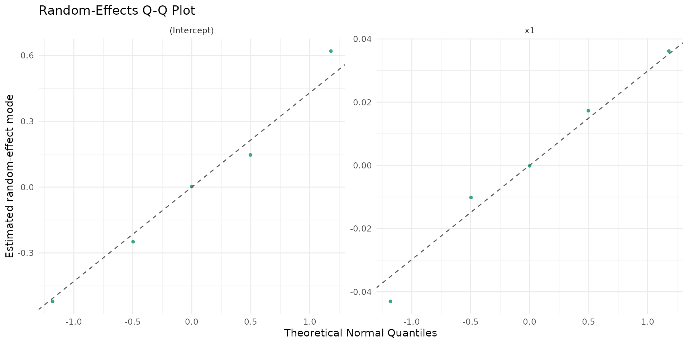
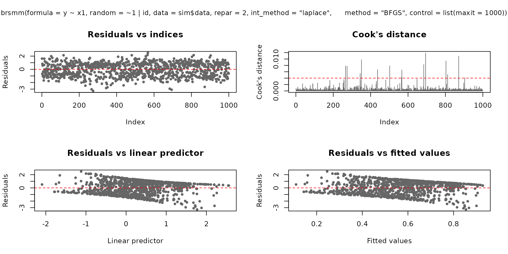
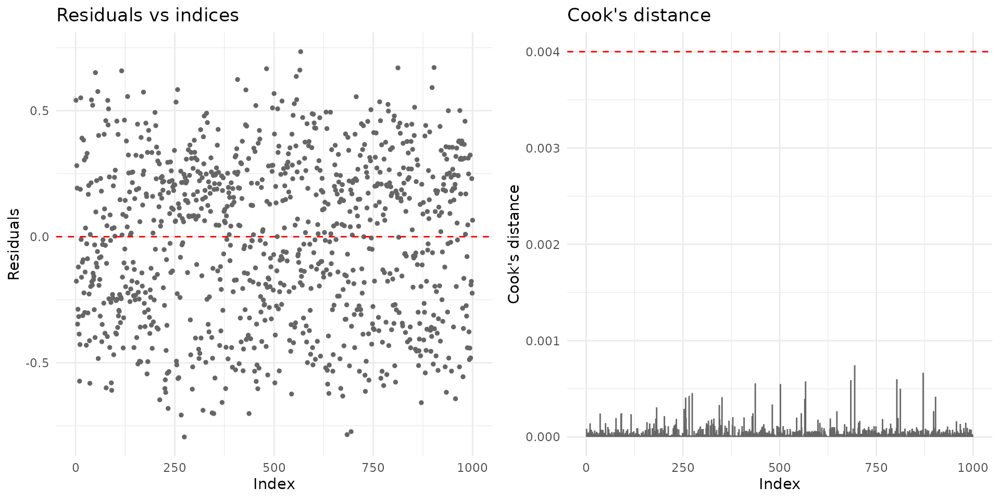
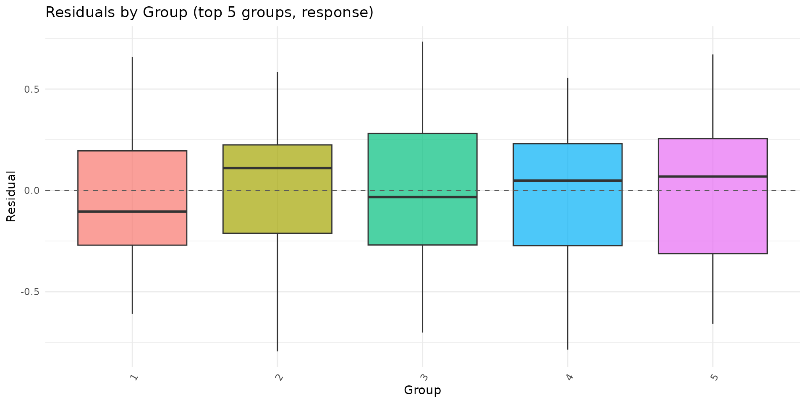

# Mixed-Effects Beta Interval Regression with brsmm

## Overview

[`brsmm()`](https://evandeilton.github.io/betaregscale/reference/brsmm.md)
extends
[`brs()`](https://evandeilton.github.io/betaregscale/reference/brs.md)
to clustered data by adding Gaussian random effects in the mean submodel
while preserving the interval-censored beta likelihood for scale-derived
outcomes.

This vignette covers:

1.  full model mathematics;
2.  estimation by marginal maximum likelihood (Laplace approximation);
3.  practical use of all current `brsmm` methods;
4.  inferential and validation workflows, including parameter recovery.

``` r
library(betaregscale)
```

## Mathematical model

Assume observations $i = 1,\ldots,n_{j}$ within groups $j = 1,\ldots,G$,
with group-specific random-effects vector
$\mathbf{b}_{j} \in {\mathbb{R}}^{q_{b}}$.

### Linear predictors

$$\eta_{\mu,ij} = x_{ij}^{\top}\beta + w_{ij}^{\top}\mathbf{b}_{j},\qquad\eta_{\phi,ij} = z_{ij}^{\top}\gamma$$

$$\mu_{ij} = g^{- 1}\left( \eta_{\mu,ij} \right),\qquad\phi_{ij} = h^{- 1}\left( \eta_{\phi,ij} \right)$$

with $g( \cdot )$ and $h( \cdot )$ chosen by `link` and `link_phi`. The
random-effects design row $w_{ij}$ is defined by
`random = ~ terms | group`.

### Beta parameterization

For each $\left( \mu_{ij},\phi_{ij} \right)$, `repar` maps to beta shape
parameters $\left( a_{ij},b_{ij} \right)$ via
[`brs_repar()`](https://evandeilton.github.io/betaregscale/reference/brs_repar.md).

### Conditional contribution by censoring type

Each observation contributes:

$$L_{ij}\left( b_{j};\theta \right) = \begin{cases}
{f\left( y_{ij};a_{ij},b_{ij} \right),} & {\delta_{ij} = 0} \\
{F\left( u_{ij};a_{ij},b_{ij} \right),} & {\delta_{ij} = 1} \\
{1 - F\left( l_{ij};a_{ij},b_{ij} \right),} & {\delta_{ij} = 2} \\
{F\left( u_{ij};a_{ij},b_{ij} \right) - F\left( l_{ij};a_{ij},b_{ij} \right),} & {\delta_{ij} = 3}
\end{cases}$$

where $l_{ij},u_{ij}$ are interval endpoints on $(0,1)$, $f( \cdot )$ is
beta density, and $F( \cdot )$ is beta CDF.

### Random-effects distribution

$$\mathbf{b}_{j} \sim \mathcal{N}(\mathbf{0},D),$$

where $D$ is a symmetric positive-definite covariance matrix.
Internally,
[`brsmm()`](https://evandeilton.github.io/betaregscale/reference/brsmm.md)
optimizes a packed lower-Cholesky parameterization $D = LL^{\top}$
(diagonal entries on log-scale for positivity).

### Group marginal likelihood

$$L_{j}(\theta) = \int_{{\mathbb{R}}^{q_{b}}}\prod\limits_{i = 1}^{n_{j}}L_{ij}\left( b_{j};\theta \right)\,\varphi_{q_{b}}\left( \mathbf{b}_{j};\mathbf{0},D \right)\, d\mathbf{b}_{j}$$

$$\ell(\theta) = \sum\limits_{j = 1}^{G}\log L_{j}(\theta)$$

### Laplace approximation used by `brsmm()`

Define
$$Q_{j}(\mathbf{b}) = \sum\limits_{i = 1}^{n_{j}}\log L_{ij}(\mathbf{b};\theta) + \log\varphi_{q_{b}}(\mathbf{b};\mathbf{0},D)$$
and
${\widehat{\mathbf{b}}}_{j} = \arg\max_{\mathbf{b}}Q_{j}(\mathbf{b})$,
with curvature
$$H_{j} = - \nabla^{2}Q_{j}\left( {\widehat{\mathbf{b}}}_{j} \right).$$
Then

$$\log L_{j}(\theta) \approx Q_{j}\left( {\widehat{\mathbf{b}}}_{j} \right) + \frac{q_{b}}{2}\log(2\pi) - \frac{1}{2}\log\left| H_{j} \right|.$$

[`brsmm()`](https://evandeilton.github.io/betaregscale/reference/brsmm.md)
maximizes the approximated $\ell(\theta)$ with
[`stats::optim()`](https://rdrr.io/r/stats/optim.html), and computes
group-level posterior modes ${\widehat{\mathbf{b}}}_{j}$. For
$q_{b} = 1$, this reduces to the scalar random-intercept formula.

## Simulating clustered scale data

The next helper simulates data from a known mixed model to illustrate
fitting, inference, and recovery checks.

``` r
sim_brsmm_data <- function(seed = 3501L, g = 24L, ni = 12L,
                           beta = c(0.20, 0.65),
                           gamma = c(-0.15),
                           sigma_b = 0.55) {
  set.seed(seed)
  id <- factor(rep(seq_len(g), each = ni))
  n <- length(id)
  x1 <- rnorm(n)

  b_true <- rnorm(g, mean = 0, sd = sigma_b)
  eta_mu <- beta[1] + beta[2] * x1 + b_true[as.integer(id)]
  eta_phi <- rep(gamma[1], n)

  mu <- plogis(eta_mu)
  phi <- plogis(eta_phi)
  shp <- brs_repar(mu = mu, phi = phi, repar = 2)
  y <- round(stats::rbeta(n, shp$shape1, shp$shape2) * 100)

  list(
    data = data.frame(y = y, x1 = x1, id = id),
    truth = list(beta = beta, gamma = gamma, sigma_b = sigma_b, b = b_true)
  )
}

sim <- sim_brsmm_data(
  g = 5,
  ni = 200,
  beta = c(0.20, 0.65),
  gamma = c(-0.15),
  sigma_b = 0.55
)
str(sim$data)
#> 'data.frame':    1000 obs. of  3 variables:
#>  $ y : num  92 0 71 59 21 5 34 1 19 0 ...
#>  $ x1: num  -0.3677 -2.0069 -0.0469 -0.2468 0.7634 ...
#>  $ id: Factor w/ 5 levels "1","2","3","4",..: 1 1 1 1 1 1 1 1 1 1 ...
```

## Fitting `brsmm()`

``` r
fit_mm <- brsmm(
  y ~ x1,
  random = ~ 1 | id,
  data = sim$data,
  repar = 2,
  int_method = "laplace",
  method = "BFGS",
  control = list(maxit = 1000)
)

summary(fit_mm)
#> 
#> Call:
#> brsmm(formula = y ~ x1, random = ~1 | id, data = sim$data, repar = 2, 
#>     int_method = "laplace", method = "BFGS", control = list(maxit = 1000))
#> 
#> Randomized Quantile Residuals:
#>     Min      1Q  Median      3Q     Max 
#> -2.8356 -0.6727 -0.0422  0.6040  3.0833 
#> 
#> Coefficients (mean model with logit link):
#>             Estimate Std. Error z value Pr(>|z|)    
#> (Intercept)  0.26237    0.18121   1.448    0.148    
#> x1           0.63844    0.04381  14.573   <2e-16 ***
#> ---
#> Signif. codes:  0 '***' 0.001 '**' 0.01 '*' 0.05 '.' 0.1 ' ' 1
#> 
#> Phi coefficients (precision model with logit link):
#>             Estimate Std. Error z value Pr(>|z|)   
#> (Intercept) -0.10608    0.04044  -2.623  0.00872 **
#> ---
#> Signif. codes:  0 '***' 0.001 '**' 0.01 '*' 0.05 '.' 0.1 ' ' 1
#> 
#> Random-effects parameters (Cholesky scale):
#>                      Estimate Std. Error z value Pr(>|z|)   
#> logSD.(Intercept)|id  -0.9293     0.3338  -2.784  0.00537 **
#> ---
#> Signif. codes:  0 '***' 0.001 '**' 0.01 '*' 0.05 '.' 0.1 ' ' 1
#> ---
#> Mixed beta interval model (Laplace)
#> Observations: 1000  | Groups: 5 
#> Log-likelihood: -4182.1094 on 4 Df | AIC: 8372.2188 | BIC: 8391.8498 
#> Pseudo R-squared: 0.1815 
#> Number of iterations: 37 (BFGS) 
#> Censoring: 852 interval | 39 left | 109 right
```

## Random intercept + slope example

The model below includes a random intercept and random slope for `x1`:

``` r
fit_mm_rs <- brsmm(
  y ~ x1,
  random = ~ 1 + x1 | id,
  data = sim$data,
  repar = 2,
  int_method = "laplace",
  method = "BFGS",
  control = list(maxit = 1200)
)

summary(fit_mm_rs)
#> 
#> Call:
#> brsmm(formula = y ~ x1, random = ~1 + x1 | id, data = sim$data, 
#>     repar = 2, int_method = "laplace", method = "BFGS", control = list(maxit = 1200))
#> 
#> Randomized Quantile Residuals:
#>     Min      1Q  Median      3Q     Max 
#> -3.6105 -0.6741 -0.0459  0.6224  3.9925 
#> 
#> Coefficients (mean model with logit link):
#>             Estimate Std. Error z value Pr(>|z|)    
#> (Intercept)   0.2621     0.1805   1.452    0.146    
#> x1            0.6375     0.0455  14.012   <2e-16 ***
#> ---
#> Signif. codes:  0 '***' 0.001 '**' 0.01 '*' 0.05 '.' 0.1 ' ' 1
#> 
#> Phi coefficients (precision model with logit link):
#>             Estimate Std. Error z value Pr(>|z|)   
#> (Intercept) -0.10665    0.04046  -2.636   0.0084 **
#> ---
#> Signif. codes:  0 '***' 0.001 '**' 0.01 '*' 0.05 '.' 0.1 ' ' 1
#> 
#> Random-effects parameters (Cholesky scale):
#>                       Estimate Std. Error z value Pr(>|z|)   
#> logSD.(Intercept)|id  -0.92945    0.33379  -2.785  0.00536 **
#> cov.x1:(Intercept)|id -0.02742    0.04459  -0.615  0.53852   
#> logSD.x1|id           -7.05471   37.93692  -0.186  0.85248   
#> ---
#> Signif. codes:  0 '***' 0.001 '**' 0.01 '*' 0.05 '.' 0.1 ' ' 1
#> ---
#> Mixed beta interval model (Laplace)
#> Observations: 1000  | Groups: 5 
#> Log-likelihood: -4181.9196 on 6 Df | AIC: 8375.8392 | BIC: 8405.2858 
#> Pseudo R-squared: 0.1815 
#> Number of iterations: 64 (BFGS) 
#> Censoring: 852 interval | 39 left | 109 right
```

Covariance structure of random effects:

``` r
kbl10(fit_mm_rs$random$D)
```

|   V1    |   V2    |
|:-------:|:-------:|
| 0.1558  | -0.0108 |
| -0.0108 | 0.0008  |

``` r
kbl10(
  data.frame(term = names(fit_mm_rs$random$sd_b), sd = as.numeric(fit_mm_rs$random$sd_b)),
  digits = 4
)
```

|    term     |   sd   |
|:-----------:|:------:|
| (Intercept) | 0.3948 |
|     x1      | 0.0274 |

``` r
kbl10(head(ranef(fit_mm_rs), 10))
```

| (Intercept) |   x1    |
|:-----------:|:-------:|
|   -0.5205   | 0.0362  |
|   0.6196    | -0.0430 |
|   -0.2488   | 0.0173  |
|   0.1465    | -0.0102 |
|   0.0024    | -0.0002 |

## Additional studies of random effects (numerical and visual)

Following practices from established mixed-models packages, the package
now allows for a dedicated study of the random effects focusing on:

- $D$ structure and correlation;
- empirical distribution of modes by group;
- empirical shrinkage intensity;
- specific visual diagnostics for the random components.

``` r
re_study <- brsmm_re_study(fit_mm_rs)
print(re_study)
#> 
#> Random-effects study
#> Groups: 5 
#> 
#> Random-effects (VarCorr):
#>   Name                      Std.Dev.  Corr
#>   re1                         0.3948
#>   re2                         0.0274  -0.9995
#> 
#> ICC (latent logistic scale): 0.0452
#> 
#> Summary by term (SD_model = model SD; shrinkage = Var(modes)/Var(model)):
#>         term sd_model mean_mode sd_mode shrinkage_ratio shapiro_p
#>  (Intercept)   0.3948    -1e-04  0.4296               1    0.9641
#>           x1   0.0274     0e+00  0.0298               1    0.9641
kbl10(re_study$summary)
```

|    term     | sd_model | mean_mode | sd_mode | shrinkage_ratio | shapiro_p |
|:-----------:|:--------:|:---------:|:-------:|:---------------:|:---------:|
| (Intercept) |  0.3948  |  -1e-04   | 0.4296  |        1        |  0.9641   |
|     x1      |  0.0274  |   0e+00   | 0.0298  |        1        |  0.9641   |

``` r
kbl10(re_study$D)
```

|   V1    |   V2    |
|:-------:|:-------:|
| 0.1558  | -0.0108 |
| -0.0108 | 0.0008  |

``` r
kbl10(re_study$Corr)
```

|   V1    |   V2    |
|:-------:|:-------:|
| 1.0000  | -0.9995 |
| -0.9995 | 1.0000  |

Suggested visualizations for random effects:

``` r
if (requireNamespace("ggplot2", quietly = TRUE)) {
  autoplot.brsmm(fit_mm_rs, type = "ranef_caterpillar")
  autoplot.brsmm(fit_mm_rs, type = "ranef_density")
  autoplot.brsmm(fit_mm_rs, type = "ranef_pairs")
  autoplot.brsmm(fit_mm_rs, type = "ranef_qq")
}
```



## Core methods

### Coefficients and random effects

`coef(fit_mm, model = "random")` returns packed random-effect covariance
parameters on the optimizer scale (lower-Cholesky, with a log-diagonal).
For random-intercept models, this simplifies to $\log\sigma_{b}$.

``` r
kbl10(
  data.frame(
    parameter = names(coef(fit_mm, model = "full")),
    estimate = as.numeric(coef(fit_mm, model = "full"))
  ),
  digits = 4
)
```

|            parameter             | estimate |
|:--------------------------------:|:--------:|
|           (Intercept)            |  0.2624  |
|                x1                |  0.6384  |
|        (phi)\_(Intercept)        | -0.1061  |
| (re_chol_logsd)\_(Intercept)\|id | -0.9293  |

``` r
kbl10(
  data.frame(
    log_sigma_b = as.numeric(coef(fit_mm, model = "random")),
    sigma_b = as.numeric(exp(coef(fit_mm, model = "random")))
  ),
  digits = 4
)
```

| log_sigma_b | sigma_b |
|:-----------:|:-------:|
|   -0.9293   | 0.3948  |

``` r
kbl10(head(ranef(fit_mm), 10))
```

|    x    |
|:-------:|
| -0.5220 |
| 0.6187  |
| -0.2499 |
| 0.1420  |
| 0.0083  |

For random intercept + slope models:

``` r
kbl10(
  data.frame(
    parameter = names(coef(fit_mm_rs, model = "random")),
    estimate = as.numeric(coef(fit_mm_rs, model = "random"))
  ),
  digits = 4
)
```

|            parameter             | estimate |
|:--------------------------------:|:--------:|
| (re_chol_logsd)\_(Intercept)\|id | -0.9294  |
|  (re_chol)\_x1:(Intercept)\|id   | -0.0274  |
|     (re_chol_logsd)\_x1\|id      | -7.0547  |

``` r
kbl10(fit_mm_rs$random$D)
```

|   V1    |   V2    |
|:-------:|:-------:|
| 0.1558  | -0.0108 |
| -0.0108 | 0.0008  |

### Variance-covariance, summary and likelihood criteria

``` r
vc <- vcov(fit_mm)
dim(vc)
#> [1] 4 4

sm <- summary(fit_mm)
kbl10(sm$coefficients)
```

|             | mean.Estimate | mean.Std..Error | mean.z.value | mean.Pr…z.. | precision.Estimate | precision.Std..Error | precision.z.value | precision.Pr…z.. | random.Estimate | random.Std..Error | random.z.value | random.Pr…z.. |
|:------------|:-------------:|:---------------:|:------------:|:-----------:|:------------------:|:--------------------:|:-----------------:|:----------------:|:---------------:|:-----------------:|:--------------:|:-------------:|
| (Intercept) |    0.2624     |     0.1812      |    1.4479    |   0.1477    |      -0.1061       |        0.0404        |      -2.623       |      0.0087      |     -0.9293     |      0.3338       |    -2.7839     |    0.0054     |
| x1          |    0.6384     |     0.0438      |   14.5727    |   0.0000    |      -0.1061       |        0.0404        |      -2.623       |      0.0087      |     -0.9293     |      0.3338       |    -2.7839     |    0.0054     |

``` r

kbl10(
  data.frame(
    logLik = as.numeric(logLik(fit_mm)),
    AIC = AIC(fit_mm),
    BIC = BIC(fit_mm),
    nobs = nobs(fit_mm)
  ),
  digits = 4
)
```

|  logLik   |   AIC    |   BIC   | nobs |
|:---------:|:--------:|:-------:|:----:|
| -4182.109 | 8372.219 | 8391.85 | 1000 |

### Fitted values, prediction and residuals

``` r
kbl10(
  data.frame(
    mu_hat = head(fitted(fit_mm, type = "mu")),
    phi_hat = head(fitted(fit_mm, type = "phi")),
    pred_mu = head(predict(fit_mm, type = "response")),
    pred_eta = head(predict(fit_mm, type = "link")),
    pred_phi = head(predict(fit_mm, type = "precision")),
    pred_var = head(predict(fit_mm, type = "variance"))
  ),
  digits = 4
)
```

| mu_hat | phi_hat | pred_mu | pred_eta | pred_phi | pred_var |
|:------:|:-------:|:-------:|:--------:|:--------:|:--------:|
| 0.3789 | 0.4735  | 0.3789  | -0.4943  |  0.4735  |  0.1114  |
| 0.1764 | 0.4735  | 0.1764  | -1.5409  |  0.4735  |  0.0688  |
| 0.4281 | 0.4735  | 0.4281  | -0.2895  |  0.4735  |  0.1159  |
| 0.3972 | 0.4735  | 0.3972  | -0.4172  |  0.4735  |  0.1134  |
| 0.5567 | 0.4735  | 0.5567  |  0.2278  |  0.4735  |  0.1169  |
| 0.3379 | 0.4735  | 0.3379  | -0.6728  |  0.4735  |  0.1059  |

``` r

kbl10(
  data.frame(
    res_response = head(residuals(fit_mm, type = "response")),
    res_pearson = head(residuals(fit_mm, type = "pearson"))
  ),
  digits = 4
)
```

| res_response | res_pearson |
|:------------:|:-----------:|
|    0.5411    |   1.6211    |
|   -0.1764    |   -0.6725   |
|    0.2819    |   0.8279    |
|    0.1928    |   0.5726    |
|   -0.3467    |   -1.0142   |
|   -0.2879    |   -0.8845   |

### Diagnostic plotting methods

[`plot.brsmm()`](https://evandeilton.github.io/betaregscale/reference/plot.brsmm.md)
supports base and ggplot2 backends:

``` r
plot(fit_mm, which = 1:4, type = "pearson")
```



``` r

if (requireNamespace("ggplot2", quietly = TRUE)) {
  plot(fit_mm, which = 1:2, gg = TRUE)
}
```



[`autoplot.brsmm()`](https://evandeilton.github.io/betaregscale/reference/autoplot.brsmm.md)
provides focused ggplot diagnostics:

``` r
if (requireNamespace("ggplot2", quietly = TRUE)) {
  autoplot.brsmm(fit_mm, type = "calibration")
  autoplot.brsmm(fit_mm, type = "score_dist")
  autoplot.brsmm(fit_mm, type = "ranef_qq")
  autoplot.brsmm(fit_mm, type = "residuals_by_group")
}
```



### Prediction with `newdata`

If `newdata` contains unseen groups,
[`predict.brsmm()`](https://evandeilton.github.io/betaregscale/reference/predict.brsmm.md)
uses a random effect equal to zero for those levels.

``` r
nd <- sim$data[1:8, c("x1", "id")]
kbl10(
  data.frame(pred_seen = as.numeric(predict(fit_mm, newdata = nd, type = "response"))),
  digits = 4
)
```

| pred_seen |
|:---------:|
|  0.3789   |
|  0.1764   |
|  0.4281   |
|  0.3972   |
|  0.5567   |
|  0.3379   |
|  0.4601   |
|  0.3268   |

``` r

nd_unseen <- nd
nd_unseen$id <- factor(rep("new_cluster", nrow(nd_unseen)))
kbl10(
  data.frame(pred_unseen = as.numeric(predict(fit_mm, newdata = nd_unseen, type = "response"))),
  digits = 4
)
```

| pred_unseen |
|:-----------:|
|   0.5069    |
|   0.2652    |
|   0.5578    |
|   0.5262    |
|   0.6791    |
|   0.4624    |
|   0.5895    |
|   0.4500    |

The same logic applies to random intercept + slope models:

``` r
kbl10(
  data.frame(pred_rs_seen = as.numeric(predict(fit_mm_rs, newdata = nd, type = "response"))),
  digits = 4
)
```

| pred_rs_seen |
|:------------:|
|    0.3761    |
|    0.1665    |
|    0.4280    |
|    0.3954    |
|    0.5636    |
|    0.3330    |
|    0.4617    |
|    0.3214    |

``` r
kbl10(
  data.frame(pred_rs_unseen = as.numeric(predict(fit_mm_rs, newdata = nd_unseen, type = "response"))),
  digits = 4
)
```

| pred_rs_unseen |
|:--------------:|
|     0.5069     |
|     0.2655     |
|     0.5578     |
|     0.5262     |
|     0.6789     |
|     0.4624     |
|     0.5894     |
|     0.4501     |

## Statistical tests and validation workflow

### Wald tests (from `summary`)

[`summary.brsmm()`](https://evandeilton.github.io/betaregscale/reference/summary.brsmm.md)
reports Wald $z$-tests for each parameter:
$$z_{k} = {\widehat{\theta}}_{k}/{SE}\left( {\widehat{\theta}}_{k} \right).$$

``` r
sm <- summary(fit_mm)
kbl10(sm$coefficients)
```

|             | mean.Estimate | mean.Std..Error | mean.z.value | mean.Pr…z.. | precision.Estimate | precision.Std..Error | precision.z.value | precision.Pr…z.. | random.Estimate | random.Std..Error | random.z.value | random.Pr…z.. |
|:------------|:-------------:|:---------------:|:------------:|:-----------:|:------------------:|:--------------------:|:-----------------:|:----------------:|:---------------:|:-----------------:|:--------------:|:-------------:|
| (Intercept) |    0.2624     |     0.1812      |    1.4479    |   0.1477    |      -0.1061       |        0.0404        |      -2.623       |      0.0087      |     -0.9293     |      0.3338       |    -2.7839     |    0.0054     |
| x1          |    0.6384     |     0.0438      |   14.5727    |   0.0000    |      -0.1061       |        0.0404        |      -2.623       |      0.0087      |     -0.9293     |      0.3338       |    -2.7839     |    0.0054     |

### Evolutionary scheme and Likelihood Ratio (LR) test selection

A practical workflow of increasing complexity:

1.  [`brs()`](https://evandeilton.github.io/betaregscale/reference/brs.md):
    no random effect (ignores clustering);
2.  `brsmm(..., random = ~ 1 | id)`: random intercept;
3.  `brsmm(..., random = ~ 1 + x1 | id)`: random intercept + slope.

In the first jump (`brs` to `brsmm` with intercept), the hypothesis
$\sigma_{b}^{2} = 0$ lies on the boundary of the parameter space. Thus,
the classical asymptotic $\chi^{2}$ reference distribution should be
interpreted with caution. In the second jump (intercept to intercept +
slope), the Likelihood Ratio (LR) test with a $\chi^{2}$ distribution is
commonly used as a practical diagnostic for goodness-of-fit gains.

``` r
# Base model without a random effect
fit_brs <- brs(
  y ~ x1,
  data = sim$data,
  repar = 2
)

# Reuse the mixed models already fitted:
# fit_mm    : random = ~ 1 | id
# fit_mm_rs : random = ~ 1 + x1 | id

tab_lr <- anova(fit_brs, fit_mm, fit_mm_rs, test = "Chisq")
kbl10(
  data.frame(model = rownames(tab_lr), tab_lr, row.names = NULL),
  digits = 4
)
```

|   model    | Df  |  logLik   |   AIC    |   BIC    |  Chisq  | Chi.Df | Pr..Chisq. |
|:----------:|:---:|:---------:|:--------:|:--------:|:-------:|:------:|:----------:|
|  M1 (brs)  |  3  | -4219.025 | 8444.051 | 8458.774 |   NA    |   NA   |     NA     |
| M2 (brsmm) |  4  | -4182.109 | 8372.219 | 8391.850 | 73.8319 |   1    |   0.0000   |
| M3 (brsmm) |  6  | -4181.920 | 8375.839 | 8405.286 | 0.3795  |   2    |   0.8272   |

Operational decision rule (analytical):

- If the second jump (RI to RI+RS) does not improve the fit (high
  p-value), prefer the random-intercept model for parsimony.
- If there is a robust gain, adopt the RI+RS model and validate
  parameter stability (especially `sd_b` and the $D$ matrix) via
  sensitivity and residual diagnostics.

### Residual diagnostics (quick checks)

``` r
r <- residuals(fit_mm, type = "pearson")
kbl10(
  data.frame(
    mean = mean(r),
    sd = stats::sd(r),
    q025 = as.numeric(stats::quantile(r, 0.025)),
    q975 = as.numeric(stats::quantile(r, 0.975))
  ),
  digits = 4
)
```

|  mean   |   sd   |  q025   |  q975  |
|:-------:|:------:|:-------:|:------:|
| -0.0328 | 0.9963 | -1.8841 | 1.5617 |

## Parameter recovery experiment

A single-fit recovery table can be produced directly from the previous
fit:

``` r
est <- c(
  beta0 = unname(coef(fit_mm, model = "mean")[1]),
  beta1 = unname(coef(fit_mm, model = "mean")[2]),
  sigma_b = unname(exp(coef(fit_mm, model = "random")))
)

true <- c(
  beta0 = sim$truth$beta[1],
  beta1 = sim$truth$beta[2],
  sigma_b = sim$truth$sigma_b
)

recovery_table <- data.frame(
  parameter = names(true),
  true = as.numeric(true),
  estimate = as.numeric(est[names(true)]),
  bias = as.numeric(est[names(true)] - true)
)
kbl10(recovery_table)
```

| parameter | true | estimate |  bias   |
|:---------:|:----:|:--------:|:-------:|
|   beta0   | 0.20 |  0.2624  | 0.0624  |
|   beta1   | 0.65 |  0.6384  | -0.0116 |
|  sigma_b  | 0.55 |  0.3948  | -0.1552 |

For a Monte Carlo recovery study, repeat simulation and fitting across
replicates:

``` r
mc_recovery <- function(R = 50L, seed = 7001L) {
  set.seed(seed)
  out <- vector("list", R)

  for (r in seq_len(R)) {
    sim_r <- sim_brsmm_data(seed = seed + r)
    fit_r <- brsmm(
      y ~ x1,
      random = ~ 1 | id,
      data = sim_r$data,
      repar = 2,
      int_method = "laplace",
      method = "BFGS",
      control = list(maxit = 1000)
    )

    out[[r]] <- c(
      beta0 = unname(coef(fit_r, model = "mean")[1]),
      beta1 = unname(coef(fit_r, model = "mean")[2]),
      sigma_b = unname(exp(coef(fit_r, model = "random")))
    )
  }

  est <- do.call(rbind, out)
  truth <- c(beta0 = 0.20, beta1 = 0.65, sigma_b = 0.55)

  data.frame(
    parameter = colnames(est),
    truth = as.numeric(truth[colnames(est)]),
    mean_est = colMeans(est),
    bias = colMeans(est) - truth[colnames(est)],
    rmse = sqrt(colMeans((sweep(est, 2, truth[colnames(est)], "-"))^2))
  )
}

kbl10(mc_recovery(R = 50))
```

## How this maps to automated package tests

The package test suite includes dedicated `brsmm` tests for:

1.  fitting with Laplace integration;
2.  one- and two-part formulas;
3.  S3 methods (`coef`, `vcov`, `summary`, `predict`, `residuals`,
    `ranef`);
4.  parameter recovery under known DGP settings.

Run locally:

``` r
devtools::test(filter = "brsmm")
```

## References

Ferrari, S. L. P. and Cribari-Neto, F. (2004). Beta regression for
modelling rates and proportions. *Journal of Applied Statistics*, 31(7),
799-815. DOI: 10.1080/0266476042000214501. Validated online via:
<https://doi.org/10.1080/0266476042000214501>.

Pinheiro, J. C. and Bates, D. M. (2000). *Mixed-Effects Models in S and
S-PLUS*. Springer. DOI: 10.1007/b98882. Validated online via:
<https://doi.org/10.1007/b98882>.

Rue, H., Martino, S., and Chopin, N. (2009). Approximate Bayesian
inference for latent Gaussian models by using integrated nested Laplace
approximations. *Journal of the Royal Statistical Society: Series B*,
71(2), 319-392. DOI: 10.1111/j.1467-9868.2008.00700.x. Validated online
via: <https://doi.org/10.1111/j.1467-9868.2008.00700.x>.
