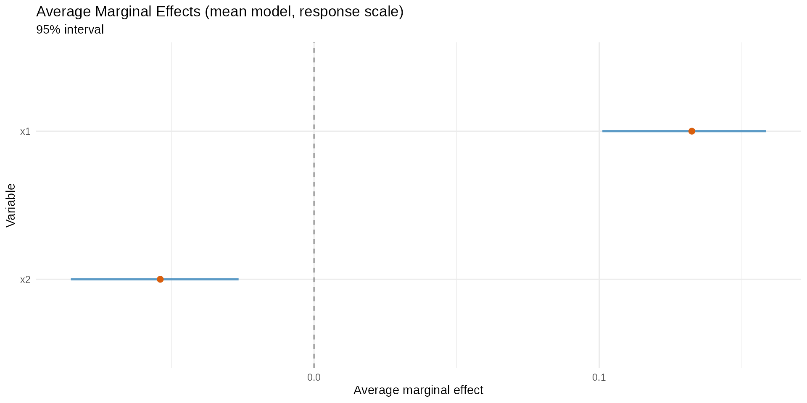
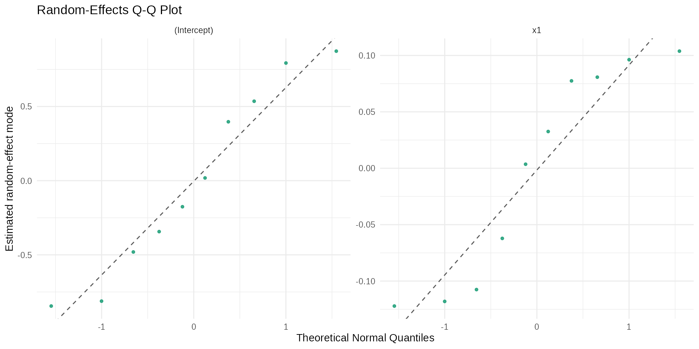

# Advanced Workflows for High-Level Users

## Audience and scope

This vignette is designed for analysts who already know beta regression
and need a production-oriented workflow with:

1.  reproducible model selection;
2.  inferential and predictive diagnostics;
3.  mixed-effects escalation (`brs` -\> `brsmm`) with LR comparison;
4.  high-signal reporting tables for technical decision-making.

``` r
library(betaregscale)
```

## 1) Reproducible simulation and data checks

``` r
n <- 260
d <- data.frame(
  x1 = rnorm(n),
  x2 = rnorm(n),
  z1 = rnorm(n)
)

sim <- brs_sim(
  formula = ~ x1 + x2 | z1,
  data = d,
  beta = c(0.15, 0.55, -0.30),
  zeta = c(-0.10, 0.35),
  link = "logit",
  link_phi = "logit",
  ncuts = 100,
  repar = 2
)

kbl10(head(sim, 10))
```

| left  | right |  yt  |  y  | delta |   x1    |   x2    |   z1    |
|:-----:|:-----:|:----:|:---:|:-----:|:-------:|:-------:|:-------:|
| 0.745 | 0.755 | 0.75 | 75  |   3   | 0.5206  | 0.2576  | -0.9272 |
| 0.705 | 0.715 | 0.71 | 71  |   3   | -1.0797 | 0.6131  | 0.7927  |
| 0.045 | 0.055 | 0.05 |  5  |   3   | 0.1392  | -0.6523 | -0.6891 |
| 0.025 | 0.035 | 0.03 |  3  |   3   | -0.0847 | -0.1383 | -0.0417 |
| 0.275 | 0.285 | 0.28 | 28  |   3   | -0.6666 | -0.1236 | -0.7856 |
| 0.000 | 0.005 | 0.00 |  0  |   1   | -2.5161 | -0.9647 | 0.4345  |
| 0.085 | 0.095 | 0.09 |  9  |   3   | -0.7351 | 0.0190  | -0.6656 |
| 0.000 | 0.005 | 0.00 |  0  |   1   | -1.0201 | 1.6917  | 0.4499  |
| 0.605 | 0.615 | 0.61 | 61  |   3   | 0.1136  | 0.8858  | -0.5480 |
| 0.005 | 0.015 | 0.01 |  1  |   3   | -0.4738 | -0.7299 | 1.8569  |

``` r
kbl10(
  data.frame(
    n = nrow(sim),
    exact = sum(sim$delta == 0),
    left = sum(sim$delta == 1),
    right = sum(sim$delta == 2),
    interval = sum(sim$delta == 3)
  ),
  digits = 4
)
```

|  n  | exact | left | right | interval |
|:---:|:-----:|:----:|:-----:|:--------:|
| 260 |   0   |  15  |  16   |   229    |

## 2) Fixed-effects candidate set and model ranking

``` r
fit_logit <- brs(y ~ x1 + x2 | z1, data = sim, link = "logit", repar = 2)
fit_probit <- brs(y ~ x1 + x2 | z1, data = sim, link = "probit", repar = 2)
fit_cauchit <- brs(y ~ x1 + x2 | z1, data = sim, link = "cauchit", repar = 2)

tab_rank <- brs_table(
  logit = fit_logit,
  probit = fit_probit,
  cauchit = fit_cauchit
)
kbl10(tab_rank)
```

| model | nobs | npar | logLik | AIC | BIC | pseudo_r2 | exact | left | right | interval | prop_exact | prop_left | prop_right | prop_interval |
|:--:|:--:|:--:|:--:|:--:|:--:|:--:|:--:|:--:|:--:|:--:|:--:|:--:|:--:|:--:|
| logit | 260 | 5 | -1120.320 | 2250.639 | 2268.443 | 0.1875 | 0 | 15 | 16 | 229 | 0 | 0.0577 | 0.0615 | 0.8808 |
| probit | 260 | 5 | -1120.281 | 2250.563 | 2268.366 | 0.1807 | 0 | 15 | 16 | 229 | 0 | 0.0577 | 0.0615 | 0.8808 |
| cauchit | 260 | 5 | -1120.656 | 2251.311 | 2269.115 | 0.1580 | 0 | 15 | 16 | 229 | 0 | 0.0577 | 0.0615 | 0.8808 |

## 3) Inference stack: Wald + bootstrap + AME

``` r
kbl10(brs_est(fit_logit))
```

|      variable      | estimate |   se   | z_value | p_value | ci_lower | ci_upper |
|:------------------:|:--------:|:------:|:-------:|:-------:|:--------:|:--------:|
|    (Intercept)     |  0.0673  | 0.0783 | 0.8589  | 0.3904  | -0.0862  |  0.2208  |
|         x1         |  0.5759  | 0.0847 | 6.7979  | 0.0000  |  0.4099  |  0.7419  |
|         x2         | -0.2344  | 0.0751 | -3.1193 | 0.0018  | -0.3816  | -0.0871  |
| (phi)\_(Intercept) | -0.1677  | 0.0769 | -2.1800 | 0.0293  | -0.3185  | -0.0169  |
|     (phi)\_z1      |  0.3492  | 0.0893 | 3.9085  | 0.0001  |  0.1741  |  0.5243  |

``` r
kbl10(confint(fit_logit))
```

|                    |  2.5 %  | 97.5 %  |
|:-------------------|:-------:|:-------:|
| (Intercept)        | -0.0862 | 0.2208  |
| x1                 | 0.4099  | 0.7419  |
| x2                 | -0.3816 | -0.0871 |
| (phi)\_(Intercept) | -0.3185 | -0.0169 |
| (phi)\_z1          | 0.1741  | 0.5243  |

``` r

boot_tab <- brs_bootstrap(fit_logit, R = 80, level = 0.95)
kbl10(head(boot_tab, 10))
```

| parameter | estimate | se_boot | ci_lower | ci_upper | mcse_lower | mcse_upper | wald_lower | wald_upper | level |
|:--:|:--:|:--:|:--:|:--:|:--:|:--:|:--:|:--:|:--:|
| (Intercept) | 0.0673 | 0.0765 | -0.1117 | 0.1797 | 0.0164 | 0.0125 | -0.0862 | 0.2208 | 0.95 |
| x1 | 0.5759 | 0.0786 | 0.4619 | 0.7419 | 0.0129 | 0.0144 | 0.4099 | 0.7419 | 0.95 |
| x2 | -0.2344 | 0.0736 | -0.3600 | -0.1112 | 0.0124 | 0.0098 | -0.3816 | -0.0871 | 0.95 |
| (phi)\_(Intercept) | -0.1677 | 0.0699 | -0.3160 | -0.0475 | 0.0252 | 0.0146 | -0.3185 | -0.0169 | 0.95 |
| (phi)\_z1 | 0.3492 | 0.0805 | 0.2168 | 0.4992 | 0.0129 | 0.0170 | 0.1741 | 0.5243 | 0.95 |

``` r

set.seed(2026) # For marginal effects simulation
ame_mu <- brs_marginaleffects(
  fit_logit,
  model = "mean",
  type = "response",
  interval = TRUE,
  n_sim = 120
)
kbl10(ame_mu)
```

| variable |   ame   | std.error | ci.lower | ci.upper | model |   type   |  n  |
|:--------:|:-------:|:---------:|:--------:|:--------:|:-----:|:--------:|:---:|
|    x1    | 0.1325  |  0.0170   |  0.1004  |  0.1652  | mean  | response | 260 |
|    x2    | -0.0539 |  0.0184   | -0.0936  | -0.0201  | mean  | response | 260 |

``` r
if (requireNamespace("ggplot2", quietly = TRUE)) {
  boot_tab_bca <- brs_bootstrap(
    fit_logit,
    R = 120,
    level = 0.95,
    ci_type = "bca",
    keep_draws = TRUE
  )
  autoplot.brs_bootstrap(
    boot_tab_bca,
    type = "ci_forest",
    title = "Bootstrap (BCa) vs Wald intervals"
  )

  set.seed(2026) # For marginal effects simulation
  ame_mu_draws <- brs_marginaleffects(
    fit_logit,
    model = "mean",
    type = "response",
    interval = TRUE,
    n_sim = 160,
    keep_draws = TRUE,
  )
  autoplot.brs_marginaleffects(ame_mu_draws, type = "forest")
}
```



## 4) Prediction layer on analyst scale

``` r
score_prob <- brs_predict_scoreprob(fit_logit, scores = 0:10)
kbl10(score_prob[1:8, 1:7])
```

| score_0 | score_1 | score_2 | score_3 | score_4 | score_5 | score_6 |
|:-------:|:-------:|:-------:|:-------:|:-------:|:-------:|:-------:|
| 0.0048  | 0.0087  | 0.0084  | 0.0082  | 0.0081  | 0.0080  | 0.0079  |
| 0.1651  | 0.0641  | 0.0379  | 0.0284  | 0.0233  | 0.0200  | 0.0176  |
| 0.0068  | 0.0108  | 0.0099  | 0.0094  | 0.0090  | 0.0088  | 0.0086  |
| 0.0258  | 0.0250  | 0.0189  | 0.0162  | 0.0145  | 0.0134  | 0.0125  |
| 0.0267  | 0.0289  | 0.0226  | 0.0197  | 0.0179  | 0.0166  | 0.0157  |
| 0.2515  | 0.0772  | 0.0437  | 0.0319  | 0.0257  | 0.0217  | 0.0190  |
| 0.0354  | 0.0341  | 0.0256  | 0.0218  | 0.0195  | 0.0179  | 0.0167  |
| 0.1894  | 0.0709  | 0.0415  | 0.0310  | 0.0253  | 0.0216  | 0.0190  |

## 5) Out-of-sample validation

``` r
set.seed(2026) # For cross-validation reproducibility
cv_tab <- brs_cv(
  y ~ x1 + x2 | z1,
  data = sim,
  k = 5,
  repeats = 5,
  repar = 2
)
kbl10(head(cv_tab, 10))
```

| repeat | fold | n_train | n_test | log_score | rmse_yt | mae_yt | converged | error |
|:------:|:----:|:-------:|:------:|:---------:|:-------:|:------:|:---------:|:-----:|
|   1    |  1   |   208   |   52   |  -4.2138  | 0.3373  | 0.2928 |   TRUE    |  NA   |
|   1    |  2   |   208   |   52   |  -4.3150  | 0.3325  | 0.2779 |   TRUE    |  NA   |
|   1    |  3   |   208   |   52   |  -4.3508  | 0.3539  | 0.3109 |   TRUE    |  NA   |
|   1    |  4   |   208   |   52   |  -4.3223  | 0.2888  | 0.2440 |   TRUE    |  NA   |
|   1    |  5   |   208   |   52   |  -4.4093  | 0.3228  | 0.2793 |   TRUE    |  NA   |
|   2    |  1   |   208   |   52   |  -4.0261  | 0.3232  | 0.2885 |   TRUE    |  NA   |
|   2    |  2   |   208   |   52   |  -4.3619  | 0.3393  | 0.2897 |   TRUE    |  NA   |
|   2    |  3   |   208   |   52   |  -4.5482  | 0.3137  | 0.2699 |   TRUE    |  NA   |
|   2    |  4   |   208   |   52   |  -4.4991  | 0.3573  | 0.2932 |   TRUE    |  NA   |
|   2    |  5   |   208   |   52   |  -4.2584  | 0.3214  | 0.2808 |   TRUE    |  NA   |

## 6) Escalation to mixed models

### 6.1 Simulate clustered data with random intercept + slope

``` r
g <- 10
ni <- 120
id <- factor(rep(seq_len(g), each = ni))
n_mm <- length(id)
x1 <- rnorm(n_mm)
x2 <- rbinom(n_mm, size = 1, prob = 1 / 2)

b0 <- rnorm(g, sd = 0.40)
b1 <- rnorm(g, sd = 0.22)

eta_mu <- 0.20 + 0.65 * x1 - 0.30 * x2 + b0[id] + b1[id] * x1
eta_phi <- rep(-0.20, n_mm)

mu <- plogis(eta_mu)
phi <- plogis(eta_phi)
shp <- brs_repar(mu = mu, phi = phi, repar = 2)
y <- round(stats::rbeta(n_mm, shp$shape1, shp$shape2) * 100)

dmm <- data.frame(y = y, id = id, x1 = x1, x2 = x2)
kbl10(head(dmm, 10))
```

|  y  | id  |   x1    | x2  |
|:---:|:---:|:-------:|:---:|
| 94  |  1  | -0.3521 |  1  |
| 77  |  1  | 1.8287  |  1  |
| 99  |  1  | -0.8629 |  1  |
| 89  |  1  | -0.6258 |  0  |
| 100 |  1  | 0.8891  |  0  |
| 26  |  1  | 0.4643  |  1  |
| 99  |  1  | 0.0371  |  0  |
| 95  |  1  | 0.7236  |  0  |
| 89  |  1  | 0.1241  |  0  |
| 77  |  1  | -0.4552 |  0  |

### 6.2 Fit evolutionary sequence

``` r
fit_brs <- brs(y ~ x1 + x2, data = dmm, repar = 2)
fit_ri <- brsmm(y ~ x1 + x2, random = ~ 1 | id, data = dmm, repar = 2)
fit_rs <- brsmm(y ~ x1 + x2, random = ~ 1 + x1 | id, data = dmm, repar = 2)

tab_lr <- anova(fit_brs, fit_ri, fit_rs, test = "Chisq")
kbl10(data.frame(model = rownames(tab_lr), tab_lr, row.names = NULL))
```

|   model    | Df  |  logLik   |   AIC    |   BIC    |  Chisq   | Chi.Df | Pr..Chisq. |
|:----------:|:---:|:---------:|:--------:|:--------:|:--------:|:------:|:----------:|
|  M1 (brs)  |  4  | -4929.925 | 9867.850 | 9888.210 |    NA    |   NA   |     NA     |
| M2 (brsmm) |  5  | -4829.123 | 9668.247 | 9693.697 | 201.6026 |   1    |   0.0000   |
| M3 (brsmm) |  7  | -4827.018 | 9668.037 | 9703.667 |  4.2101  |   2    |   0.1218   |

### 6.3 Model choice by LLR/LRT (ANOVA)

The [`anova()`](https://rdrr.io/r/stats/anova.html) methods provide a
practical LLR workflow:

- `M0 = brs` (no random effects);
- `M1 = brsmm` with random intercept (`~ 1 | id`);
- `M2 = brsmm` with random intercept + slope (`~ 1 + x1 | id`).

In nested comparisons, the statistic is:
``` math

LR = 2\{\ell(\hat\theta_{\text{complex}}) - \ell(\hat\theta_{\text{simple}})\}.
```

For the first step (`M0 -> M1`), the null involves variance components
at the boundary ($`\sigma_b^2 = 0`$); p-values should be interpreted
with caution. For `M1 -> M2`, the chi-square approximation is often used
as a practical decision aid.

``` r
tab_lr_df <- data.frame(model = rownames(tab_lr), tab_lr, row.names = NULL)
tab_lr_df$decision <- c(
  "baseline",
  ifelse(is.na(tab_lr_df$`Pr(>Chisq)`[2]), "inspect AIC/BIC + diagnostics",
    ifelse(tab_lr_df$`Pr(>Chisq)`[2] < 0.05, "prefer M1 over M0", "prefer M0 (parsimony)")
  ),
  ifelse(is.na(tab_lr_df$`Pr(>Chisq)`[3]), "inspect AIC/BIC + diagnostics",
    ifelse(tab_lr_df$`Pr(>Chisq)`[3] < 0.05, "prefer M2 over M1", "prefer M1 (parsimony)")
  )
)
kbl10(tab_lr_df)
```

|   model    | Df  |  logLik   |   AIC    |   BIC    |  Chisq   | Chi.Df | Pr..Chisq. | decision |
|:----------:|:---:|:---------:|:--------:|:--------:|:--------:|:------:|:----------:|:--------:|
|  M1 (brs)  |  4  | -4929.925 | 9867.850 | 9888.210 |    NA    |   NA   |     NA     | baseline |
| M2 (brsmm) |  5  | -4829.123 | 9668.247 | 9693.697 | 201.6026 |   1    |   0.0000   | baseline |
| M3 (brsmm) |  7  | -4827.018 | 9668.037 | 9703.667 |  4.2101  |   2    |   0.1218   | baseline |

## 7) Random-effects study (numeric + visual)

``` r
rs <- brsmm_re_study(fit_rs)
print(rs)
#> 
#> Random-effects study
#> Groups: 10 
#> 
#> Summary by term:
#>         term sd_model mean_mode sd_mode shrinkage_ratio shapiro_p
#>  (Intercept)   0.6117   -0.0040  0.6315          1.0000    0.4816
#>           x1   0.1138   -0.0015  0.0930          0.6682    0.0760
#> 
#> Estimated covariance matrix D:
#>        [,1]   [,2]
#> [1,] 0.3742 0.0463
#> [2,] 0.0463 0.0130
#> 
#> Estimated correlation matrix:
#>        [,1]   [,2]
#> [1,] 1.0000 0.6654
#> [2,] 0.6654 1.0000
kbl10(rs$summary)
```

|    term     | sd_model | mean_mode | sd_mode | shrinkage_ratio | shapiro_p |
|:-----------:|:--------:|:---------:|:-------:|:---------------:|:---------:|
| (Intercept) |  0.6117  |  -0.0040  | 0.6315  |     1.0000      |  0.4816   |
|     x1      |  0.1138  |  -0.0015  | 0.0930  |     0.6682      |  0.0760   |

``` r
kbl10(rs$D)
```

|   V1   |   V2   |
|:------:|:------:|
| 0.3742 | 0.0463 |
| 0.0463 | 0.0130 |

``` r
kbl10(rs$Corr)
```

|   V1   |   V2   |
|:------:|:------:|
| 1.0000 | 0.6654 |
| 0.6654 | 1.0000 |

``` r
if (requireNamespace("ggplot2", quietly = TRUE)) {
  autoplot.brsmm(fit_rs, type = "ranef_caterpillar")
  autoplot.brsmm(fit_rs, type = "ranef_density")
  autoplot.brsmm(fit_rs, type = "ranef_pairs")
  autoplot.brsmm(fit_rs, type = "ranef_qq")
}
```



## 8) Practical decision checklist

- Start with `brs` candidates (`link`, `repar`) and rank with
  `brs_table`.
- Add bootstrap and AME before escalating complexity.
- Use `brs_cv` for out-of-sample stability checks.
- Escalate to `brsmm` only when LR/AIC/BIC and diagnostics support it.
- For random slopes, always inspect
  [`brsmm_re_study()`](https://evandeilton.github.io/betaregscale/reference/brsmm_re_study.md)
  and random-effects plots.

## References

Ferrari, S. L. P. and Cribari-Neto, F. (2004). Beta regression for
modelling rates and proportions. *Journal of Applied Statistics*, 31(7),
799-815. DOI: 10.1080/0266476042000214501. Validated online via:
<https://doi.org/10.1080/0266476042000214501>.

Smithson, M., and Verkuilen, J. (2006). A better lemon squeezer?
Maximum-likelihood regression with beta-distributed dependent variables.
*Psychological Methods*, 11(1), 54-71. DOI: 10.1037/1082-989X.11.1.54.
Validated online via: <https://doi.org/10.1037/1082-989X.11.1.54>.

Rue, H., Martino, S., and Chopin, N. (2009). Approximate Bayesian
inference for latent Gaussian models by using integrated nested Laplace
approximations. *Journal of the Royal Statistical Society: Series B*,
71(2), 319-392. DOI: 10.1111/j.1467-9868.2008.00700.x. Validated online
via: <https://doi.org/10.1111/j.1467-9868.2008.00700.x>.
