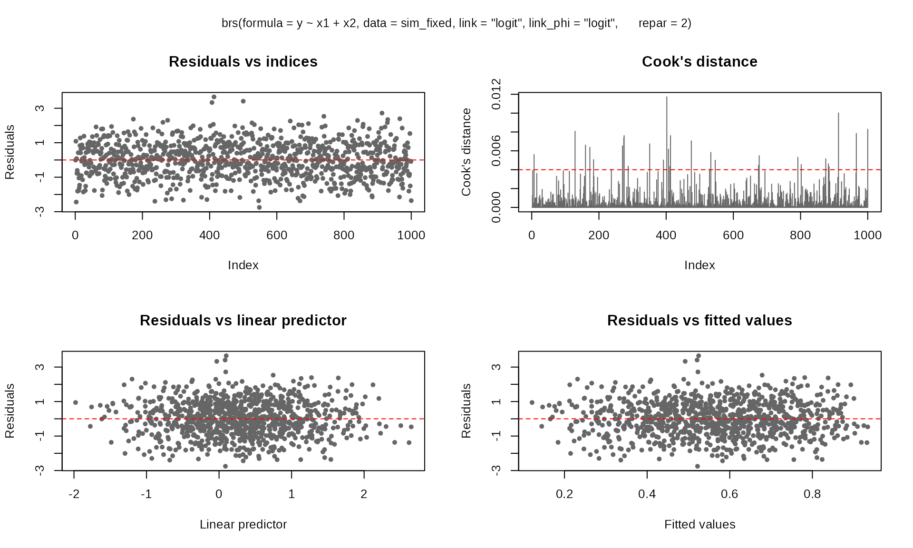
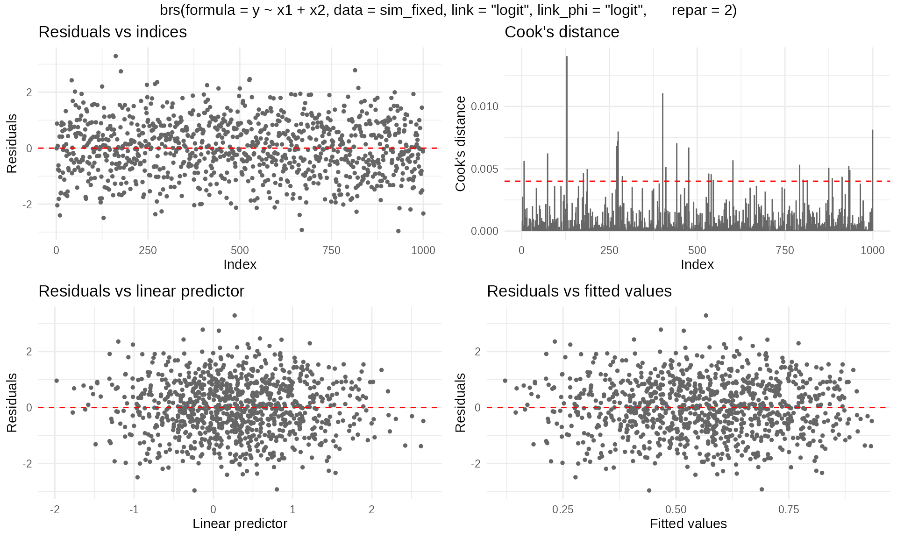
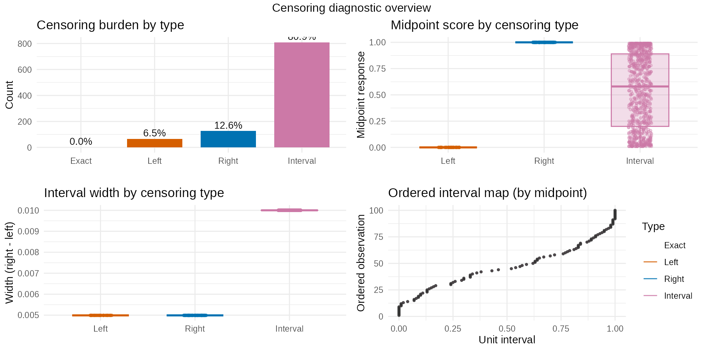
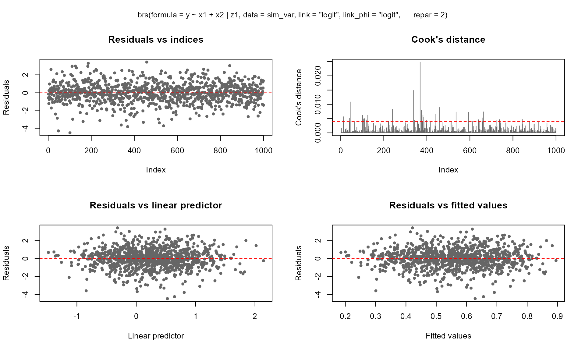
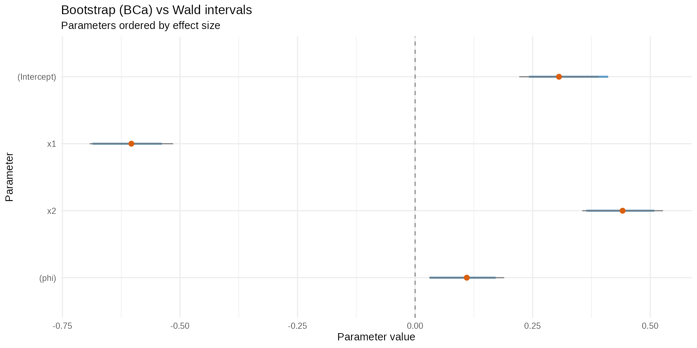
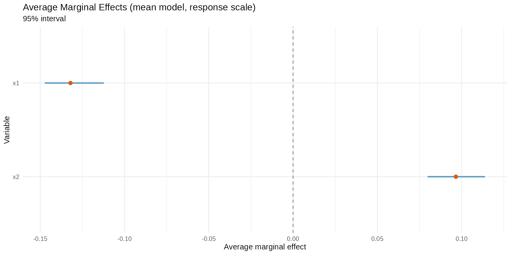

# Introduction to betaregscale

## Overview

The **betaregscale** package provides maximum-likelihood estimation of
beta regression models for responses derived from bounded rating scales.
Common examples include pain intensity scales (NRS-11, NRS-21, NRS-101),
Likert-type scales, product quality ratings, and any instrument whose
response can be mapped to the open interval $`(0,1)`$.

The key idea is that a discrete score recorded on a bounded scale
carries measurement uncertainty inherent to the instrument. For
instance, a pain score of $`y=6`$ on a 0–10 NRS is not an exact value
but rather represents a range: after rescaling to $`(0,1)`$, the
observation is treated as interval-censored in $`[0.55,0.65]`$. The
package uses the beta distribution to model such data, building a
complete likelihood that supports mixed censoring types within the same
dataset.

## Installation

``` r
# Development version from GitHub:
# install.packages("remotes")
remotes::install_github("evandeilton/betaregscale")
```

``` r
library(betaregscale)
```

## Censoring types

The complete likelihood supports four censoring types, automatically
classified by
[`brs_check()`](https://evandeilton.github.io/betaregscale/reference/brs_check.md):

| $`\delta`$ | Type                     | Likelihood contribution           |
|:----------:|:-------------------------|:----------------------------------|
|     0      | Exact (uncensored)       | $`f(y_i;a_i,b_i)`$                |
|     1      | Left-censored ($`y=0`$)  | $`F(u_i;a_i,b_i)`$                |
|     2      | Right-censored ($`y=K`$) | $`1-F(l_i;a_i,b_i)`$              |
|     3      | Interval-censored        | $`F(u_i;a_i,b_i)-F(l_i;a_i,b_i)`$ |

where $`f(\cdot)`$ and $`F(\cdot)`$ are the beta density and CDF,
$`[l_i,u_i]`$ are the interval endpoints, and $`(a_i,b_i)`$ are the beta
shape parameters derived from $`\mu_i`$ and $`\phi_i`$ via the chosen
reparameterization.

## Interval construction

Scale observations are mapped to $`(0,1)`$ with midpoint uncertainty
intervals:

``` math
y_t=y/K,\quad\text{interval }[y_t-h/K,y_t+h/K]
```

where $`K`$ is the number of scale categories (`ncuts`) and $`h`$ is the
half-width (`lim`, default **0.5**).

``` r
# Illustrate brs_check with a 0-10 NRS scale
y_example <- c(0, 3, 5, 7, 10)
cr <- brs_check(y_example, ncuts = 10)
kbl10(cr)
```

| left | right | yt  |  y  | delta |
|:----:|:-----:|:---:|:---:|:-----:|
| 0.00 | 0.05  | 0.0 |  0  |   1   |
| 0.25 | 0.35  | 0.3 |  3  |   3   |
| 0.45 | 0.55  | 0.5 |  5  |   3   |
| 0.65 | 0.75  | 0.7 |  7  |   3   |
| 0.95 | 1.00  | 1.0 | 10  |   2   |

The `delta` column shows that $`y=0`$ is left-censored ($`\delta=1`$),
$`y=10`$ is right-censored ($`\delta=2`$), and all interior values are
interval-censored ($`\delta=3`$).

## Data preparation with `brs_prep()`

In practice, analysts may want to supply their own censoring indicators
or interval endpoints rather than relying on the automatic
classification of
[`brs_check()`](https://evandeilton.github.io/betaregscale/reference/brs_check.md).
The
[`brs_prep()`](https://evandeilton.github.io/betaregscale/reference/brs_prep.md)
function provides a flexible, validated bridge between raw analyst data
and
[`brs()`](https://evandeilton.github.io/betaregscale/reference/brs.md).

It supports four input modes:

### Mode 1: Score only (automatic)

``` r
# Equivalent to brs_check - delta inferred from y
d1 <- data.frame(y = c(0, 3, 5, 7, 10), x1 = rnorm(5))
kbl10(brs_prep(d1, ncuts = 10))
```

| left | right | yt  |  y  | delta |   x1    |
|:----:|:-----:|:---:|:---:|:-----:|:-------:|
| 0.00 | 0.05  | 0.0 |  0  |   1   | -1.4000 |
| 0.25 | 0.35  | 0.3 |  3  |   3   | 0.2553  |
| 0.45 | 0.55  | 0.5 |  5  |   3   | -2.4373 |
| 0.65 | 0.75  | 0.7 |  7  |   3   | -0.0056 |
| 0.95 | 1.00  | 1.0 | 10  |   2   | 0.6216  |

### Mode 2: Score + explicit censoring indicator

``` r
# Analyst specifies delta directly
d2 <- data.frame(
  y     = c(50, 0, 99, 50),
  delta = c(0, 1, 2, 3),
  x1    = rnorm(4)
)
kbl10(brs_prep(d2, ncuts = 100))
```

| left  | right |  yt  |  y  | delta |   x1    |
|:-----:|:-----:|:----:|:---:|:-----:|:-------:|
| 0.500 | 0.500 | 0.50 | 50  |   0   | 1.1484  |
| 0.000 | 0.005 | 0.00 |  0  |   1   | -1.8218 |
| 0.985 | 1.000 | 0.99 | 99  |   2   | -0.2473 |
| 0.495 | 0.505 | 0.50 | 50  |   3   | -0.2442 |

### Mode 3: Interval endpoints with NA patterns

When the analyst provides `left` and/or `right` columns, censoring is
inferred from the NA pattern:

``` r
d3 <- data.frame(
  left  = c(NA, 20, 30, NA),
  right = c(5, NA, 45, NA),
  y     = c(NA, NA, NA, 50),
  x1    = rnorm(4)
)
kbl10(brs_prep(d3, ncuts = 100))
```

| left | right |  yt   |  y  | delta |   x1    |
|:----:|:-----:|:-----:|:---:|:-----:|:-------:|
| 0.0  | 0.05  | 0.025 | NA  |   1   | -0.2827 |
| 0.2  | 1.00  | 0.600 | NA  |   2   | -0.5537 |
| 0.3  | 0.45  | 0.375 | NA  |   3   | 0.6290  |
| 0.5  | 0.50  | 0.500 | 50  |   0   | 2.0650  |

### Mode 4: Analyst-supplied intervals

When the analyst provides `y`, `left`, and `right` simultaneously, their
endpoints are used directly (rescaled by $`K`$):

``` r
d4 <- data.frame(
  y     = c(50, 75),
  left  = c(48, 73),
  right = c(52, 77),
  x1    = rnorm(2)
)
kbl10(brs_prep(d4, ncuts = 100))
```

| left | right |  yt  |  y  | delta |   x1    |
|:----:|:-----:|:----:|:---:|:-----:|:-------:|
| 0.48 | 0.52  | 0.50 | 50  |   3   | -1.6310 |
| 0.73 | 0.77  | 0.75 | 75  |   3   | 0.5124  |

### Using brs_prep with `brs()`

Data processed by
[`brs_prep()`](https://evandeilton.github.io/betaregscale/reference/brs_prep.md)
is automatically detected by
[`brs()`](https://evandeilton.github.io/betaregscale/reference/brs.md) -
the internal
[`brs_check()`](https://evandeilton.github.io/betaregscale/reference/brs_check.md)
step is skipped:

``` r
set.seed(42)
n <- 1000
dat <- data.frame(x1 = rnorm(n), x2 = rnorm(n))
sim <- brs_sim(
  formula = ~ x1 + x2, data = dat,
  beta = c(0.2, -0.5, 0.3), phi = 0.3,
  link = "logit", link_phi = "logit",
  repar = 2
)
# Remove left, right, yt so brs_prep can rebuild them
prep <- brs_prep(sim[-c(1:3)], ncuts = 100)
fit_prep <- brs(y ~ x1 + x2,
  data = prep, repar = 2,
  link = "logit", link_phi = "logit"
)
summary(fit_prep, digits = 4)
#> 
#> Call:
#> brs(formula = y ~ x1 + x2, data = prep, link = "logit", link_phi = "logit", 
#>     repar = 2)
#> 
#> Quantile residuals:
#>     Min      1Q  Median      3Q     Max 
#> -3.1122 -0.6590 -0.0288  0.6409  3.6970 
#> 
#> Coefficients (mean model with logit link):
#>             Estimate Std. Error z value Pr(>|z|)    
#> (Intercept)  0.18254    0.04364   4.183 2.88e-05 ***
#> x1          -0.48490    0.04491 -10.797  < 2e-16 ***
#> x2           0.26206    0.04447   5.893 3.80e-09 ***
#> ---
#> Signif. codes:  0 '***' 0.001 '**' 0.01 '*' 0.05 '.' 0.1 ' ' 1
#> 
#> Phi coefficients (precision model with logit link):
#>       Estimate Std. Error z value Pr(>|z|)    
#> (phi)  0.26989    0.03992    6.76 1.38e-11 ***
#> ---
#> Signif. codes:  0 '***' 0.001 '**' 0.01 '*' 0.05 '.' 0.1 ' ' 1
#> ---
#> Log-likelihood: -4072.5673 on 4 Df | AIC: 8153.1346 | BIC: 8172.7656 
#> Pseudo R-squared: 0.1292 
#> Number of iterations: 35 (BFGS) 
#> Censoring: 796 interval | 74 left | 130 right
```

## Example 1: Fixed dispersion model

### Simulating data

We simulate observations from a beta regression model with fixed
dispersion, two covariates, and a logit link for the mean.

``` r
set.seed(4255)
n <- 1000
dat <- data.frame(x1 = rnorm(n), x2 = rnorm(n))

sim_fixed <- brs_sim(
  formula  = ~ x1 + x2,
  data     = dat,
  beta     = c(0.3, -0.6, 0.4),
  phi      = 1 / 10,
  link     = "logit",
  link_phi = "logit",
  ncuts    = 100,
  repar    = 2
)

kbl10(head(sim_fixed, 8))
```

| left  | right |  yt  |  y  | delta |   x1    |   x2    |
|:-----:|:-----:|:----:|:---:|:-----:|:-------:|:-------:|
| 0.165 | 0.175 | 0.17 | 17  |   3   | 1.9510  | 0.2888  |
| 0.985 | 0.995 | 0.99 | 99  |   3   | 0.7725  | 1.6103  |
| 0.000 | 0.005 | 0.00 |  0  |   1   | 0.7264  | 1.0542  |
| 0.575 | 0.585 | 0.58 | 58  |   3   | 0.0487  | -0.4923 |
| 0.095 | 0.105 | 0.10 | 10  |   3   | -0.5445 | -1.4098 |
| 0.065 | 0.075 | 0.07 |  7  |   3   | 0.3600  | -1.0116 |
| 0.025 | 0.035 | 0.03 |  3  |   3   | 0.7136  | 2.3083  |
| 0.355 | 0.365 | 0.36 | 36  |   3   | -0.7274 | 0.2061  |

Each observation is centered in its interval. For example, a score of 67
on a 0–100 scale yields $`y_t=0.67`$ with the interval
$`[0.665,0.675]`$.

### Fitting the model

``` r
fit_fixed <- brs(
  y ~ x1 + x2,
  data     = sim_fixed,
  link     = "logit",
  link_phi = "logit",
  repar    = 2
)
summary(fit_fixed)
#> 
#> Call:
#> brs(formula = y ~ x1 + x2, data = sim_fixed, link = "logit", 
#>     link_phi = "logit", repar = 2)
#> 
#> Quantile residuals:
#>     Min      1Q  Median      3Q     Max 
#> -3.0753 -0.6600  0.0058  0.7071  3.3708 
#> 
#> Coefficients (mean model with logit link):
#>             Estimate Std. Error z value Pr(>|z|)    
#> (Intercept)  0.30604    0.04312   7.097 1.28e-12 ***
#> x1          -0.60332    0.04530 -13.317  < 2e-16 ***
#> x2           0.44135    0.04385  10.066  < 2e-16 ***
#> ---
#> Signif. codes:  0 '***' 0.001 '**' 0.01 '*' 0.05 '.' 0.1 ' ' 1
#> 
#> Phi coefficients (precision model with logit link):
#>       Estimate Std. Error z value Pr(>|z|)   
#> (phi)  0.10991    0.04057   2.709  0.00674 **
#> ---
#> Signif. codes:  0 '***' 0.001 '**' 0.01 '*' 0.05 '.' 0.1 ' ' 1
#> ---
#> Log-likelihood: -4035.2262 on 4 Df | AIC: 8078.4524 | BIC: 8098.0834 
#> Pseudo R-squared: 0.2393 
#> Number of iterations: 39 (BFGS) 
#> Censoring: 809 interval | 65 left | 126 right
```

The summary output follows the `betareg` package style, showing separate
coefficient tables for the mean and precision submodels, with Wald
z-tests and $`p`$-values based on the standard normal distribution.

### Goodness of fit

``` r
kbl10(brs_gof(fit_fixed))
```

|  logLik   |   AIC    |   BIC    | pseudo_r2 |
|:---------:|:--------:|:--------:|:---------:|
| -4035.226 | 8078.452 | 8098.083 |  0.2393   |

### Comparing link functions

The package supports several link functions for the mean submodel. We
can compare them using information criteria:

``` r
links <- c("logit", "probit", "cauchit", "cloglog")
fits <- lapply(setNames(links, links), function(lnk) {
  brs(y ~ x1 + x2, data = sim_fixed, link = lnk, repar = 2)
})

# Estimates
est_table <- do.call(rbind, lapply(names(fits), function(lnk) {
  e <- brs_est(fits[[lnk]])
  e$link <- lnk
  e
}))
kbl10(est_table)
```

|  variable   | estimate |   se   | z_value  | p_value | ci_lower | ci_upper |  link   |
|:-----------:|:--------:|:------:|:--------:|:-------:|:--------:|:--------:|:-------:|
| (Intercept) |  0.3060  | 0.0431 |  7.0968  | 0.0000  |  0.2215  |  0.3906  |  logit  |
|     x1      | -0.6033  | 0.0453 | -13.3169 | 0.0000  | -0.6921  | -0.5145  |  logit  |
|     x2      |  0.4413  | 0.0438 | 10.0661  | 0.0000  |  0.3554  |  0.5273  |  logit  |
|    (phi)    |  0.1099  | 0.0406 |  2.7095  | 0.0067  |  0.0304  |  0.1894  |  logit  |
| (Intercept) |  0.1866  | 0.0262 |  7.1224  | 0.0000  |  0.1352  |  0.2379  | probit  |
|     x1      | -0.3652  | 0.0266 | -13.7107 | 0.0000  | -0.4175  | -0.3130  | probit  |
|     x2      |  0.2669  | 0.0261 | 10.2177  | 0.0000  |  0.2157  |  0.3181  | probit  |
|    (phi)    |  0.1118  | 0.0405 |  2.7603  | 0.0058  |  0.0324  |  0.1913  | probit  |
| (Intercept) |  0.2766  | 0.0409 |  6.7671  | 0.0000  |  0.1965  |  0.3566  | cauchit |
|     x1      | -0.5595  | 0.0493 | -11.3590 | 0.0000  | -0.6561  | -0.4630  | cauchit |

``` r

# Goodness of fit
gof_table <- do.call(rbind, lapply(fits, brs_gof))
kbl10(gof_table)
```

|         |  logLik   |   AIC    |   BIC    | pseudo_r2 |
|:--------|:---------:|:--------:|:--------:|:---------:|
| logit   | -4035.226 | 8078.452 | 8098.083 |  0.2393   |
| probit  | -4035.685 | 8079.370 | 8099.001 |  0.2383   |
| cauchit | -4035.500 | 8079.000 | 8098.631 |  0.1918   |
| cloglog | -4037.563 | 8083.126 | 8102.757 |  0.1824   |

### Residual diagnostics

The [`plot()`](https://rdrr.io/r/graphics/plot.default.html) method
provides six diagnostic panels. By default, the first four are shown:

``` r
plot(fit_fixed, caption = NULL, gg = TRUE, title = NULL, theme = ggplot2::theme_bw())
```



For ggplot2 output (requires the **ggplot2** package):

``` r
plot(fit_fixed, gg = TRUE)
```



### Predictions

``` r
# Fitted means
kbl10(
  data.frame(mu_hat = head(predict(fit_fixed, type = "response"))),
  digits = 4
)
```

| mu_hat |
|:------:|
| 0.3222 |
| 0.6343 |
| 0.5825 |
| 0.5148 |
| 0.5031 |
| 0.4115 |

``` r

# Conditional variance
kbl10(
  data.frame(var_hat = head(predict(fit_fixed, type = "variance"))),
  digits = 4
)
```

| var_hat |
|:-------:|
| 0.1152  |
| 0.1224  |
| 0.1283  |
| 0.1317  |
| 0.1319  |
| 0.1277  |

``` r

# Quantile predictions
kbl10(predict(fit_fixed, type = "quantile", at = c(0.10, 0.25, 0.5, 0.75, 0.90)))
```

| q_0.1  | q_0.25 | q_0.5  | q_0.75 | q_0.9  |
|:------:|:------:|:------:|:------:|:------:|
| 0.0007 | 0.0170 | 0.1779 | 0.6024 | 0.8964 |
| 0.0711 | 0.3148 | 0.7508 | 0.9675 | 0.9980 |
| 0.0435 | 0.2311 | 0.6578 | 0.9398 | 0.9947 |
| 0.0208 | 0.1444 | 0.5288 | 0.8860 | 0.9856 |
| 0.0181 | 0.1318 | 0.5060 | 0.8745 | 0.9833 |
| 0.0048 | 0.0565 | 0.3311 | 0.7601 | 0.9538 |
| 0.1348 | 0.4660 | 0.8689 | 0.9905 | 0.9997 |
| 0.1221 | 0.4392 | 0.8517 | 0.9880 | 0.9996 |
| 0.0319 | 0.1895 | 0.6011 | 0.9185 | 0.9915 |
| 0.0288 | 0.1777 | 0.5834 | 0.9111 | 0.9902 |

### Confidence intervals

Wald confidence intervals based on the asymptotic normal approximation:

``` r
kbl10(confint(fit_fixed))
```

|             |  2.5 %  | 97.5 %  |
|:------------|:-------:|:-------:|
| (Intercept) | 0.2215  | 0.3906  |
| x1          | -0.6921 | -0.5145 |
| x2          | 0.3554  | 0.5273  |
| (phi)       | 0.0304  | 0.1894  |

``` r
kbl10(confint(fit_fixed, model = "mean"))
```

|             |  2.5 %  | 97.5 %  |
|:------------|:-------:|:-------:|
| (Intercept) | 0.2215  | 0.3906  |
| x1          | -0.6921 | -0.5145 |
| x2          | 0.3554  | 0.5273  |

### Censoring structure

The
[`brs_cens()`](https://evandeilton.github.io/betaregscale/reference/brs_cens.md)
function provides a visual and tabular overview of the censoring types
in the fitted model:

``` r
brs_cens(fit_fixed, gg = TRUE, inform = TRUE)
```



## Example 2: Variable dispersion model

In many applications, the dispersion parameter $`\phi`$ may depend on
covariates. The package supports variable-dispersion models using the
`Formula` package notation: `y ~ x1 + x2 | z1 + z2`, where the terms
after `|` define the linear predictor for $`\phi`$. The same
[`brs_sim()`](https://evandeilton.github.io/betaregscale/reference/brs_sim.md)
function is used for fixed and variable dispersion; the second formula
part activates the precision submodel in simulation.

### Simulating data

``` r
set.seed(2222)
n <- 1000
dat_z <- data.frame(
  x1 = rnorm(n),
  x2 = rnorm(n),
  x3 = rbinom(n, size = 1, prob = 0.5),
  z1 = rnorm(n),
  z2 = rnorm(n)
)

sim_var <- brs_sim(
  formula = ~ x1 + x2 + x3 | z1 + z2,
  data = dat_z,
  beta = c(0.2, -0.6, 0.2, 0.2),
  zeta = c(0.2, -0.8, 0.6),
  link = "logit",
  link_phi = "logit",
  ncuts = 100,
  repar = 2
)

kbl10(head(sim_var, 10))
```

| left  | right |  yt  |  y  | delta |   x1    |   x2    | x3  |   z1    |   z2    |
|:-----:|:-----:|:----:|:---:|:-----:|:-------:|:-------:|:---:|:-------:|:-------:|
| 0.265 | 0.275 | 0.27 | 27  |   3   | -0.3381 | -0.8235 |  0  | 0.0306  | -1.1222 |
| 0.175 | 0.185 | 0.18 | 18  |   3   | 0.9392  | -1.7563 |  0  | 0.1938  | -0.2891 |
| 0.000 | 0.005 | 0.00 |  0  |   1   | 1.7377  | -1.3148 |  1  | -0.4283 | 0.3479  |
| 0.525 | 0.535 | 0.53 | 53  |   3   | 0.6963  | -0.8196 |  0  | 0.3694  | 0.2811  |
| 0.085 | 0.095 | 0.09 |  9  |   3   | 0.4623  | -0.1183 |  1  | 0.0553  | -1.2184 |
| 0.955 | 0.965 | 0.96 | 96  |   3   | -0.3151 | -0.0648 |  1  | 0.7169  | -0.5613 |
| 0.165 | 0.175 | 0.17 | 17  |   3   | 0.1927  | -0.9985 |  0  | -0.2222 | 0.4225  |
| 0.385 | 0.395 | 0.39 | 39  |   3   | 1.1307  | 0.6330  |  1  | 1.2509  | -1.5492 |
| 0.005 | 0.015 | 0.01 |  1  |   3   | 1.9764  | -0.4887 |  0  | -1.8699 | 0.3679  |
| 0.515 | 0.525 | 0.52 | 52  |   3   | 1.2071  | -1.3548 |  1  | -0.2813 | -1.6754 |

### Fitting the model

``` r
fit_var <- brs(
  y ~ x1 + x2 | z1,
  data     = sim_var,
  link     = "logit",
  link_phi = "logit",
  repar    = 2
)
summary(fit_var)
#> 
#> Call:
#> brs(formula = y ~ x1 + x2 | z1, data = sim_var, link = "logit", 
#>     link_phi = "logit", repar = 2)
#> 
#> Quantile residuals:
#>     Min      1Q  Median      3Q     Max 
#> -3.6111 -0.6344  0.0131  0.6654  3.2463 
#> 
#> Coefficients (mean model with logit link):
#>             Estimate Std. Error z value Pr(>|z|)    
#> (Intercept)  0.27141    0.04245   6.394 1.62e-10 ***
#> x1          -0.54553    0.04375 -12.468  < 2e-16 ***
#> x2           0.17226    0.04141   4.160 3.18e-05 ***
#> ---
#> Signif. codes:  0 '***' 0.001 '**' 0.01 '*' 0.05 '.' 0.1 ' ' 1
#> 
#> Phi coefficients (precision model with logit link):
#>             Estimate Std. Error z value Pr(>|z|)    
#> (Intercept)  0.24653    0.04233   5.823 5.77e-09 ***
#> z1          -0.72230    0.04507 -16.028  < 2e-16 ***
#> ---
#> Signif. codes:  0 '***' 0.001 '**' 0.01 '*' 0.05 '.' 0.1 ' ' 1
#> ---
#> Log-likelihood: -3922.2430 on 5 Df | AIC: 7854.4861 | BIC: 7879.0249 
#> Pseudo R-squared: 0.1159 
#> Number of iterations: 42 (BFGS) 
#> Censoring: 744 interval | 105 left | 151 right
```

Notice the `(phi)_` prefix in the precision coefficient names, following
the `betareg` convention.

### Accessing coefficients by submodel

``` r
# Full parameter vector
round(coef(fit_var), 4)
#>       (Intercept)                x1                x2 (phi)_(Intercept) 
#>            0.2714           -0.5455            0.1723            0.2465 
#>          (phi)_z1 
#>           -0.7223

# Mean submodel only
round(coef(fit_var, model = "mean"), 4)
#> (Intercept)          x1          x2 
#>      0.2714     -0.5455      0.1723

# Precision submodel only
round(coef(fit_var, model = "precision"), 4)
#> (phi)_(Intercept)          (phi)_z1 
#>            0.2465           -0.7223

# Variance-covariance matrix for the mean submodel
kbl10(vcov(fit_var, model = "mean"))
```

|             | (Intercept) |   x1    |   x2   |
|:------------|:-----------:|:-------:|:------:|
| (Intercept) |   0.0018    | -0.0001 | 0.0000 |
| x1          |   -0.0001   | 0.0019  | 0.0000 |
| x2          |   0.0000    | 0.0000  | 0.0017 |

### Comparing link functions (variable dispersion)

``` r
links <- c("logit", "probit", "cauchit", "cloglog")
fits_var <- lapply(setNames(links, links), function(lnk) {
  brs(y ~ x1 + x2 | z1, data = sim_var, link = lnk, repar = 2)
})

# Estimates
est_var <- do.call(rbind, lapply(names(fits_var), function(lnk) {
  e <- brs_est(fits_var[[lnk]])
  e$link <- lnk
  e
}))
kbl10(est_var)
```

|      variable      | estimate |   se   | z_value  | p_value | ci_lower | ci_upper |  link  |
|:------------------:|:--------:|:------:|:--------:|:-------:|:--------:|:--------:|:------:|
|    (Intercept)     |  0.2714  | 0.0424 |  6.3938  |    0    |  0.1882  |  0.3546  | logit  |
|         x1         | -0.5455  | 0.0438 | -12.4682 |    0    | -0.6313  | -0.4598  | logit  |
|         x2         |  0.1723  | 0.0414 |  4.1599  |    0    |  0.0911  |  0.2534  | logit  |
| (phi)\_(Intercept) |  0.2465  | 0.0423 |  5.8234  |    0    |  0.1636  |  0.3295  | logit  |
|     (phi)\_z1      | -0.7223  | 0.0451 | -16.0277 |    0    | -0.8106  | -0.6340  | logit  |
|    (Intercept)     |  0.1675  | 0.0260 |  6.4315  |    0    |  0.1165  |  0.2186  | probit |
|         x1         | -0.3352  | 0.0262 | -12.8011 |    0    | -0.3865  | -0.2839  | probit |
|         x2         |  0.1056  | 0.0253 |  4.1771  |    0    |  0.0561  |  0.1552  | probit |
| (phi)\_(Intercept) |  0.2467  | 0.0423 |  5.8291  |    0    |  0.1638  |  0.3297  | probit |
|     (phi)\_z1      | -0.7229  | 0.0451 | -16.0344 |    0    | -0.8112  | -0.6345  | probit |

``` r

# Goodness of fit
gof_var <- do.call(rbind, lapply(fits_var, brs_gof))
kbl10(gof_var)
```

|         |  logLik   |   AIC    |   BIC    | pseudo_r2 |
|:--------|:---------:|:--------:|:--------:|:---------:|
| logit   | -3922.243 | 7854.486 | 7879.025 |  0.1159   |
| probit  | -3922.227 | 7854.455 | 7878.994 |  0.1216   |
| cauchit | -3923.161 | 7856.323 | 7880.862 |  0.0902   |
| cloglog | -3922.296 | 7854.593 | 7879.132 |  0.0898   |

### Diagnostics for variable dispersion

``` r
plot(fit_var)
```



## Advanced analyst functions

The package includes analyst-facing helpers for uncertainty
quantification, effect interpretation, score-scale communication, and
predictive validation.

### Parametric bootstrap confidence intervals

``` r
set.seed(101)
boot_ci <- brs_bootstrap(
  fit_fixed,
  R = 100,
  level = 0.95,
  ci_type = "bca",
  keep_draws = TRUE
)
kbl10(head(boot_ci, 10))
```

| parameter | estimate | se_boot | ci_lower | ci_upper | mcse_lower | mcse_upper | wald_lower | wald_upper | level |
|:--:|:--:|:--:|:--:|:--:|:--:|:--:|:--:|:--:|:--:|
| (Intercept) | 0.3060 | 0.0410 | 0.2420 | 0.4106 | 0.0058 | 0.0137 | 0.2215 | 0.3906 | 0.95 |
| x1 | -0.6033 | 0.0424 | -0.6863 | -0.5387 | 0.0059 | 0.0045 | -0.6921 | -0.5145 | 0.95 |
| x2 | 0.4413 | 0.0423 | 0.3641 | 0.5088 | 0.0100 | 0.0034 | 0.3554 | 0.5273 | 0.95 |
| (phi) | 0.1099 | 0.0396 | 0.0307 | 0.1714 | 0.0093 | 0.0039 | 0.0304 | 0.1894 | 0.95 |

``` r
autoplot.brs_bootstrap(
  boot_ci,
  type = "ci_forest",
  title = "Bootstrap (BCa) vs Wald intervals"
)
```



### Average marginal effects (AME)

``` r
set.seed(202)
ame <- brs_marginaleffects(
  fit_fixed,
  model = "mean",
  type = "response",
  interval = TRUE,
  n_sim = 120,
  keep_draws = TRUE
)
kbl10(ame)
```

| variable |   ame   | std.error | ci.lower | ci.upper | model |   type   |  n   |
|:--------:|:-------:|:---------:|:--------:|:--------:|:-----:|:--------:|:----:|
|    x1    | -0.1321 |  0.0088   | -0.1473  | -0.1123  | mean  | response | 1000 |
|    x2    | 0.0966  |  0.0093   |  0.0798  |  0.1140  | mean  | response | 1000 |

``` r
autoplot.brs_marginaleffects(ame, type = "forest")
```



### Score probabilities on the original scale

``` r
prob_scores <- brs_predict_scoreprob(fit_fixed, scores = 0:10)
kbl10(prob_scores[1:6, 1:6])
```

| score_0 | score_1 | score_2 | score_3 | score_4 | score_5 |
|:-------:|:-------:|:-------:|:-------:|:-------:|:-------:|
| 0.1754  | 0.0657  | 0.0386  | 0.0288  | 0.0235  | 0.0201  |
| 0.0218  | 0.0190  | 0.0139  | 0.0117  | 0.0104  | 0.0095  |
| 0.0320  | 0.0249  | 0.0176  | 0.0145  | 0.0127  | 0.0115  |
| 0.0516  | 0.0342  | 0.0230  | 0.0185  | 0.0159  | 0.0142  |
| 0.0559  | 0.0360  | 0.0240  | 0.0192  | 0.0165  | 0.0146  |
| 0.1016  | 0.0509  | 0.0318  | 0.0246  | 0.0206  | 0.0180  |

``` r
kbl10(
  data.frame(row_sum = rowSums(prob_scores)[1:6]),
  digits = 4
)
```

| row_sum |
|:-------:|
| 0.4263  |
| 0.1260  |
| 0.1605  |
| 0.2141  |
| 0.2245  |
| 0.3163  |

### Repeated k-fold cross-validation

``` r
set.seed(303) # For cross-validation reproducibility
cv_res <- brs_cv(
  y ~ x1 + x2,
  data = sim_fixed,
  k = 5,
  repeats = 5,
  repar = 2,
)
kbl10(cv_res)
```

| repeat | fold | n_train | n_test | log_score | rmse_yt | mae_yt | converged | error |
|:------:|:----:|:-------:|:------:|:---------:|:-------:|:------:|:---------:|:-----:|
|   1    |  1   |   800   |  200   |  -4.0713  | 0.3472  | 0.3019 |   TRUE    |  NA   |
|   1    |  2   |   800   |  200   |  -3.9984  | 0.3451  | 0.3019 |   TRUE    |  NA   |
|   1    |  3   |   800   |  200   |  -3.9235  | 0.3395  | 0.2997 |   TRUE    |  NA   |
|   1    |  4   |   800   |  200   |  -4.0902  | 0.3311  | 0.2874 |   TRUE    |  NA   |
|   1    |  5   |   800   |  200   |  -4.1125  | 0.3420  | 0.2958 |   TRUE    |  NA   |
|   2    |  1   |   800   |  200   |  -4.0795  | 0.3270  | 0.2892 |   TRUE    |  NA   |
|   2    |  2   |   800   |  200   |  -4.2062  | 0.3504  | 0.2972 |   TRUE    |  NA   |
|   2    |  3   |   800   |  200   |  -4.1858  | 0.3248  | 0.2818 |   TRUE    |  NA   |
|   2    |  4   |   800   |  200   |  -3.8729  | 0.3457  | 0.3036 |   TRUE    |  NA   |
|   2    |  5   |   800   |  200   |  -3.8752  | 0.3578  | 0.3159 |   TRUE    |  NA   |

``` r
kbl10(
  data.frame(
    metric = c("log_score", "rmse_yt", "mae_yt"),
    mean = c(
      mean(cv_res$log_score, na.rm = TRUE),
      mean(cv_res$rmse_yt, na.rm = TRUE),
      mean(cv_res$mae_yt, na.rm = TRUE)
    )
  ),
  digits = 4
)
```

|  metric   |  mean   |
|:---------:|:-------:|
| log_score | -4.0404 |
|  rmse_yt  | 0.3409  |
|  mae_yt   | 0.2974  |

## S3 methods reference

The following standard S3 methods are available for objects of class
`"brs"`:

| Method | Description |
|:---|:---|
| [`print()`](https://rdrr.io/r/base/print.html) | Compact display of call and coefficients |
| [`summary()`](https://rdrr.io/r/base/summary.html) | Detailed output with Wald tests and goodness-of-fit |
| `coef(model=)` | Extract coefficients (full, mean, or precision) |
| `vcov(model=)` | Variance-covariance matrix (full, mean, or precision) |
| `confint(model=)` | Wald confidence intervals |
| [`logLik()`](https://rdrr.io/r/stats/logLik.html) | Log-likelihood value |
| [`AIC()`](https://rdrr.io/r/stats/AIC.html), [`BIC()`](https://rdrr.io/r/stats/AIC.html) | Information criteria |
| [`nobs()`](https://rdrr.io/r/stats/nobs.html) | Number of observations |
| [`formula()`](https://rdrr.io/r/stats/formula.html) | Model formula |
| `model.matrix(model=)` | Design matrix (mean or precision) |
| [`fitted()`](https://rdrr.io/r/stats/fitted.values.html) | Fitted mean values |
| `residuals(type=)` | Residuals: response, pearson, rqr, weighted, sweighted |
| `predict(type=)` | Predictions: response, link, precision, variance, quantile |
| `plot(gg=)` | Diagnostic plots (base R or ggplot2) |

## Reparameterizations

The package supports three reparameterizations of the beta distribution,
controlled by the `repar` argument:

**Direct (`repar = 0`):** Shape parameters $`a=\mu`$ and $`b=\phi`$ are
used directly. This is rarely used in practice.

**Precision (`repar = 1`, Ferrari & Cribari-Neto, 2004):** The mean
$`\mu\in(0,1)`$ and precision $`\phi>0`$ yield $`a=\mu\phi`$ and
$`b=(1-\mu)\phi`$. Higher $`\phi`$ means less variability.

**Mean–variance (`repar = 2`):** The mean $`\mu\in(0,1)`$ and dispersion
$`\phi\in(0,1)`$ yield $`a=\mu(1-\phi)/\phi`$ and
$`b=(1-\mu)(1-\phi)/\phi`$. Here $`\phi`$ acts as a coefficient of
variation: smaller $`\phi`$ means less variability.

``` r
# Precision parameterization: mu = 0.5, phi = 10 (high precision)
brs_repar(mu = 0.5, phi = 10, repar = 1)
#>   shape1 shape2
#> 1      5      5

# Mean-variance parameterization: mu = 0.5, phi = 0.1 (low dispersion)
brs_repar(mu = 0.5, phi = 0.1, repar = 2)
#>   shape1 shape2
#> 1    4.5    4.5
```

## References

- Ferrari, S. L. P., and Cribari-Neto, F. (2004). Beta regression for
  modelling rates and proportions. *Journal of Applied Statistics*,
  **31**(7), 799–815. DOI: 10.1080/0266476042000214501. Validated online
  via: <https://doi.org/10.1080/0266476042000214501>.

- Smithson, M., and Verkuilen, J. (2006). A better lemon squeezer?
  Maximum-likelihood regression with beta-distributed dependent
  variables. *Psychological Methods*, **11**(1), 54–71. DOI:
  10.1037/1082-989X.11.1.54. Validated online via:
  <https://doi.org/10.1037/1082-989X.11.1.54>.

- Hawker, G. A., Mian, S., Kendzerska, T., and French, M. (2011).
  Measures of adult pain: Visual Analog Scale for Pain (VAS Pain),
  Numeric Rating Scale for Pain (NRS Pain), McGill Pain Questionnaire
  (MPQ), Short-Form McGill Pain Questionnaire (SF-MPQ), Chronic Pain
  Grade Scale (CPGS), Short Form-36 Bodily Pain Scale (SF-36 BPS), and
  Measure of Intermittent and Constant Osteoarthritis Pain (ICOAP).
  *Arthritis Care and Research*, **63**(S11), S240–S252. DOI:
  10.1002/acr.20543. Validated online via:
  <https://doi.org/10.1002/acr.20543>.

- Hjermstad, M. J., Fayers, P. M., Haugen, D. F., et al. (2011). Studies
  comparing numerical rating scales, verbal rating scales, and visual
  analogue scales for assessment of pain intensity in adults: a
  systematic literature review. *Journal of Pain and Symptom
  Management*, **41**(6), 1073–1093. DOI:
  10.1016/j.jpainsymman.2010.08.016. Validated online via:
  <https://doi.org/10.1016/j.jpainsymman.2010.08.016>.
