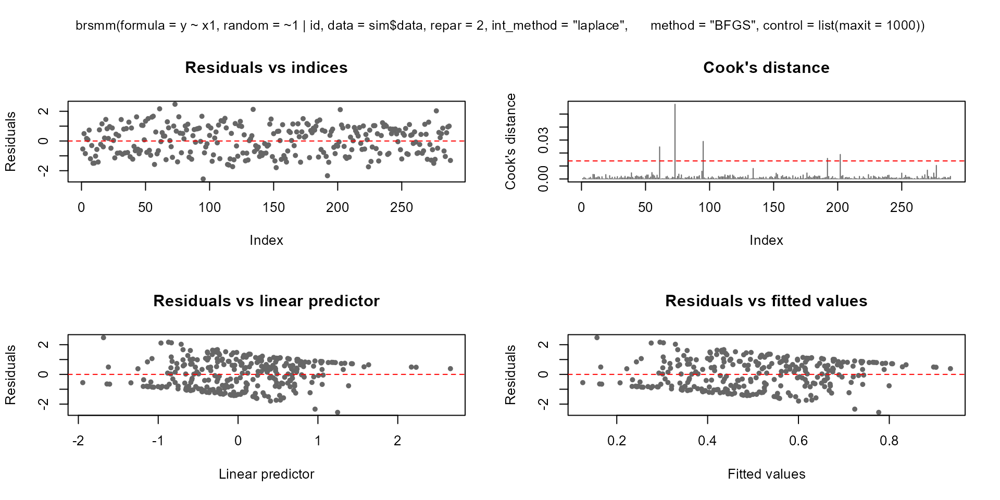
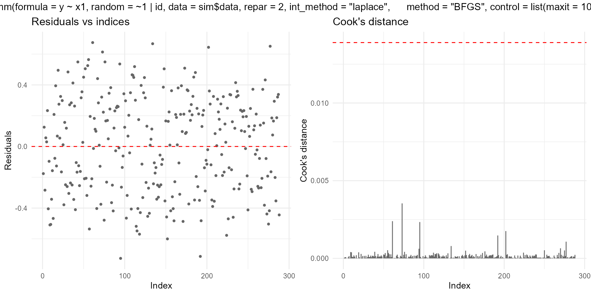
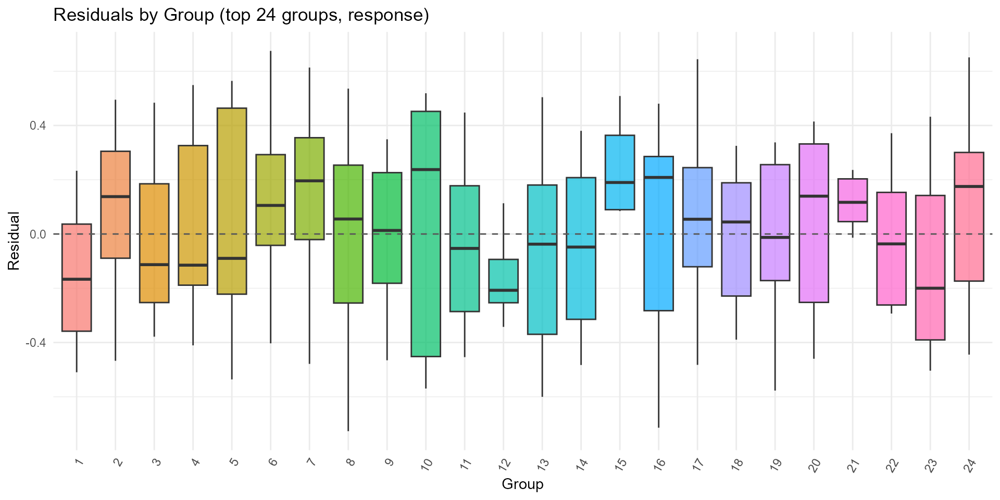

# Mixed-Effects Beta Interval Regression with brsmm

## Overview

[`brsmm()`](https://evandeilton.github.io/betaregscale/reference/brsmm.md)
extends
[`brs()`](https://evandeilton.github.io/betaregscale/reference/brs.md)
to clustered data by adding a Gaussian random intercept in the mean
submodel while preserving the interval-censored beta likelihood for
scale-derived outcomes.

This vignette covers:

1.  full model mathematics;
2.  estimation by marginal maximum likelihood (Laplace approximation);
3.  practical use of all current `brsmm` methods;
4.  inferential and validation workflows, including parameter recovery.

``` r

library(betaregscale)
```

## Mathematical model

Assume observations $`i = 1, \dots, n_j`$ within groups
$`j = 1, \dots, G`$, with random intercept
$`b_j \sim \mathcal{N}(0,\sigma_b^2)`$.

### Linear predictors

``` math
\eta_{\mu,ij} = x_{ij}^\top \beta + b_j,
\qquad
\eta_{\phi,ij} = z_{ij}^\top \gamma
```

``` math
\mu_{ij} = g^{-1}(\eta_{\mu,ij}),
\qquad
\phi_{ij} = h^{-1}(\eta_{\phi,ij})
```

with $`g(\cdot)`$ and $`h(\cdot)`$ chosen by `link` and `link_phi`.

### Beta parameterization

For each $`(\mu_{ij}, \phi_{ij})`$, `repar` maps to beta shape
parameters $`(a_{ij}, b_{ij})`$ via
[`brs_repar()`](https://evandeilton.github.io/betaregscale/reference/brs_repar.md).

### Conditional contribution by censoring type

Each observation contributes:

``` math
L_{ij}(b_j;\theta)=
\begin{cases}
f(y_{ij}; a_{ij}, b_{ij}), & \delta_{ij}=0\\
F(u_{ij}; a_{ij}, b_{ij}), & \delta_{ij}=1\\
1 - F(l_{ij}; a_{ij}, b_{ij}), & \delta_{ij}=2\\
F(u_{ij}; a_{ij}, b_{ij}) - F(l_{ij}; a_{ij}, b_{ij}), & \delta_{ij}=3
\end{cases}
```

where $`l_{ij},u_{ij}`$ are interval endpoints on $`(0,1)`$,
$`f(\cdot)`$ is beta density, and $`F(\cdot)`$ is beta CDF.

### Group marginal likelihood

``` math
L_j(\theta)=\int_{\mathbb{R}}
\prod_{i=1}^{n_j} L_{ij}(b_j;\theta)\,
\varphi(b_j;0,\sigma_b^2)\,db_j
```

``` math
\ell(\theta)=\sum_{j=1}^G \log L_j(\theta)
```

### Laplace approximation used by `brsmm()`

Define
``` math
Q_j(b)=\sum_{i=1}^{n_j}\log L_{ij}(b;\theta)+\log\varphi(b;0,\sigma_b^2)
```
and $`\hat b_j=\arg\max_b Q_j(b)`$, with curvature
$`H_j=-Q_j''(\hat b_j)`$. Then

``` math
\log L_j(\theta) \approx
Q_j(\hat b_j) + \frac{1}{2}\log(2\pi) - \frac{1}{2}\log(H_j).
```

[`brsmm()`](https://evandeilton.github.io/betaregscale/reference/brsmm.md)
maximizes the approximated $`\ell(\theta)`$ with
[`stats::optim()`](https://rdrr.io/r/stats/optim.html), and computes
group-level posterior modes $`\hat b_j`$ and local standard deviations
from the local curvature.

## Simulating clustered scale data

The next helper simulates data from a known mixed model to illustrate
fitting, inference, and recovery checks.

``` r

sim_brsmm_data <- function(seed = 3501L, g = 24L, ni = 12L,
                           beta = c(0.20, 0.65),
                           gamma = c(-0.15),
                           sigma_b = 0.55) {
  set.seed(seed)
  id <- factor(rep(seq_len(g), each = ni))
  n <- length(id)
  x1 <- rnorm(n)

  b_true <- rnorm(g, mean = 0, sd = sigma_b)
  eta_mu <- beta[1] + beta[2] * x1 + b_true[as.integer(id)]
  eta_phi <- rep(gamma[1], n)

  mu <- plogis(eta_mu)
  phi <- plogis(eta_phi)
  shp <- brs_repar(mu = mu, phi = phi, repar = 2)
  y <- round(stats::rbeta(n, shp$shape1, shp$shape2) * 100)

  list(
    data = data.frame(y = y, x1 = x1, id = id),
    truth = list(beta = beta, gamma = gamma, sigma_b = sigma_b, b = b_true)
  )
}

sim <- sim_brsmm_data()
str(sim$data)
#> 'data.frame':    288 obs. of  3 variables:
#>  $ y : num  18 29 12 43 56 55 3 21 4 4 ...
#>  $ x1: num  -0.3677 -2.0069 -0.0469 -0.2468 0.7634 ...
#>  $ id: Factor w/ 24 levels "1","2","3","4",..: 1 1 1 1 1 1 1 1 1 1 ...
```

## Fitting `brsmm()`

``` r

fit_mm <- brsmm(
  y ~ x1,
  random = ~ 1 | id,
  data = sim$data,
  repar = 2,
  int_method = "laplace",
  method = "BFGS",
  control = list(maxit = 1000)
)

fit_mm
#> 
#> Call:
#> brsmm(formula = y ~ x1, random = ~1 | id, data = sim$data, repar = 2, 
#>     int_method = "laplace", method = "BFGS", control = list(maxit = 1000))
#> 
#> Mixed beta interval model (Laplace)
#> Observations: 288  | Groups: 24 
#> Log-likelihood: -1231.3848 
#> Random SD: 0.4302 
#> Convergence code: 0
```

## Core methods

### Coefficients and random effects

`coef(fit_mm, model = "random")` is on the optimizer scale
($`\log \sigma_b`$); use [`exp()`](https://rdrr.io/r/base/Log.html) to
report $`\sigma_b`$.

``` r

coef(fit_mm, model = "full")
#>       (Intercept)                x1 (phi)_(Intercept)           (sd)_id 
#>        0.01049205        0.62964734       -0.13626108       -0.84340306
coef(fit_mm, model = "mean")
#> (Intercept)          x1 
#>  0.01049205  0.62964734
coef(fit_mm, model = "precision")
#> (phi)_(Intercept) 
#>        -0.1362611
coef(fit_mm, model = "random")
#>    (sd)_id 
#> -0.8434031
exp(coef(fit_mm, model = "random"))
#>   (sd)_id 
#> 0.4302439
head(ranef.brsmm(fit_mm))
#>           1           2           3           4           5           6 
#> -0.37073868  0.45544460 -0.17416818 -0.45937414  0.02482787  0.42957598
```

### Variance-covariance, summary and likelihood criteria

``` r

vc <- vcov(fit_mm)
dim(vc)
#> [1] 4 4

sm <- summary(fit_mm)
sm
#> 
#> Call:
#> brsmm(formula = y ~ x1, random = ~1 | id, data = sim$data, repar = 2, 
#>     int_method = "laplace", method = "BFGS", control = list(maxit = 1000))
#> 
#> Mixed beta interval model (Laplace)
#> Observations: 288  | Groups: 24 
#> logLik =-1231.3848 | AIC =2470.7696 | BIC =2485.4215
#> 
#>                   Estimate Std. Error z value Pr(>|z|)    
#> (Intercept)        0.01049    0.07629   0.138   0.8906    
#> x1                 0.62965    0.08648   7.280 3.33e-13 ***
#> (phi)_(Intercept) -0.13626    0.07684  -1.773   0.0762 .  
#> (sd)_id           -0.84340    0.26033  -3.240   0.0012 ** 
#> ---
#> Signif. codes:  0 '***' 0.001 '**' 0.01 '*' 0.05 '.' 0.1 ' ' 1

logLik(fit_mm)
#> 'log Lik.' -1231.385 (df=4)
AIC(fit_mm)
#> [1] 2470.77
BIC(fit_mm)
#> [1] 2485.421
nobs(fit_mm)
#> [1] 288
```

### Fitted values, prediction and residuals

``` r

head(fitted(fit_mm, type = "mu"))
#> [1] 0.3562297 0.1646703 0.4037745 0.3738721 0.5300724 0.3169592
head(fitted(fit_mm, type = "phi"))
#> [1] 0.4659873 0.4659873 0.4659873 0.4659873 0.4659873 0.4659873

head(predict(fit_mm, type = "response"))
#>         1         1         1         1         1         1 
#> 0.3562297 0.1646703 0.4037745 0.3738721 0.5300724 0.3169592
head(predict(fit_mm, type = "link"))
#>          1          1          1          1          1          1 
#> -0.5917664 -1.6238812 -0.3897623 -0.5156411  0.1204348 -0.7677815
head(predict(fit_mm, type = "precision"))
#> [1] 0.4659873 0.4659873 0.4659873 0.4659873 0.4659873 0.4659873
head(predict(fit_mm, type = "variance"))
#> [1] 0.10686492 0.06409842 0.11218210 0.10908379 0.11607542 0.10088443

head(residuals(fit_mm, type = "response"))
#> [1] -0.17622967  0.12532969 -0.28377453  0.05612795  0.02992764  0.23304080
head(residuals(fit_mm, type = "pearson"))
#> [1] -0.53909021  0.49502863 -0.84725011  0.16994135  0.08784202  0.73370233
```

### Diagnostic plotting methods

[`plot.brsmm()`](https://evandeilton.github.io/betaregscale/reference/plot.brsmm.md)
supports base and ggplot2 backends:

``` r

plot(fit_mm, which = 1:4, type = "pearson")
```



``` r


if (requireNamespace("ggplot2", quietly = TRUE)) {
  plot(fit_mm, which = 1:2, gg = TRUE)
}
```



[`autoplot.brsmm()`](https://evandeilton.github.io/betaregscale/reference/autoplot.brsmm.md)
provides focused ggplot diagnostics:

``` r

if (requireNamespace("ggplot2", quietly = TRUE)) {
  autoplot.brsmm(fit_mm, type = "calibration")
  autoplot.brsmm(fit_mm, type = "score_dist")
  autoplot.brsmm(fit_mm, type = "ranef_qq")
  autoplot.brsmm(fit_mm, type = "residuals_by_group")
}
```



### Prediction with `newdata`

If `newdata` contains unseen groups,
[`predict.brsmm()`](https://evandeilton.github.io/betaregscale/reference/predict.brsmm.md)
uses random effect equal to zero for those levels.

``` r

nd <- sim$data[1:8, c("x1", "id")]
predict(fit_mm, newdata = nd, type = "response")
#> [1] 0.3562297 0.1646703 0.4037745 0.3738721 0.5300724 0.3169592 0.4348336
#> [8] 0.3063872

nd_unseen <- nd
nd_unseen$id <- factor(rep("new_cluster", nrow(nd_unseen)))
predict(fit_mm, newdata = nd_unseen, type = "response")
#> [1] 0.4449669 0.2221566 0.4952442 0.4638376 0.6203828 0.4020230 0.5271188
#> [8] 0.3902347
```

## Statistical tests and validation workflow

### Wald tests (from `summary`)

[`summary.brsmm()`](https://evandeilton.github.io/betaregscale/reference/summary.brsmm.md)
reports Wald $`z`$-tests for each parameter:
``` math
z_k = \hat\theta_k / \mathrm{SE}(\hat\theta_k).
```

``` r

summary(fit_mm)$coefficients
#>                      Estimate Std. Error    z value     Pr(>|z|)
#> (Intercept)        0.01049205 0.07628513  0.1375372 8.906062e-01
#> x1                 0.62964734 0.08648480  7.2804391 3.328449e-13
#> (phi)_(Intercept) -0.13626108 0.07683662 -1.7733873 7.616454e-02
#> (sd)_id           -0.84340306 0.26033065 -3.2397379 1.196396e-03
```

### Likelihood-ratio test for nested fixed effects

For nested models with the same random-effect structure, an LR test can
be computed as:
``` math
LR = 2\{\ell(\hat\theta_1)-\ell(\hat\theta_0)\},
```
using a $`\chi^2`$ reference with parameter-count difference.

``` r

fit_null <- brsmm(
  y ~ 1,
  random = ~ 1 | id,
  data = sim$data,
  repar = 2,
  int_method = "laplace",
  method = "BFGS",
  control = list(maxit = 1000)
)

ll0 <- logLik(fit_null)
ll1 <- logLik(fit_mm)
lr_stat <- 2 * (as.numeric(ll1) - as.numeric(ll0))
df_diff <- attr(ll1, "df") - attr(ll0, "df")
p_value <- stats::pchisq(lr_stat, df = df_diff, lower.tail = FALSE)

c(LR = lr_stat, df = df_diff, p_value = p_value)
```

### Residual diagnostics (quick checks)

``` r

r <- residuals(fit_mm, type = "pearson")
c(
  mean = mean(r),
  sd = stats::sd(r),
  q025 = as.numeric(stats::quantile(r, 0.025)),
  q975 = as.numeric(stats::quantile(r, 0.975))
)
#>        mean          sd        q025        q975 
#>  0.03804295  0.96104668 -1.56672203  1.62863684
```

## Parameter recovery experiment

A single-fit recovery table can be produced directly from the previous
fit:

``` r

est <- c(
  beta0 = coef(fit_mm, model = "mean")[1],
  beta1 = coef(fit_mm, model = "mean")[2],
  sigma_b = exp(coef(fit_mm, model = "random"))
)

true <- c(
  beta0 = sim$truth$beta[1],
  beta1 = sim$truth$beta[2],
  sigma_b = sim$truth$sigma_b
)

recovery_table <- data.frame(
  parameter = names(true),
  true = as.numeric(true),
  estimate = as.numeric(est[names(true)]),
  bias = as.numeric(est[names(true)] - true)
)
recovery_table
#>   parameter true estimate bias
#> 1     beta0 0.20       NA   NA
#> 2     beta1 0.65       NA   NA
#> 3   sigma_b 0.55       NA   NA
```

For a Monte Carlo recovery study, repeat simulation and fitting across
replicates:

``` r

mc_recovery <- function(R = 50L, seed = 7001L) {
  set.seed(seed)
  out <- vector("list", R)

  for (r in seq_len(R)) {
    sim_r <- sim_brsmm_data(seed = seed + r)
    fit_r <- brsmm(
      y ~ x1,
      random = ~ 1 | id,
      data = sim_r$data,
      repar = 2,
      int_method = "laplace",
      method = "BFGS",
      control = list(maxit = 1000)
    )

    out[[r]] <- c(
      beta0 = coef(fit_r, model = "mean")[1],
      beta1 = coef(fit_r, model = "mean")[2],
      sigma_b = exp(coef(fit_r, model = "random"))
    )
  }

  est <- do.call(rbind, out)
  truth <- c(beta0 = 0.20, beta1 = 0.65, sigma_b = 0.55)

  data.frame(
    parameter = colnames(est),
    truth = as.numeric(truth[colnames(est)]),
    mean_est = colMeans(est),
    bias = colMeans(est) - truth[colnames(est)],
    rmse = sqrt(colMeans((sweep(est, 2, truth[colnames(est)], "-"))^2))
  )
}

mc_recovery(R = 50)
```

## How this maps to automated package tests

The package test suite includes dedicated `brsmm` tests for:

1.  fitting with Laplace integration;
2.  one- and two-part formulas;
3.  S3 methods (`coef`, `vcov`, `summary`, `predict`, `residuals`,
    `ranef`);
4.  parameter recovery under known DGP settings.

Run locally:

``` r

devtools::test(filter = "brsmm")
```

## References

Ferrari, S. L. P. and Cribari-Neto, F. (2004). Beta regression for
modelling rates and proportions. *Journal of Applied Statistics*, 31(7),
799-815.

Lopes, J. E. (2024). *Beta Regression for Interval-Censored
Scale-Derived Outcomes*. MSc Dissertation, PPGMNE/UFPR.

Pinheiro, J. C. and Bates, D. M. (2000). *Mixed-Effects Models in S and
S-PLUS*. Springer.
